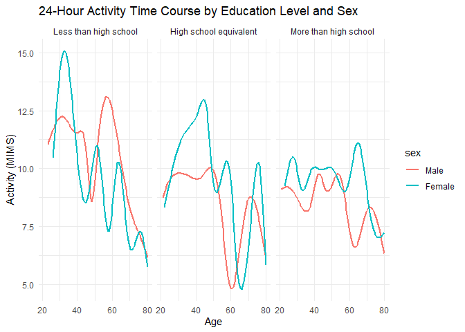

p8105_hw3_yf2735
================
Yujing FU
2024-10-04

    ## ── Attaching core tidyverse packages ──────────────────────── tidyverse 2.0.0 ──
    ## ✔ dplyr     1.1.4     ✔ readr     2.1.5
    ## ✔ forcats   1.0.0     ✔ stringr   1.5.1
    ## ✔ ggplot2   3.5.1     ✔ tibble    3.2.1
    ## ✔ lubridate 1.9.3     ✔ tidyr     1.3.1
    ## ✔ purrr     1.0.2     
    ## ── Conflicts ────────────────────────────────────────── tidyverse_conflicts() ──
    ## ✖ dplyr::filter() masks stats::filter()
    ## ✖ dplyr::lag()    masks stats::lag()
    ## ℹ Use the conflicted package (<http://conflicted.r-lib.org/>) to force all conflicts to become errors
    ## 
    ## Attaching package: 'janitor'
    ## 
    ## 
    ## The following objects are masked from 'package:stats':
    ## 
    ##     chisq.test, fisher.test

## Problem 1

``` r
library(p8105.datasets)
data("ny_noaa")
```

``` r
head(ny_noaa)
```

    ## # A tibble: 6 × 7
    ##   id          date        prcp  snow  snwd tmax  tmin 
    ##   <chr>       <date>     <int> <int> <int> <chr> <chr>
    ## 1 US1NYAB0001 2007-11-01    NA    NA    NA <NA>  <NA> 
    ## 2 US1NYAB0001 2007-11-02    NA    NA    NA <NA>  <NA> 
    ## 3 US1NYAB0001 2007-11-03    NA    NA    NA <NA>  <NA> 
    ## 4 US1NYAB0001 2007-11-04    NA    NA    NA <NA>  <NA> 
    ## 5 US1NYAB0001 2007-11-05    NA    NA    NA <NA>  <NA> 
    ## 6 US1NYAB0001 2007-11-06    NA    NA    NA <NA>  <NA>

``` r
ny_noaa_clean =
  ny_noaa |> 
  mutate(across(c(prcp, snow, snwd, tmax, tmin), as.numeric)) |> 
  separate(date, into = c("year", "month", "day"), sep = "-") |> 
  mutate(across(c(year, month, day), as.numeric)) |> 
  mutate(tmax = tmax/10, #°C
         tmin = tmin/10,
         prcp = prcp/10) #mm
head(ny_noaa_clean)
```

    ## # A tibble: 6 × 9
    ##   id           year month   day  prcp  snow  snwd  tmax  tmin
    ##   <chr>       <dbl> <dbl> <dbl> <dbl> <dbl> <dbl> <dbl> <dbl>
    ## 1 US1NYAB0001  2007    11     1    NA    NA    NA    NA    NA
    ## 2 US1NYAB0001  2007    11     2    NA    NA    NA    NA    NA
    ## 3 US1NYAB0001  2007    11     3    NA    NA    NA    NA    NA
    ## 4 US1NYAB0001  2007    11     4    NA    NA    NA    NA    NA
    ## 5 US1NYAB0001  2007    11     5    NA    NA    NA    NA    NA
    ## 6 US1NYAB0001  2007    11     6    NA    NA    NA    NA    NA

The dataset shows the weather in New York City. The dimension of the
dataset is 2595176, 9 for rows and columns. It includes key variables
such as weather station ID `id`, date of observation (`year`, `month`,
`day`), and precipitation (tenths of mm) `prcp` (e.g. 11.7). Also
included are the snowing conditions: snowfall `snow` and snow depth
`snwd`, and the highest and lowest temperature during the day (`tmax`
and `tmin`). There are many missing values for the variables `snwd`,
`tmax`, and `tmin`.

Make a two-panel plot showing the average max temperature in January and
in July in each station across years. Is there any observable /
interpretable structure? Any outliers?

``` r
ny_noaa_clean_avgtmax =
  ny_noaa_clean |> 
  filter(month == 1 | month == 7) |> 
  drop_na(tmax, tmin) |> 
  group_by(id, year, month) |>
  summarise(tmax_avg = mean(tmax, na.rm = TRUE), tmin_avg = mean(tmin, na.rm = TRUE)) 
```

    ## `summarise()` has grouped output by 'id', 'year'. You can override using the
    ## `.groups` argument.

``` r
ny_noaa_clean_avgtmax
```

    ## # A tibble: 8,141 × 5
    ## # Groups:   id, year [4,195]
    ##    id           year month tmax_avg tmin_avg
    ##    <chr>       <dbl> <dbl>    <dbl>    <dbl>
    ##  1 USC00300023  1981     1    -2.11   -13.5 
    ##  2 USC00300023  1981     7    28.5     15.4 
    ##  3 USC00300023  1982     1    -4.33   -12.2 
    ##  4 USC00300023  1982     7    27.8     13.2 
    ##  5 USC00300023  1983     1     1.11    -7.39
    ##  6 USC00300023  1983     7    29.8     13.5 
    ##  7 USC00300023  1984     7    27.2     12.2 
    ##  8 USC00300023  1985     1    -1.30   -12.3 
    ##  9 USC00300023  1989     7    27.1     12.3 
    ## 10 USC00300023  1990     1     4.92    -4.98
    ## # ℹ 8,131 more rows

``` r
ggplot(ny_noaa_clean_avgtmax, aes(x = year, y = tmax_avg, color = id)) +
  geom_line(alpha = 0.5) +
  facet_wrap(~month, ncol=1) +
  labs(title = "Average Max Temperature in January and July", x = "Year", y = "Average Max Temperature(°C)") +
  theme(legend.position = "none")
```

<!-- --> The
average maximum temperature in each weather station in New York have
quite similar trend. We can see that the average maximum temperature in
January is around -10°C to 10°C and in July is variating around 25°C to
30°C. There are some outliers, for example in the July of 1988 the
average maximum temperature is pretty low which is around 15°C.

Make a two-panel plot showing (i) tmax vs tmin for the full dataset
(note that a scatterplot may not be the best option)

``` r
tmax_boxplot =
  ggplot(ny_noaa_clean, aes(x = factor(month), y = tmax, fill = factor(month))) +
  geom_boxplot() +
  labs(title = "Max Temperature by Month", x = "Month", y = "Temperature (°C)") +
  theme_minimal() +
  theme(legend.position = "none")

tmin_boxplot =
  ggplot(ny_noaa_clean, aes(x = factor(month), y = tmin, fill = factor(month))) +
  geom_boxplot() +
  labs(title = "Min Temperature by Month", x = "Month", y = "Temperature (°C)") +
  theme_minimal() +
  theme(legend.position = "none")


(tmax_boxplot / tmin_boxplot) +
  plot_annotation(title = "Max and Min Temperature by Month") +
  plot_layout(ncol = 1, nrow = 2)  
```

    ## Warning: Removed 1134358 rows containing non-finite outside the scale range
    ## (`stat_boxplot()`).

    ## Warning: Removed 1134420 rows containing non-finite outside the scale range
    ## (`stat_boxplot()`).

<!-- --> We
can see that the trend of maximum and minimu temperature are quite
similar in along the year and there are not a very big lap of
temperature between two graph in each month.

2)  make a plot showing the distribution of snowfall values greater than
    0 and less than 100 separately by year.

``` r
snow_filtered =
  ny_noaa_clean |> 
  filter(snow > 0 & snow < 100) |> 
  drop_na(snow) |> 
  ggplot(aes(x = factor(year), y = snow, fill = factor(year))) +
  geom_violin(alpha = 0.6) +
  labs(
    title = "Distribution of Snowfall by Year (0-100 mm)",
    x = "Year",
    y = "Snowfall (mm)"
  ) +
  theme(legend.position = "bottom")
snow_filtered
```

<!-- --> The
distribution of snowfall across the years appears to be quite
consistent, with a prevalent occurrence of snowfalls below 25mm.
Additionally, snowfalls around 50mm and 75mm are also commonly observed.

## Problem 2

``` r
demo_df = 
  read.csv("data/nhanes_covar.csv", skip = 4) |> 
  janitor::clean_names() |> 
  mutate(across(c(sex, age, bmi, education), as.numeric)) |> 
  drop_na(sex, age, bmi, education) |> 
  filter(age >= 21) |> 
  mutate(
    sex = factor(sex, levels = c("1", "2"), labels = c("Male", "Female")),
    education = factor(education, levels = c("1", "2", "3"), labels = c("Less than high school", "High school equivalent", "More than high school"))
  )

head(demo_df)
```

    ##    seqn    sex age  bmi              education
    ## 1 62161   Male  22 23.3 High school equivalent
    ## 2 62164 Female  44 23.2  More than high school
    ## 3 62169   Male  21 20.1 High school equivalent
    ## 4 62174   Male  80 33.9  More than high school
    ## 5 62177   Male  51 20.1 High school equivalent
    ## 6 62178   Male  80 28.5 High school equivalent

``` r
accel_df = 
  read.csv("data/nhanes_accel.csv") |> 
  janitor::clean_names() |> 
  drop_na()

head(accel_df)
```

    ##    seqn      min1      min2      min3      min4       min5       min6      min7
    ## 1 62161 1.1060000 3.1151667 1.4675000 0.9376667 1.59866667 0.14533333 2.1005000
    ## 2 62164 1.9245714 1.6694286 2.3760000 0.9345714 2.59314286 5.22128571 2.3931429
    ## 3 62169 5.8468571 5.1777143 4.7628571 6.4820000 6.85357143 7.24185714 6.1151429
    ## 4 62174 5.4210000 3.4821667 3.7173333 3.8083333 6.85466667 4.44916667 0.5611667
    ## 5 62177 6.1432857 8.0574286 9.9902857 6.5981429 4.57100000 2.78271429 7.1042857
    ## 6 62178 0.1665714 0.4288571 0.1312857 1.2022857 0.07957143 0.04871429 0.1055714
    ##         min8        min9      min10      min11      min12      min13      min14
    ## 1 0.50950000  1.63216667 1.19633333 0.94716667 0.02633333 0.05516667 0.03700000
    ## 2 4.90171429  1.96828571 3.13400000 2.77085714 2.45385714 2.19642857 3.07885714
    ## 3 7.48414286  5.47071429 6.49071429 5.13528571 3.51342857 5.43285714 3.83571429
    ## 4 1.60800000  0.69816667 2.72433333 4.84533333 0.57766667 1.17400000 2.80066667
    ## 5 7.25271429 10.12742857 7.49428571 2.71800000 2.39414286 2.20128571 0.84985714
    ## 6 0.06528571  0.05642857 0.06385714 0.09085714 0.03757143 0.36371429 0.05457143
    ##         min15      min16      min17      min18       min19      min20
    ## 1  2.09833333 0.54350000 0.09150000 0.97050000  0.81416667 0.96516667
    ## 2  7.72414286 9.46428571 6.85071429 5.50271429  6.11042857 3.44328571
    ## 3 10.21671429 6.94185714 5.96185714 8.16300000 14.19957143 8.69257143
    ## 4  1.06100000 0.02900000 0.94883333 2.67600000  4.88066667 0.12650000
    ## 5  3.29757143 2.91828571 3.67457143 7.59357143  6.24828571 5.78985714
    ## 6  0.06057143 0.06271429 0.06542857 0.06771429  0.07042857 0.07228571
    ##         min21     min22     min23     min24     min25    min26      min27
    ## 1  0.04783333 1.8638333 1.0780000 1.0251667 1.2346667 2.287000 0.06066667
    ## 2  3.56785714 1.4735714 3.1010000 1.7724286 3.2760000 4.532286 2.50342857
    ## 3 25.99200000 9.2397143 6.6297143 5.0961429 4.7812857 8.476857 7.40785714
    ## 4  2.59683333 5.0246667 1.6535000 5.2570000 4.7160000 5.022667 4.71866667
    ## 5  3.34571429 3.3151429 3.0055714 4.1824286 2.2404286 3.792000 5.72214286
    ## 6  0.17742857 0.1485714 0.1614286 0.1288571 0.2352857 0.107000 0.08628571
    ##        min28      min29      min30     min31     min32     min33     min34
    ## 1 0.05333333  0.1025000 0.09066667 0.3088333 0.4005000 1.2341667 0.0330000
    ## 2 1.33314286  0.7650000 5.98485714 3.2498571 0.7451429 0.9901429 1.3421429
    ## 3 4.46742857  5.3842857 3.79214286 5.9865714 4.2181429 3.4907143 3.6242857
    ## 4 6.85616667  2.8058333 4.36016667 3.3575000 1.7415000 1.9980000 0.9796667
    ## 5 5.53057143 12.4681429 5.63242857 1.3045714 2.7482857 0.3947143 1.5540000
    ## 6 0.06428571  0.3781429 0.06600000 0.0690000 0.1048571 0.2677143 0.1234286
    ##       min35      min36     min37     min38       min39     min40      min41
    ## 1 3.0613333 1.72283333 0.0605000 4.2205000  0.80516667  0.898000 1.74450000
    ## 2 3.5911429 5.06328571 4.6420000 5.0187143  2.66400000  1.362571 2.42728571
    ## 3 5.9530000 7.59800000 7.6967143 6.3448571 20.12942857 10.044429 4.40814286
    ## 4 0.0155000 0.45716667 0.6661667 1.0471667  0.02000000  0.507500 0.04266667
    ## 5 0.6207143 0.24671429 1.5098571 1.6868571  3.07028571  4.032857 2.19928571
    ## 6 0.1035714 0.09385714 0.2358571 0.1608571  0.07028571  0.087000 0.10500000
    ##        min42       min43      min44      min45      min46      min47     min48
    ## 1 1.50583333  0.85750000 1.02650000 0.04950000 0.13666667 0.91100000 0.2995000
    ## 2 5.16485714  6.52671429 3.21700000 6.48942857 6.60214286 2.53542857 3.5322857
    ## 3 8.66385714 10.43171429 6.74828571 3.88942857 3.97585714 3.47000000 5.1680000
    ## 4 0.75550000  1.76300000 3.28700000 0.08933333 0.73216667 1.36283333 0.1175000
    ## 5 0.68957143  1.25457143 3.01571429 2.72642857 7.68657143 1.78000000 1.3987143
    ## 6 0.08871429  0.07342857 0.07214286 0.07142857 0.07357143 0.08042857 0.9402857
    ##       min49     min50      min51     min52      min53     min54     min55
    ## 1 0.3636667 0.0455000 0.03066667 2.2156667 0.05766667 1.2155000 0.0765000
    ## 2 2.3647143 1.0395714 0.80500000 0.7220000 1.15857143 1.2434286 1.2767143
    ## 3 5.6922857 5.1940000 3.52957143 6.1744286 7.89214286 7.5892857 6.3474286
    ## 4 0.7593333 0.5965000 0.41900000 0.1470000 1.74133333 2.2860000 4.3313333
    ## 5 1.3294286 3.2545714 2.82700000 2.2508571 0.39171429 0.6314286 0.7008571
    ## 6 0.6418571 0.3317143 2.16342857 0.6201429 2.34014286 0.1752857 0.2057143
    ##        min56      min57      min58      min59      min60     min61      min62
    ## 1 0.06383333 0.53200000 0.04483333 0.09400000 0.02733333 0.9225000 0.03783333
    ## 2 1.25514286 0.61371429 0.70185714 4.95400000 4.05985714 9.2511429 2.89728571
    ## 3 5.19942857 5.81400000 8.09185714 6.62314286 5.90171429 6.4380000 6.42714286
    ## 4 0.12083333 0.01833333 0.69800000 0.08400000 0.59683333 0.0150000 0.01566667
    ## 5 1.00000000 2.22285714 3.57671429 2.91128571 5.56700000 2.3552857 4.00685714
    ## 6 0.07800000 1.70857143 0.06128571 0.04771429 0.11757143 0.2091429 1.26385714
    ##       min63      min64      min65      min66      min67     min68    min69
    ## 1 0.1496667 0.09216667 0.37833333 0.03766667 1.12833333 0.1235000 1.212833
    ## 2 1.8705714 1.16971429 2.62500000 2.47600000 2.33585714 4.9830000 3.257714
    ## 3 5.1032857 5.13557143 4.54085714 5.72085714 4.70342857 6.6672857 5.612857
    ## 4 0.1830000 0.74966667 0.03100000 0.03066667 0.04216667 0.8726667 5.841333
    ## 5 3.4702857 2.78542857 5.23985714 4.85128571 3.40928571 4.4434286 7.369857
    ## 6 0.1928571 0.86528571 0.08057143 0.31628571 0.70757143 3.1707143 0.373000
    ##        min70      min71      min72       min73      min74      min75     min76
    ## 1 0.05033333 0.02433333 0.05433333  0.02733333 0.67966667 0.05116667 0.7471667
    ## 2 4.62114286 3.82814286 2.04371429  1.08242857 6.02271429 5.11242857 7.6460000
    ## 3 3.49600000 3.55214286 6.01142857  4.94900000 5.52071429 5.44814286 6.1675714
    ## 4 6.25750000 4.06583333 4.98950000  0.46616667 1.11483333 6.53716667 5.7031667
    ## 5 2.94085714 3.17085714 3.30200000 10.27471429 1.13885714 2.03528571 2.4571429
    ## 6 0.07828571 0.07200000 0.10414286  0.05257143 0.07642857 0.08957143 0.2072857
    ##        min77     min78      min79     min80     min81     min82      min83
    ## 1 0.74283333  1.256500 0.85366667 1.1658333 0.2063333 0.8235000 0.11466667
    ## 2 6.18071429  4.771000 4.37328571 4.5602857 1.9208571 2.6482857 2.16771429
    ## 3 5.77571429 10.524714 7.08928571 7.9594286 7.1157143 4.8552857 7.51828571
    ## 4 0.41050000  1.037500 0.35883333 0.9313333 0.2370000 1.5290000 5.59866667
    ## 5 1.79257143  3.820857 3.33142857 4.1767143 5.0798571 2.0201429 5.89828571
    ## 6 0.07585714  0.117000 0.06028571 0.1011429 0.2574286 0.1445714 0.07942857
    ##       min84      min85      min86     min87     min88     min89      min90
    ## 1 1.0558333 3.76483333 6.86433333 5.9491667 1.5935000 0.3526667 0.76800000
    ## 2 1.3182857 2.75457143 1.84757143 1.4767143 0.7151429 1.5521429 1.58257143
    ## 3 9.2150000 5.03114286 4.39642857 9.5675714 9.1124286 9.9498571 9.70157143
    ## 4 3.2016667 3.29600000 2.95866667 0.0330000 0.3941667 1.1373333 0.21200000
    ## 5 3.3002857 1.22585714 6.24371429 0.8900000 0.8145714 0.1021429 1.51500000
    ## 6 0.1295714 0.08314286 0.08885714 0.1797143 0.4185714 0.2560000 0.08171429
    ##        min91      min92       min93       min94      min95       min96
    ## 1 0.27533333 0.02916667  1.99200000  0.05216667  0.8761667  0.42550000
    ## 2 1.39957143 3.49628571  0.97557143  3.40085714  3.4975714  3.59057143
    ## 3 4.50771429 7.57714286 12.13600000 13.80671429 15.4634286 10.19300000
    ## 4 0.52683333 2.16116667  3.36600000  0.18866667  1.7766667  0.62133333
    ## 5 4.04014286 2.89857143  1.78514286  0.53900000  3.3961429  2.26971429
    ## 6 0.09885714 0.22742857  0.08757143  0.44971429  0.3501429  0.06742857
    ##         min97     min98     min99    min100    min101    min102     min103
    ## 1  1.25950000 1.9640000 0.9631667 6.1611667 5.0600000 3.8905000 1.73416667
    ## 2  1.11071429 0.6540000 1.3022857 1.6920000 2.4138571 2.0637143 4.80985714
    ## 3 16.74428571 6.0544286 7.7181429 6.4250000 6.3781429 7.3930000 7.24800000
    ## 4  2.27216667 2.2016667 1.4770000 1.2400000 0.2983333 0.9633333 0.06733333
    ## 5  1.05628571 2.7915714 2.8867143 1.0764286 0.3478571 3.0298571 0.16071429
    ## 6  0.06285714 0.2267143 0.1127143 0.1721429 0.2462857 0.1628571 0.07471429
    ##       min104     min105    min106    min107   min108     min109    min110
    ## 1 0.68850000 3.86466667 0.9385000 3.0663333 0.165000 0.11933333 0.3096667
    ## 2 2.35628571 4.34928571 2.2215714 2.3371429 1.856286 1.37785714 1.9111429
    ## 3 4.54257143 5.67342857 3.6414286 1.8427143 3.651143 6.69342857 4.9812857
    ## 4 2.01500000 0.70383333 1.3295000 2.8850000 1.051667 0.43416667 1.1525000
    ## 5 0.01685714 0.03871429 0.2692857 0.1135714 0.037000 0.04571429 1.0747143
    ## 6 0.57357143 0.20714286 0.4165714 1.2757143 2.353571 2.24900000 1.1871429
    ##      min111    min112     min113     min114     min115     min116     min117
    ## 1 0.0440000 1.8651667 0.06550000 0.04533333 0.03833333 0.04066667 0.04716667
    ## 2 1.5015714 2.7841429 4.82114286 1.14285714 0.83671429 2.16371429 2.47271429
    ## 3 4.4315714 4.2114286 3.85028571 2.50428571 4.05371429 6.18600000 2.18785714
    ## 4 1.6951667 0.7251667 0.40683333 1.20800000 2.83383333 1.92450000 0.76683333
    ## 5 0.3255714 4.8220000 0.67857143 1.70828571 1.78671429 0.07928571 2.89414286
    ## 6 4.2235714 2.1302857 0.05114286 0.06600000 0.03957143 0.42500000 0.54457143
    ##      min118    min119     min120     min121     min122     min123   min124
    ## 1 0.0465000 0.1553333 0.07316667 0.05616667 0.04616667 0.05133333 0.054500
    ## 2 1.6887143 3.4271429 2.87485714 3.48642857 2.68114286 1.32457143 1.655571
    ## 3 1.6775714 1.8771429 1.53500000 6.40014286 2.98242857 1.16442857 2.159286
    ## 4 4.6925000 1.9898333 0.92116667 5.02516667 2.47583333 3.31250000 4.648667
    ## 5 1.0571429 2.2451429 0.88071429 1.68914286 1.64257143 1.04371429 4.057000
    ## 6 0.9478571 0.7670000 1.59871429 0.19357143 0.22742857 0.04657143 0.032000
    ##      min125     min126     min127    min128     min129     min130     min131
    ## 1 0.0700000 3.91650000 0.05883333 0.7985000 0.54283333 0.04283333 0.03583333
    ## 2 1.4102857 3.38757143 4.01928571 3.7651429 1.82485714 5.39185714 6.45000000
    ## 3 1.8468571 1.31171429 1.87728571 0.7925714 3.87571429 4.13971429 5.09214286
    ## 4 1.3453333 0.02783333 0.89250000 0.0000000 0.01583333 0.00000000 0.48383333
    ## 5 0.0900000 0.36814286 0.23342857 0.8464286 0.02714286 0.28700000 0.05742857
    ## 6 0.3137143 0.05528571 0.53714286 0.7427143 0.12057143 0.26285714 0.24242857
    ##       min132     min133     min134    min135     min136     min137     min138
    ## 1 0.08633333 0.03266667 0.03916667 0.0815000 0.04366667 0.06833333 0.05250000
    ## 2 5.73914286 3.65400000 6.03042857 6.4885714 5.50014286 2.76257143 0.56771429
    ## 3 7.70142857 6.56814286 7.78300000 3.6694286 2.74485714 1.76514286 1.75885714
    ## 4 0.77600000 2.21250000 3.20583333 3.5860000 0.55150000 4.05166667 4.65766667
    ## 5 0.07014286 0.02928571 0.30371429 1.2752857 1.75557143 0.11628571 0.03542857
    ## 6 0.22585714 0.43557143 0.21328571 0.1977143 0.02785714 0.05914286 0.02842857
    ##       min139     min140     min141    min142     min143     min144     min145
    ## 1 0.05750000 0.03666667 0.05150000 0.2845000 0.04816667 0.10233333 0.04883333
    ## 2 2.65614286 4.84928571 5.39300000 1.6230000 1.81842857 3.09828571 2.83957143
    ## 3 0.74857143 1.10071429 2.23871429 2.4992857 0.75385714 0.76200000 2.47971429
    ## 4 1.57550000 8.14266667 7.35966667 5.2120000 3.42700000 0.70583333 0.70166667
    ## 5 0.71357143 0.08228571 0.03142857 0.8262857 0.39814286 0.93914286 1.67742857
    ## 6 0.06357143 0.03200000 0.24928571 0.2105714 0.19357143 0.05814286 0.12942857
    ##     min146     min147    min148     min149     min150    min151    min152
    ## 1 1.628833 0.08916667 0.7366667 0.06150000 1.02316667 0.7321667 1.6490000
    ## 2 4.730714 2.03842857 1.0944286 1.27757143 2.63514286 2.0685714 3.8125714
    ## 3 1.465286 1.47728571 1.1155714 1.45171429 1.05142857 0.7455714 1.5747143
    ## 4 0.570500 0.13400000 0.1313333 0.02916667 0.02716667 1.2593333 0.7513333
    ## 5 1.649857 0.64342857 0.1048571 0.08142857 0.09414286 2.0551429 0.7997143
    ## 6 0.152000 0.46057143 0.5968571 1.90457143 0.51871429 1.6417143 3.5350000
    ##       min153     min154    min155     min156     min157     min158     min159
    ## 1 1.19233333 0.03433333 1.5848333 3.13200000 0.04783333 0.05883333 0.95566667
    ## 2 5.00371429 3.50614286 2.3912857 1.15842857 1.05871429 2.12142857 3.33357143
    ## 3 2.68957143 1.84314286 0.9957143 2.32671429 1.34685714 0.86928571 1.10985714
    ## 4 1.31800000 5.17350000 1.1570000 0.18033333 0.83800000 0.01283333 0.70116667
    ## 5 0.89442857 0.13371429 0.8211429 0.05314286 0.66657143 1.25314286 1.38771429
    ## 6 0.04842857 0.10900000 0.4131429 0.41400000 0.36042857 0.05071429 0.08742857
    ##      min160     min161     min162     min163     min164    min165     min166
    ## 1 0.2906667 0.09433333 0.07583333 0.14933333 2.29583333 1.8775000 0.89350000
    ## 2 5.5154286 3.94600000 2.97057143 3.04742857 1.69500000 4.1510000 1.99614286
    ## 3 3.4422857 1.81714286 2.11671429 4.52285714 3.96600000 4.9967143 7.95228571
    ## 4 0.5521667 0.04450000 0.05416667 0.07066667 0.55183333 0.2163333 0.03033333
    ## 5 0.0770000 0.04257143 0.55371429 0.78371429 0.05257143 0.7341429 0.19885714
    ## 6 0.2621429 0.04342857 0.40242857 1.39700000 1.03128571 0.6190000 0.91171429
    ##       min167     min168    min169    min170     min171     min172   min173
    ## 1 1.85833333 3.60533333 0.1311667 0.0300000 0.03166667 0.20516667 1.679667
    ## 2 1.41557143 2.60328571 1.0987143 0.8400000 0.59900000 4.07471429 2.160000
    ## 3 6.37228571 1.99114286 3.2218571 3.7427143 2.48000000 2.01100000 1.658857
    ## 4 0.66233333 0.78483333 0.4636667 2.7030000 2.13300000 0.23383333 1.928167
    ## 5 0.05028571 0.04114286 0.3430000 0.5477143 0.63828571 1.18300000 1.131714
    ## 6 0.04142857 0.05242857 0.1114286 0.1631429 0.04228571 0.04642857 1.002143
    ##       min174    min175     min176    min177     min178     min179     min180
    ## 1 0.38033333 0.7505000 0.62783333 0.7303333 0.04583333 0.41816667 0.33533333
    ## 2 1.00257143 0.6420000 2.05842857 2.2654286 1.53414286 2.19400000 1.74985714
    ## 3 0.88500000 0.9822857 3.10614286 1.8597143 5.11085714 4.53557143 5.00242857
    ## 4 0.09783333 0.1715000 0.02083333 2.3660000 0.25766667 2.23900000 1.63800000
    ## 5 0.83614286 5.1092857 5.38071429 2.3541429 2.21642857 2.51642857 3.98514286
    ## 6 0.20771429 0.1118571 0.37600000 0.1602857 0.06100000 0.05242857 0.07214286
    ##       min181     min182     min183     min184     min185     min186     min187
    ## 1 1.46783333 0.34616667 1.58050000 1.29100000 0.09366667 0.16183333 0.69450000
    ## 2 2.35942857 3.15014286 3.92585714 5.93085714 4.90857143 5.83814286 5.45685714
    ## 3 4.75971429 1.16842857 1.32771429 0.67557143 1.57742857 0.95500000 2.70171429
    ## 4 1.35966667 1.35216667 3.86600000 0.13666667 0.48733333 0.80850000 2.47366667
    ## 5 1.06285714 2.89228571 2.30971429 4.05842857 6.53028571 1.14185714 0.88628571
    ## 6 0.08342857 0.05342857 0.04528571 0.04785714 0.03600000 0.03457143 0.04214286
    ##      min188     min189     min190     min191     min192    min193     min194
    ## 1 1.0053333 0.02766667 1.18483333 3.05400000 0.27350000 1.7816667 0.56733333
    ## 2 4.8241429 4.43642857 2.22885714 3.05928571 2.36342857 0.4760000 0.93228571
    ## 3 1.4970000 2.46057143 2.01657143 4.23414286 0.99771429 1.4968571 0.99000000
    ## 4 1.1523333 0.70666667 1.96300000 0.75983333 4.42650000 1.1025000 2.07516667
    ## 5 0.2112857 0.41242857 1.49514286 0.04328571 0.03414286 1.8038571 2.38814286
    ## 6 0.1391429 0.03400000 0.03642857 0.05028571 0.07957143 0.1918571 0.07942857
    ##       min195     min196     min197    min198     min199     min200     min201
    ## 1 0.31466667 0.11650000 1.04083333 0.0500000 0.06116667 0.56750000 0.05133333
    ## 2 2.54542857 0.85500000 1.01557143 1.4194286 1.97571429 1.64057143 1.94528571
    ## 3 2.86157143 1.67742857 1.43757143 2.8911429 0.60885714 1.15500000 1.60585714
    ## 4 0.04883333 0.00000000 0.41816667 0.0585000 1.77600000 0.81616667 1.88150000
    ## 5 3.53157143 0.08514286 0.02428571 0.2561429 0.03785714 0.03457143 0.03514286
    ## 6 0.07671429 0.50442857 0.13785714 0.1734286 0.32285714 0.48014286 0.25785714
    ##      min202    min203     min204    min205    min206     min207     min208
    ## 1 0.0950000 0.0305000 0.03133333 0.0550000 0.4775000 0.03483333 0.40116667
    ## 2 2.1801429 2.4841429 0.90828571 2.0891429 1.1487143 3.87914286 1.92142857
    ## 3 1.8612857 2.3331429 1.30971429 1.1971429 2.8451429 2.04885714 3.32071429
    ## 4 1.1046667 1.3816667 1.03766667 3.0033333 4.3196667 2.04466667 5.54650000
    ## 5 0.0360000 1.3498571 0.05400000 0.9682857 0.0340000 1.72514286 0.09557143
    ## 6 0.8748571 0.7772857 0.57814286 0.7048571 0.2265714 0.11757143 0.07485714
    ##       min209     min210    min211     min212     min213     min214      min215
    ## 1 0.06666667 0.36700000 0.2178333 0.04550000 0.81516667 0.08800000 0.055000000
    ## 2 2.55157143 1.67171429 1.7065714 1.86685714 0.95042857 1.82014286 2.515285714
    ## 3 1.23571429 0.87742857 1.3905714 1.54142857 1.36671429 7.22042857 1.876428571
    ## 4 4.04650000 0.72683333 1.4141667 0.12816667 0.44700000 0.06116667 0.006666667
    ## 5 0.05942857 0.04814286 0.6727143 0.69400000 0.07428571 0.45871429 0.153142857
    ## 6 0.44014286 0.08885714 0.1220000 0.07071429 0.05571429 0.09714286 0.058571429
    ##       min216     min217     min218     min219    min220     min221    min222
    ## 1 0.06966667 0.22450000 3.04333333 0.07983333 0.4663333 0.08033333 0.0485000
    ## 2 2.72271429 4.49257143 1.94714286 3.41257143 0.6215714 1.11557143 0.7874286
    ## 3 4.05757143 1.42771429 1.15028571 1.53857143 0.6281429 1.52242857 2.2937143
    ## 4 0.04983333 1.84550000 3.68850000 0.73550000 1.9018333 3.39050000 2.4490000
    ## 5 0.53957143 1.31214286 0.73814286 0.27957143 1.9171429 0.04100000 0.9180000
    ## 6 0.05900000 0.05642857 0.08071429 0.91214286 1.0812857 0.45871429 0.6962857
    ##       min223     min224    min225     min226    min227    min228    min229
    ## 1 0.30300000 0.08416667 0.1448333 0.05633333 0.7108333 1.2725000 1.0070000
    ## 2 0.93314286 2.07471429 2.7767143 2.73614286 3.5194286 2.3202857 2.7475714
    ## 3 2.15485714 3.10285714 1.1965714 0.98628571 2.1165714 1.4562857 1.5984286
    ## 4 0.39766667 1.68716667 3.8705000 3.64950000 3.8180000 0.7798333 1.0853333
    ## 5 0.23471429 1.44742857 2.1114286 1.89500000 0.6270000 0.2384286 1.1990000
    ## 6 0.09285714 3.31285714 0.1108571 0.05900000 1.2771429 0.2214286 0.1804286
    ##       min230     min231     min232    min233     min234    min235     min236
    ## 1 3.60466667 0.07900000 0.04666667 0.0455000 0.26233333 0.0430000 0.04766667
    ## 2 4.45571429 1.87728571 1.34900000 1.8942857 0.73742857 1.3442857 0.92385714
    ## 3 2.92585714 5.30928571 4.34628571 5.0240000 3.15685714 3.7197143 3.72828571
    ## 4 0.46416667 1.95316667 3.40600000 0.2280000 0.80633333 3.1956667 5.01316667
    ## 5 0.06028571 0.02985714 2.53571429 1.8082857 3.27671429 1.6052857 0.84071429
    ## 6 0.14400000 0.76442857 0.27342857 0.7335714 0.06314286 0.8708571 1.50300000
    ##       min237    min238     min239     min240     min241     min242     min243
    ## 1 0.05616667 0.0595000 6.80283333 1.22250000 2.43383333 0.16483333 0.02766667
    ## 2 0.65200000 0.8388571 2.80357143 1.14557143 4.02628571 1.65557143 1.46728571
    ## 3 4.48000000 6.3951429 3.66928571 0.70214286 2.40285714 4.73214286 2.70128571
    ## 4 1.06733333 0.3261667 2.37550000 2.71600000 0.89200000 4.43583333 3.05733333
    ## 5 1.15785714 0.6837143 0.04085714 0.52457143 0.06742857 0.16900000 0.14500000
    ## 6 0.17728571 2.9972857 1.33428571 0.07957143 0.11885714 0.06328571 0.05842857
    ##       min244     min245    min246     min247     min248    min249     min250
    ## 1 0.06533333 0.02933333 0.0345000 0.03533333 0.02783333 0.0320000 0.03583333
    ## 2 1.90600000 1.01000000 2.7658571 3.32171429 3.18371429 5.3550000 4.26328571
    ## 3 1.71000000 3.19728571 1.4324286 3.85014286 0.52914286 0.8101429 4.34928571
    ## 4 6.81600000 3.24033333 3.3440000 2.48450000 2.87066667 0.5956667 0.08300000
    ## 5 0.37857143 0.91728571 0.9627143 0.80000000 0.78400000 0.2104286 0.03500000
    ## 6 0.21671429 0.06842857 0.1041429 0.04785714 0.06757143 0.1275714 0.10800000
    ##       min251    min252     min253     min254     min255     min256     min257
    ## 1 0.03816667 1.6071667 0.56233333 0.31750000 0.04450000 2.34283333 0.26516667
    ## 2 1.53642857 3.8401429 1.56528571 2.22228571 2.79128571 2.67871429 2.12614286
    ## 3 4.51814286 7.9108571 3.87128571 5.44500000 5.42100000 5.67357143 7.90100000
    ## 4 0.40100000 3.2498333 2.01616667 0.57450000 0.03833333 0.38350000 0.00000000
    ## 5 0.52614286 0.1334286 0.46314286 0.88557143 0.59742857 0.34614286 0.11671429
    ## 6 0.21214286 0.4407143 0.08057143 0.05171429 0.11000000 0.06285714 0.07685714
    ##      min258     min259     min260    min261     min262    min263     min264
    ## 1 1.1103333 0.02583333 1.76133333 3.1711667 0.02700000 0.2798333 1.19133333
    ## 2 2.2040000 2.36942857 2.05228571 2.3620000 1.37800000 1.0734286 0.30600000
    ## 3 5.9124286 4.14071429 0.86228571 1.1288571 1.78757143 0.4962857 0.05700000
    ## 4 0.0160000 0.22083333 0.01983333 1.1901667 4.14600000 2.6410000 0.36150000
    ## 5 0.3821429 0.56528571 0.02257143 1.7262857 0.07371429 1.7680000 0.32928571
    ## 6 0.1447143 0.07900000 0.14242857 0.1917143 1.52514286 0.2992857 0.06357143
    ##       min265     min266     min267     min268     min269    min270     min271
    ## 1 0.63116667 0.82500000 0.03650000 0.02883333 0.03633333 0.6130000 0.12900000
    ## 2 1.67828571 0.36742857 0.45000000 0.59371429 0.38000000 1.5371429 0.49585714
    ## 3 1.97071429 0.00000000 0.05271429 0.37171429 1.15371429 1.2754286 0.53814286
    ## 4 2.38833333 2.81116667 0.20000000 0.00000000 0.37966667 0.1321667 1.76700000
    ## 5 0.02342857 0.36600000 0.06485714 0.07128571 2.89271429 0.3798571 0.04928571
    ## 6 0.10500000 0.07285714 0.05257143 0.34200000 0.11571429 0.1268571 0.06428571
    ##       min272     min273    min274     min275     min276      min277    min278
    ## 1 0.02583333 0.91266667 1.3225000 0.04216667 0.64000000 0.043500000 0.2820000
    ## 2 1.62771429 1.18742857 0.4431429 0.23685714 1.07971429 4.825000000 5.2890000
    ## 3 0.12114286 1.59557143 0.3825714 0.66342857 2.28800000 0.005714286 1.1900000
    ## 4 1.73183333 0.01266667 0.0000000 0.50500000 0.35066667 0.452000000 2.5513333
    ## 5 0.06457143 1.11457143 0.5004286 1.25485714 0.08642857 0.051142857 0.1755714
    ## 6 0.08685714 0.84128571 0.4588571 0.14314286 0.09185714 0.439714286 1.3700000
    ##      min279     min280     min281     min282    min283     min284     min285
    ## 1 0.2263333 0.03700000 0.06816667 0.25983333 0.1063333 0.32950000 0.36600000
    ## 2 2.9044286 0.07371429 0.18628571 0.63400000 1.8898571 0.01314286 1.84385714
    ## 3 0.6408571 0.57628571 0.86414286 1.44285714 1.1242857 0.63328571 0.38142857
    ## 4 0.5576667 1.41633333 1.36816667 2.47483333 1.6375000 0.39183333 0.54816667
    ## 5 0.0220000 0.94842857 1.04928571 1.39885714 0.7745714 0.04785714 0.68214286
    ## 6 0.2240000 0.71271429 0.17257143 0.05271429 0.1945714 0.11714286 0.03571429
    ##       min286     min287     min288     min289     min290    min291    min292
    ## 1 0.57150000 0.04383333 0.18066667 0.11633333 0.83216667 0.3708333 0.7670000
    ## 2 0.17242857 1.18542857 0.04314286 0.61457143 0.86228571 1.6494286 1.3358571
    ## 3 0.89028571 0.54314286 0.51642857 1.16314286 0.28757143 0.0000000 2.4334286
    ## 4 1.13316667 3.46900000 1.94050000 0.42666667 0.04316667 3.1791667 0.6811667
    ## 5 0.04471429 1.70614286 0.05257143 0.93757143 0.16628571 1.2885714 0.3228571
    ## 6 0.04157143 0.04771429 0.14257143 0.08628571 0.04485714 0.0680000 0.1018571
    ##       min293     min294     min295    min296   min297    min298     min299
    ## 1 0.04183333 1.42216667 0.03766667 0.3808333 0.338500 0.2713333 0.16600000
    ## 2 0.47014286 1.64257143 2.31285714 0.8862857 1.044571 1.4362857 0.75200000
    ## 3 0.40885714 0.43071429 0.13785714 2.7245714 0.997000 0.9437143 0.29900000
    ## 4 0.25900000 0.50950000 0.36600000 1.2176667 1.392333 1.4258333 0.04583333
    ## 5 0.02285714 0.02814286 0.59757143 1.6502857 1.071571 0.6510000 0.04671429
    ## 6 2.00842857 0.09985714 0.12900000 0.2121429 0.092000 0.6775714 0.18228571
    ##        min300    min301     min302     min303     min304     min305     min306
    ## 1 0.241333333 0.3313333 0.11933333 0.23050000 1.25200000 0.61766667 0.07933333
    ## 2 0.008142857 0.9607143 0.01128571 0.00000000 0.59400000 1.70657143 0.86328571
    ## 3 0.877142857 0.1828571 0.46328571 1.24628571 0.04528571 0.14400000 0.71700000
    ## 4 0.737833333 0.5381667 0.59466667 0.39516667 0.29700000 1.97616667 0.10483333
    ## 5 1.047142857 0.3480000 0.10871429 0.67800000 0.61428571 0.02014286 0.02057143
    ## 6 2.329000000 1.0482857 0.08842857 0.03657143 0.36442857 1.13685714 0.07128571
    ##       min307     min308     min309     min310      min311      min312    min313
    ## 1 1.65783333 0.32400000 2.90350000 2.66983333 0.054333333 0.358333333 0.2480000
    ## 2 0.20742857 1.47257143 0.35057143 0.00000000 1.938285714 0.005571429 0.6567143
    ## 3 0.02757143 0.43628571 0.00000000 0.00000000 1.741285714 1.634142857 1.9812857
    ## 4 2.21216667 0.29950000 0.00000000 0.15333333 0.002666667 1.166833333 0.2486667
    ## 5 0.75285714 2.34700000 0.07714286 0.02742857 1.567857143 0.531285714 1.1914286
    ## 6 0.05271429 0.04571429 0.04014286 0.08400000 0.347571429 0.587285714 1.4492857
    ##       min314     min315     min316     min317    min318    min319     min320
    ## 1 0.27300000 0.91483333 0.02450000 0.25450000 0.2895000 0.8365000 0.13300000
    ## 2 0.09542857 4.33257143 0.03257143 0.40614286 1.2801429 0.1474286 1.07628571
    ## 3 2.70542857 1.51485714 0.57514286 0.79500000 0.5068571 0.7831429 0.58914286
    ## 4 0.00000000 0.57200000 0.00000000 0.35166667 0.4346667 6.8043333 3.91650000
    ## 5 0.12285714 0.04157143 1.07542857 0.08142857 1.9172857 0.9944286 0.58185714
    ## 6 1.24028571 0.27557143 0.51057143 0.48628571 0.3131429 1.1924286 0.05528571
    ##      min321     min322     min323     min324    min325    min326     min327
    ## 1 0.4030000 0.77083333 0.11750000 1.29633333 0.1636667 0.2396667 0.03116667
    ## 2 0.2920000 0.17100000 0.49228571 4.03642857 2.4487143 2.1321429 4.41114286
    ## 3 2.1798571 1.73328571 0.82514286 0.03757143 0.1072857 0.1471429 0.01042857
    ## 4 3.1153333 4.01900000 3.31633333 1.04100000 1.4641667 5.3435000 0.81316667
    ## 5 0.3630000 1.18042857 0.07257143 1.19785714 0.1007143 0.5477143 0.62828571
    ## 6 0.1915714 0.07071429 0.14714286 0.46300000 0.9828571 0.5447143 1.20957143
    ##      min328     min329       min330    min331    min332    min333      min334
    ## 1 0.0520000 0.38133333  0.134500000 0.1026667 0.4305000 0.4850000 1.147500000
    ## 2 5.3861429 2.31014286 10.500142857 3.6914286 3.5694286 6.4104286 5.030285714
    ## 3 1.0315714 0.09257143  1.233000000 0.3265714 1.1050000 0.8358571 0.002428571
    ## 4 0.0000000 0.47200000  0.006833333 0.1421667 0.0235000 0.3620000 0.095666667
    ## 5 0.6920000 0.07400000  0.070714286 2.1782857 0.4205714 0.7602857 2.169000000
    ## 6 0.9814286 4.45728571  3.399142857 0.8568571 1.6470000 1.9380000 1.525285714
    ##       min335     min336     min337    min338     min339     min340     min341
    ## 1 0.04366667 0.03166667 0.11783333 0.4543333 4.35366667 0.17700000 0.03366667
    ## 2 3.08228571 3.44900000 2.86314286 4.3065714 1.49757143 0.90071429 2.61200000
    ## 3 0.76985714 0.39571429 0.76085714 0.6970000 0.20600000 0.50014286 1.62171429
    ## 4 0.66583333 0.68766667 0.08533333 0.7853333 1.82816667 4.75600000 5.51633333
    ## 5 0.11200000 1.50428571 1.20314286 1.0631429 0.08685714 0.93957143 0.09200000
    ## 6 0.12142857 0.08271429 0.15100000 0.6622857 0.07100000 0.09642857 0.05585714
    ##      min342     min343     min344     min345     min346     min347    min348
    ## 1 0.1371667 0.91266667 0.13383333 0.04283333 0.06933333 2.71783333 0.8476667
    ## 2 0.3422857 2.99442857 1.20900000 0.66128571 1.24885714 2.16528571 3.0265714
    ## 3 0.2457143 0.06128571 0.61428571 0.29400000 0.23200000 3.33300000 0.1715714
    ## 4 0.2266667 0.95950000 2.93850000 2.09966667 0.49683333 0.02216667 0.3020000
    ## 5 0.6897143 0.03085714 0.07228571 0.47314286 0.81514286 0.02085714 0.8777143
    ## 6 0.1222857 0.22242857 0.04971429 0.15371429 0.19285714 0.04771429 0.0530000
    ##      min349      min350    min351    min352     min353      min354     min355
    ## 1 0.0755000 0.147833333 0.0420000 0.4205000 0.10233333 0.076166667 0.15566667
    ## 2 1.2190000 2.653285714 1.4207143 0.9160000 1.51700000 1.322714286 0.73957143
    ## 3 0.7260000 1.261285714 0.5692857 0.0000000 0.02214286 0.007714286 1.01457143
    ## 4 0.1005000 0.004666667 0.0795000 0.4278333 0.02116667 0.000000000 0.35733333
    ## 5 0.1958571 0.021571429 0.6498571 0.1272857 0.04614286 0.343857143 0.06028571
    ## 6 1.4391429 0.392428571 0.8624286 0.5575714 0.50800000 0.555714286 0.14642857
    ##      min356    min357    min358     min359     min360    min361      min362
    ## 1 1.1526667 0.1621667 0.1141667 0.16350000 0.07100000 0.6428333 16.25200000
    ## 2 1.7761429 2.2287143 2.2610000 1.69871429 6.06242857 7.1981429  2.38142857
    ## 3 0.1657143 0.0000000 0.3290000 2.64642857 0.51700000 0.3627143  0.02885714
    ## 4 1.0485000 3.9871667 0.0210000 1.06650000 0.12400000 2.2256667  0.84150000
    ## 5 0.0600000 2.0825714 2.0034286 0.02757143 0.02971429 0.7511429  0.02814286
    ## 6 0.2391429 1.4217143 1.1044286 0.09800000 0.18000000 1.1065714  1.37214286
    ##       min363      min364      min365    min366     min367     min368     min369
    ## 1 9.12850000 13.89500000 17.99350000 7.4945000 7.17316667 3.59966667 5.89200000
    ## 2 5.72442857  4.06271429  4.32900000 2.3404286 1.42271429 1.06242857 0.92728571
    ## 3 0.33485714  2.35400000  0.20128571 0.4818571 0.07214286 0.79328571 0.06914286
    ## 4 0.04200000  1.14533333  0.68516667 5.5095000 3.88400000 0.09633333 0.42200000
    ## 5 0.03285714  0.03285714  0.03614286 1.3960000 2.21814286 0.02671429 1.39642857
    ## 6 0.48014286  1.65514286  2.18242857 0.8577143 0.85514286 0.17757143 1.17371429
    ##       min370     min371    min372     min373     min374     min375     min376
    ## 1 6.87333333 6.32000000 7.8543333 2.49866667 6.01416667 4.27450000  9.5653333
    ## 2 1.24700000 1.09828571 5.2830000 6.40742857 5.72014286 9.06885714 17.4774286
    ## 3 1.63971429 0.50400000 0.5374286 1.20271429 1.24657143 0.01971429  0.6548571
    ## 4 2.47250000 2.91383333 4.0958333 0.62950000 0.34066667 0.12166667  0.3321667
    ## 5 0.03014286 0.04685714 2.0322857 0.03814286 0.04042857 0.56700000  0.6445714
    ## 6 1.66714286 0.42528571 1.4585714 0.52042857 3.31328571 3.70128571  3.2667143
    ##      min377      min378     min379      min380      min381    min382     min383
    ## 1  9.633333  8.21583333 12.7388333 13.25233333 14.98483333 17.109000  8.6350000
    ## 2 13.160429 14.28085714 19.5001429 22.73442857 23.04442857 24.480571 22.2907143
    ## 3  1.226429  0.99928571  0.1284286  1.14442857  1.10671429  1.226000  1.2968571
    ## 4  0.059000  0.01933333  2.1348333  0.15533333  0.04533333  0.605000  1.6931667
    ## 5  1.135714  0.71614286  0.4648571  0.07771429  0.15985714  2.048571  0.6295714
    ## 6  2.364857  2.12800000  3.8042857  2.23885714  1.12471429  4.813000  2.0207143
    ##       min384     min385      min386      min387     min388    min389     min390
    ## 1 11.3481667 12.4356667 11.40433333 12.39650000 14.0216667  9.983000 10.5390000
    ## 2 28.2072857 24.2238571 19.80571429 20.73714286 16.1698571 25.756286 19.9910000
    ## 3  0.0260000  2.2618571  0.10871429  0.92114286  0.8111429  0.954000  0.1445714
    ## 4  3.7550000  5.9110000  2.90083333  4.86766667  3.7036667  1.790167  0.9738333
    ## 5  0.9278571  0.5237143  0.05157143  0.03814286  0.4374286  0.033000  0.5475714
    ## 6  0.6272857  1.0890000  2.70400000  3.19571429  2.6741429  5.977714  1.8765714
    ##        min391     min392     min393      min394    min395     min396
    ## 1 14.93216667  7.8591667  8.9740000  6.24683333  4.104333  5.5246667
    ## 2 22.77328571 20.3144286 15.6508571 16.36542857 17.126571 17.4061429
    ## 3  0.07528571  0.3314286  0.1880000  1.30028571  0.000000  0.9447143
    ## 4  0.46450000  0.5045000  1.3211667  1.04150000  2.480000  3.0845000
    ## 5  1.42957143  0.0500000  0.8135714  0.08585714  0.043000  0.0590000
    ## 6  3.36685714  3.4851429  3.9195714  3.80842857  5.374143  4.6210000
    ##        min397     min398      min399     min400      min401     min402
    ## 1  5.08883333  5.7498333  7.83800000  6.9140000  9.27633333  4.7425000
    ## 2 30.00042857 24.5061429 21.05942857 17.3778571 18.55885714 11.8272857
    ## 3  0.41328571  0.2365714  0.28142857  0.9227143  1.71171429  0.5638571
    ## 4  5.03283333  3.5741667  3.39833333  4.9550000  1.57466667  4.0193333
    ## 5  0.03957143  0.8027143  0.04528571  0.5515714  0.02628571  0.0270000
    ## 6  5.48785714  2.8554286  4.14942857  4.3068571  4.87371429  3.6788571
    ##        min403   min404     min405    min406    min407      min408     min409
    ## 1  3.57800000 5.011667 1.98400000  3.278500  4.760833  2.45700000  5.6876667
    ## 2 12.33857143 8.856857 7.99728571 14.580571 14.292714 13.98128571 14.0042857
    ## 3  0.77785714 1.111143 0.53914286  1.731714  2.262143  2.66100000  0.3357143
    ## 4  3.33433333 2.799833 4.40650000  5.645667  6.378667  4.55350000  3.4976667
    ## 5  0.02871429 1.842857 0.05785714  1.631429  0.662000  0.05614286  0.9388571
    ## 6  3.39042857 3.115286 6.26700000  5.249143  6.693286  6.38414286  5.7525714
    ##       min410     min411     min412      min413     min414     min415     min416
    ## 1  5.9610000  7.1188333  8.1335000  7.38850000 10.2000000  4.2233333  1.2310000
    ## 2 13.4615714 12.0768571 17.8894286 12.88214286 13.6618571  9.7677143  5.4880000
    ## 3  0.3497143  2.1510000  0.5311429  0.02757143  1.3130000  0.7425714  0.6028571
    ## 4  3.2945000  5.9540000  3.0963333  2.26250000  3.0573333  4.7561667  3.0908333
    ## 5  0.3622857  0.2184286  1.0660000  0.03228571  0.9124286  1.3254286  0.1475714
    ## 6  7.0277143  7.7882857  9.0997143 10.11228571 10.2735714 11.1570000 10.1580000
    ##      min417       min418    min419      min420    min421    min422      min423
    ## 1  4.858000  5.092666667  6.639167  6.67100000  4.230167  1.808500  3.25466667
    ## 2 10.598286  5.386714286  4.167857  8.81600000  8.106286  5.515571  5.61671429
    ## 3  0.000000  0.006857143  0.626000  0.74700000  1.166286  1.027571  0.02257143
    ## 4  4.099333  4.391833333  3.008000  3.75300000  3.824000  0.542000  4.43566667
    ## 5  1.201000  0.146000000  1.460571  0.03842857 21.662429  9.035000  8.87228571
    ## 6 11.548571 11.670571429 12.535571 10.94600000 11.228571 12.482429 13.42528571
    ##      min424    min425    min426     min427    min428    min429    min430
    ## 1 0.9730000  3.535000  4.463000  5.3221667  4.871500  6.342333  5.411167
    ## 2 7.7311429 10.158571 10.320571  9.1767143 12.962000  8.193000  5.371571
    ## 3 0.5971429  1.090429  1.698714  0.4608571  0.070000  1.402143  1.190571
    ## 4 3.3073333  2.619833  5.149000  2.8121667  2.116833  2.314167  2.733333
    ## 5 9.2457143 10.312286 18.519571 23.5394286 18.184000 15.131143 14.665429
    ## 6 9.7982857  7.389571  8.781143  9.5684286  9.048714  7.276571 10.371286
    ##      min431     min432   min433     min434    min435     min436    min437
    ## 1  9.000500  7.4266667 11.01067  4.2160000  2.795167  4.7125000  5.866167
    ## 2 14.631000 13.1047143 10.08700  8.7191429 12.413429 11.6082857 14.015857
    ## 3  1.577857  0.2221429  1.01900  0.7777143  1.834429  1.9162857  6.028571
    ## 4  1.662333  2.5830000  2.34150  3.5603333  2.954500  0.1613333  1.962833
    ## 5 17.201857 16.3864286 14.11643 18.7550000 13.868571 13.3664286 17.168000
    ## 6 13.066714 12.3804286 13.14829 10.3451429 10.958429 14.3350000 13.604429
    ##      min438    min439    min440    min441    min442    min443    min444
    ## 1 11.319167  8.975500  3.167000  4.187167  3.881167  5.097333  8.186167
    ## 2 16.142286 13.161571  9.791286  7.281857  5.838000  6.242286  8.451286
    ## 3  6.861857  5.433857  4.862000  2.756714  5.667286  3.337286  3.736143
    ## 4  5.944000  2.742833  1.574000  1.507500  2.243000  2.723500  2.092667
    ## 5 20.068571 20.795857 13.878571 12.921571 14.988143 18.297286 16.250143
    ## 6 12.705571 16.372286 14.342000 14.096429 12.274429 13.155000 12.352857
    ##      min445    min446     min447    min448     min449     min450    min451
    ## 1  6.228000 10.503000 10.6073333 13.695167 15.0595000 21.1296667 29.006667
    ## 2  5.355857 10.605429  9.3672857 17.737000 11.2305714 11.9348571 13.919000
    ## 3  2.846429  1.922143  1.4914286  2.939857  2.7311429  2.4045714  1.676286
    ## 4  4.213333  2.224000  0.5958333  0.945000  0.4506667  0.6721667  1.417000
    ## 5 14.495857 13.749714  9.4038571  8.597143 12.6334286  9.1934286 10.160857
    ## 6 12.199143 14.042143 11.7002857 13.499143 13.4430000 10.4971429  9.799571
    ##      min452    min453    min454    min455    min456    min457    min458
    ## 1 19.559833 18.966500 16.616833 16.544167 21.712667 17.001500 19.013333
    ## 2 14.186857 11.661571 13.529000 13.801429 16.703571 11.510143 10.975857
    ## 3  3.779000  4.388429  4.845000  5.981571  2.105857  3.665000  3.546857
    ## 4  1.520333  2.176000  4.682333  1.014333  2.816000  1.072167  1.229167
    ## 5  9.724429  6.562429 10.296143  9.510286 11.152429 10.220714 10.596143
    ## 6 10.924571 10.634000 12.722714 13.025429 14.454429 11.495000 10.365857
    ##      min459    min460     min461     min462    min463    min464    min465
    ## 1 20.359500 17.940167 12.9875000 15.1795000 11.983833  9.574333 12.030833
    ## 2  8.798429  7.213000  8.1700000 12.3434286 11.670571 10.134286  8.042857
    ## 3  7.066143  3.316571  4.3845714  4.7580000  4.786286  4.218286  0.858000
    ## 4  0.422500  1.585500  0.8903333  0.8418333  1.376167  1.042167  1.551000
    ## 5  9.583429 10.593286 18.1935714 15.0660000 20.678143 20.105857 14.593857
    ## 6 11.581429 13.960571 11.8820000 11.4510000 11.288429 12.583429 11.697571
    ##      min466     min467    min468    min469     min470     min471    min472
    ## 1 12.017833 20.2148333 16.951000 20.665333 15.6478333 17.0136667 20.633667
    ## 2  9.257857 13.6114286  4.804714  9.560571 11.2502857 11.5727143 10.010143
    ## 3  2.758714  2.3312857  3.894429  2.127714  2.5374286  2.4687143  1.058429
    ## 4  1.574000  0.6861667  0.506500  0.601500  0.4768333  0.9183333  4.343333
    ## 5 12.813000 12.2117143  9.884571 11.827857 12.6927143 12.2281429 14.401143
    ## 6 11.340714  9.5428571  9.598000  9.090571 10.1452857  9.0048571 10.206286
    ##       min473    min474     min475    min476    min477     min478     min479
    ## 1 20.3296667 15.153333 19.9306667 17.867333 18.006500 18.6845000 17.4160000
    ## 2  7.7880000  9.419571 18.1138571 11.959857 10.734286 10.2834286 13.0261429
    ## 3  0.9084286  1.331857  2.0237143  2.185714  1.976714  0.4045714  0.9545714
    ## 4  3.5290000  2.227500  0.3911667  1.152167  2.153333  0.8031667  1.1203333
    ## 5 12.6405714  9.141429  5.6730000  6.959714  7.429143 10.2420000  5.1398571
    ## 6  9.0031429  9.624857  6.4208571  6.173286 10.493286  7.8880000 11.6787143
    ##      min480     min481    min482    min483    min484    min485    min486
    ## 1 13.924333 11.9186667  9.725667  8.155000  8.947167  5.204667  7.629333
    ## 2  8.127857 12.4311429  6.735857  8.409857 11.031714  9.272857 10.081429
    ## 3  2.711286  0.6048571  1.668000  3.060571  2.287857  7.737429  9.118857
    ## 4  1.616667  1.4720000  1.889333  4.170000  2.585500  2.252833  1.040333
    ## 5  8.046286 17.1984286 16.642000 14.582571 13.323429 10.484429 10.043857
    ## 6 13.473571  8.6307143  7.199857  8.456143  8.809857  7.957286  5.847429
    ##      min487    min488    min489    min490    min491     min492   min493
    ## 1  9.306333  9.165000 16.148333 23.532167 28.879333 19.4678333 21.08600
    ## 2  3.621571 12.270571  9.927714 14.494143 14.837571  9.5395714 10.36443
    ## 3 10.577286  7.355429  1.541000  5.676143  2.507714  9.0651429 13.86200
    ## 4  1.788500  2.865833  6.599500  1.626000  1.898000  0.9921667  1.22450
    ## 5 11.431714 10.379429 10.778429 11.639857  9.300571 13.5571429  7.99300
    ## 6  6.644429  5.618571  8.405286 10.737714  9.949714  9.9962857  7.92500
    ##       min494     min495    min496     min497    min498    min499    min500
    ## 1 19.2880000 14.1006667 12.486333 14.7860000 18.332500 14.344500 20.942500
    ## 2  6.0015714 10.5758571  8.627286  8.1784286 14.520571 12.288000 11.952286
    ## 3 13.6428571  8.0817143 16.543000  9.6171429 10.023286 12.176857 14.013857
    ## 4  0.9721667  0.9828333  1.104167  0.3851667  0.569000  0.550500  0.325000
    ## 5  7.4745714  4.0334286  9.852714 12.6205714  9.559429  9.501143  8.208714
    ## 6  6.5355714  5.2454286  4.532714  5.4235714  6.952143  9.746714  4.124000
    ##      min501    min502    min503    min504    min505    min506    min507
    ## 1 18.355167 12.151833 11.457833 11.789667 21.786333 14.529667 13.058833
    ## 2  8.235143  8.754143  8.866429 13.996714 11.518429 13.093143 13.819714
    ## 3  8.983286 10.947143 10.121429 10.696286  8.229429  8.497286  7.661143
    ## 4  3.577833  2.845833  3.229000  2.122167  4.033500  6.147333  4.500000
    ## 5  7.649429  4.419429  7.568857  4.041571  2.082571  1.787286  1.523000
    ## 6  4.980714  7.915429  8.732000 10.084714  6.976857  9.388286  7.333571
    ##      min508    min509    min510    min511    min512    min513    min514
    ## 1 15.801833 19.910500 19.885333 14.163167 15.556000 22.237500 16.601667
    ## 2  8.835571  9.581714 15.977714 14.095857 16.359571 10.423714  8.931429
    ## 3  4.143571  5.996429  3.581000  2.474286  5.227714  2.897000  3.484000
    ## 4  5.425667  5.907667  4.125667  7.008500  5.859833  6.388167  4.398833
    ## 5  2.933000  2.686286  6.229714  9.567000  6.401000  9.727286  7.750286
    ## 6  8.508000 10.633571 14.047429 10.871143 11.079857 13.030571 10.461000
    ##      min515    min516    min517    min518    min519    min520    min521
    ## 1 15.131833 11.402333 12.750167 15.715500 14.923667 17.280667 18.953500
    ## 2  7.012000  6.601429 11.313286 10.451857  7.124143 17.358000  9.005286
    ## 3  6.557286  6.934143  8.868429  9.041429  7.983000  8.551143  8.357571
    ## 4  4.841333  9.084667  8.334500  7.759000  9.265333  8.018500  8.579167
    ## 5  8.832000  7.644143  7.913143  4.299143  6.853429  3.723286  6.376857
    ## 6  9.440714  8.775857  6.834000  9.278000  7.415429  9.426143 10.627714
    ##      min522    min523    min524    min525    min526    min527    min528
    ## 1 17.363667 15.937167 17.353500 19.354000  7.228000  9.617333 10.261000
    ## 2 12.095000  8.043143 12.495714 11.894286 10.012857 10.223000 11.363000
    ## 3  5.841714  3.931857  3.326571  7.175429  5.626429  5.093429  5.839143
    ## 4 11.862000 12.029167  8.232500 10.265667  9.839333  6.675333  8.018500
    ## 5  7.604286  7.610143  8.478714  4.325286  4.199857  4.165857  2.339143
    ## 6  8.013857  9.464429 12.191571 10.769714 11.151143 11.561714 10.813714
    ##      min529   min530    min531    min532    min533    min534    min535
    ## 1 10.173167 7.354000  7.630500  4.232333 10.569167 14.778333  9.598333
    ## 2  6.518571 7.341429  6.421286  9.300571 11.696571  9.517143  9.976857
    ## 3  5.800429 5.062714  5.091286  4.434286  3.659857  4.442857  4.270857
    ## 4  7.713833 7.483833  4.807000  4.819667  3.805333  4.406500  6.150333
    ## 5  2.930000 3.906143  1.721714  3.499000  3.873286  3.196571  2.090000
    ## 6 12.426429 9.896857 12.560000 10.318000  9.391429 11.037286 10.298000
    ##      min536   min537    min538   min539    min540    min541    min542    min543
    ## 1 10.783833 9.454000 10.308167 8.580000 13.721000 12.672167 25.229167 16.723167
    ## 2  8.331857 9.560000  5.367429 7.411429  9.786571  8.598571 10.435143 13.567000
    ## 3  3.384000 4.022714  5.381143 4.307000  2.189714  2.698143  3.346571  2.148000
    ## 4  5.442333 8.739833  9.072667 6.964833  8.221500  8.074167  6.026000  5.623167
    ## 5  3.144571 1.624571  2.758143 1.563429  3.126571  3.008714  2.575571  3.877571
    ## 6  7.601000 8.311714  9.313857 8.450286  7.648571  8.816857  9.560286 11.418857
    ##      min544    min545    min546   min547    min548    min549    min550
    ## 1 15.331667 18.691500 17.046833 19.60983 16.346667 17.062833 20.387500
    ## 2 10.674286 11.696000 11.979286 10.10871 11.298571  8.851286 10.814000
    ## 3  4.024857  7.163143  2.351857  2.05600  4.469429  2.805000  2.157143
    ## 4  5.030167  8.106000  8.219667 12.22800 11.199167 13.961500 11.673000
    ## 5  4.428143  7.131286  3.867571 10.22900  6.754429  5.448571  8.692714
    ## 6  8.166714  8.840714 12.284857 12.66986 10.648714  8.740429  6.236714
    ##      min551    min552    min553    min554    min555    min556    min557
    ## 1 19.380167 17.404333 14.628000 17.961167 15.927167 11.242333 13.908167
    ## 2 11.126429  8.594000  7.207143 10.624857  8.498000  7.921571  8.851000
    ## 3  5.233143  5.428143  4.027143  3.588286  1.876429  2.296143  3.501000
    ## 4 12.091167  8.752500 10.039167  8.549833  9.779500  7.999500  8.969167
    ## 5  5.889857  3.538000  3.224429  6.809000  6.469857  5.506000  1.915571
    ## 6  7.200286  6.891571  8.180286 11.139714 11.942714 10.775857  6.833714
    ##      min558    min559    min560    min561    min562    min563    min564
    ## 1 16.561833 14.909833 13.695333 12.777667  9.516833 12.187500  9.049167
    ## 2  9.510286  8.210000  5.505571  5.151857  6.012143 10.316429  7.990143
    ## 3  1.101429  1.685286  1.693429  2.021714  1.715000  4.158571  3.043429
    ## 4  5.694500  8.041833  4.743333  6.499167  8.879667  7.869500 14.702833
    ## 5  2.098000  2.739714  2.584143  2.315429  5.171714  3.056143  1.951571
    ## 6 11.311000 11.567429 12.545286 16.631286 15.495857 18.209429 13.880714
    ##      min565    min566    min567    min568    min569    min570    min571
    ## 1 13.628167 15.020500 13.129333 16.271833 19.192167 24.284833 20.538167
    ## 2  9.040714 12.422429 19.903429 13.878000 10.431000 14.475429 11.637429
    ## 3  1.866143  2.849429  2.340000  3.169714  4.453714  3.730857  5.362143
    ## 4  7.874667 10.785167  7.740500  7.173667  7.667667  9.501833 13.906333
    ## 5  4.630714  3.875571  3.307429  2.912429  6.898714  8.305857  6.008429
    ## 6 13.085429  9.772571 12.708286 15.813000 14.382143 13.076286 11.277000
    ##      min572    min573    min574    min575    min576    min577    min578
    ## 1 23.021833 24.276833 23.844167 22.464000 20.310000 18.672167 22.177667
    ## 2 12.154143 14.488143  7.472143 14.933143 11.509714 15.390714 21.404571
    ## 3  5.765429  4.423286  2.633714  1.365143  1.301714  1.458429  2.404286
    ## 4 11.713667 13.447167 14.354833 16.044500 14.476833 16.836333 16.155667
    ## 5  1.673286  3.922857  2.645000  3.780857  3.022429  5.535571  5.299714
    ## 6 11.873143 11.191429 10.322571  9.738429  9.762286  8.479286 13.077143
    ##      min579    min580    min581    min582    min583    min584    min585
    ## 1 22.413000 19.188833 25.762500 24.220833 20.468167 22.139500 22.431333
    ## 2 14.304429 11.866857 12.727000  9.324571 18.660714 16.856857 13.953857
    ## 3  3.938571  2.953857  2.310714  4.768857  1.585000  2.304714  4.316857
    ## 4 14.873167 16.586500 17.451167 11.286333 13.182500 17.842333 13.862000
    ## 5  6.777143  5.168429  6.605429  6.358857  3.954571  3.362143  6.667000
    ## 6 11.269000 10.047143 11.228143 11.709143  8.691286 12.858000 15.013000
    ##      min586    min587    min588    min589    min590    min591    min592
    ## 1 21.274833 19.898167 24.078667 22.358167 19.780500 24.422333 22.928833
    ## 2  9.512571 11.249286 14.316000 11.061429  9.241857  9.846571  8.360286
    ## 3  1.120000  2.063429  3.256000  2.959857  3.047286  4.659286  6.034000
    ## 4 10.557667  8.913500 13.082833 11.170167 13.620667 18.146667 13.133500
    ## 5  5.006429  6.065143  7.636286  6.969857  5.403429  6.064143  7.052000
    ## 6 13.711000 13.783429 14.472000 12.910286 11.114000  9.824286 10.926714
    ##      min593    min594    min595    min596    min597    min598    min599
    ## 1 19.708500 24.082500 22.762667 19.236667 18.094833 15.048833 17.660500
    ## 2 13.208857  8.285714  9.334714 14.802571 13.064143 15.687286 15.362714
    ## 3  4.826143  5.792857  8.899571  5.634143  5.239143  6.140857  4.932286
    ## 4  8.972167 13.802333 12.707333 12.246167  9.493500 12.670500  9.118500
    ## 5  7.889286  8.922000  8.568143 11.463143  9.235143  9.086000 13.301429
    ## 6  8.526286 11.670857 10.754000 10.049714  9.148000 10.037571  7.046857
    ##      min600    min601    min602    min603    min604    min605    min606
    ## 1 18.059333 15.282667 16.464500 15.991333 14.605833 14.330000 19.825667
    ## 2 12.977714 12.559857 15.433286 16.358000  9.841000 21.739857 22.310714
    ## 3  9.695429  7.590143  7.193714  6.982429  5.802429  4.485143  3.061143
    ## 4 11.002167 13.114500 10.303333 13.039667 10.685167 15.169000 13.204500
    ## 5 11.359571  7.792143  7.661857 13.320857 11.132857 11.818286 11.735571
    ## 6  8.023000  9.862000  9.794429  5.828143  8.403143  6.060286  7.477571
    ##      min607    min608    min609    min610    min611    min612    min613
    ## 1 16.359833 17.256500 15.359000 20.464833 14.610167 19.357500 18.652333
    ## 2 21.540429 16.792714 12.272000 13.399286 18.571286 16.029857 14.423000
    ## 3  2.991286  5.403286  5.328857  4.139714  4.487143  3.653286  4.744286
    ## 4  8.164833 11.807333  9.456000 12.236000 11.646667 13.751333 13.990000
    ## 5 11.222143  6.405857  8.454857  7.116714  4.612714  6.592286 11.566429
    ## 6  8.939429 10.266000  7.499143  4.906714  5.605143  5.798714  7.131286
    ##      min614    min615    min616    min617    min618    min619    min620
    ## 1 14.162500 14.648000 16.067667 14.487667 11.390667 20.959667 13.996000
    ## 2 13.352429 13.065857 17.056714 11.374714 15.264714 16.251000 18.626286
    ## 3  5.503143  4.499429  3.446857  7.635429  8.621429  6.967857  6.113000
    ## 4 11.830833  9.889500 12.701500 11.314333 12.472000 10.317333  9.726000
    ## 5 10.711429  7.146857 11.351714  8.147714  8.515286  6.581857  7.661000
    ## 6  6.163857  7.783286  7.184000  7.503714  6.582286  9.225143  5.097571
    ##      min621    min622    min623    min624    min625    min626    min627
    ## 1 13.107167 14.840833 12.566000 17.551333 21.230500 12.150333 14.393500
    ## 2 14.359857 19.938286 13.704857 16.864571 22.436429 19.512000 22.757429
    ## 3  4.384429  6.011429  4.082857  4.202857  4.373429  2.829857  6.596286
    ## 4 11.404167  9.814167  9.458833 10.181167 11.174833  5.394167  5.872333
    ## 5 10.080714  5.598714  6.438286  6.537143 14.770714 13.465143 10.799857
    ## 6  3.329143  4.714143  6.604429  6.413857  5.095000  5.504000  7.526286
    ##      min628    min629    min630    min631    min632    min633    min634
    ## 1 13.727500 14.799333 14.860167 17.904167 18.838333 17.041167 19.871500
    ## 2 19.919143 19.468571 23.494000 22.664714 16.789286 18.253714 18.053857
    ## 3 11.609000  7.458857  8.218857  7.400714  7.371857  6.949429 12.887714
    ## 4  7.024500  8.079167  7.736333  8.209500  9.042000  9.297833  6.977167
    ## 5 12.979429 14.041857 13.827143  9.887000 12.083429 16.685000 17.478714
    ## 6  7.315714  4.852143  6.065857  7.217571  4.531857  3.918143  4.924571
    ##     min635    min636    min637    min638    min639    min640    min641
    ## 1 19.42800 19.933833 19.036500 14.935167 16.501333 14.530667 12.219000
    ## 2 16.85543 12.499571 13.547429 16.160714 18.413286 18.415429 15.552000
    ## 3  7.91500  6.320857  6.198143  7.870571  5.314000  8.546286 11.476143
    ## 4  8.92300 10.556333  5.989500  7.998833  9.510333  9.055000  5.835833
    ## 5 12.56229 13.627286  9.590714 10.269286  6.364000  9.590714 10.680857
    ## 6  5.71900  6.870571  5.140429  5.052429  6.413429  3.591429  4.508714
    ##      min642    min643    min644    min645    min646    min647    min648
    ## 1 15.187833 15.945500 23.691500 16.721333 19.429167 23.185167 17.613500
    ## 2  8.317000 13.575857 14.045143 14.193286 11.577286 10.294571 10.641286
    ## 3  7.724143  9.645143  8.516429 10.701143 11.726000  8.519571 11.421429
    ## 4  5.255667  5.430500  7.776500  7.440167  7.362167  8.292833 10.876167
    ## 5 11.607429  9.730714 10.842429  4.890286  6.888000 11.036857 11.499286
    ## 6  4.210286  5.247714  5.305000  5.910000  3.629000  4.292714  4.850714
    ##      min649    min650    min651    min652    min653    min654    min655
    ## 1 17.755333 14.591167 23.671000 20.714000 19.981833 18.663500 20.857667
    ## 2  9.949714  6.848714  8.858571 12.417286 17.037000 13.622000  4.831143
    ## 3  9.226286  6.722571  5.732286 12.365000 12.686714 12.798286 12.630857
    ## 4  9.829500  7.043500  5.785000  5.974667  8.403500  8.747667  5.316000
    ## 5 15.155857 16.903714 16.900143 14.281857  8.325857 12.310000 12.039857
    ## 6  5.611143  5.584286  4.254429  4.768429  6.185857  6.931429  3.448286
    ##      min656    min657    min658    min659    min660    min661    min662
    ## 1 27.599667 25.460167 16.525167 23.784500 22.288167 22.504000 22.462833
    ## 2  9.315000  8.002714 12.967857 15.602000 10.091429  8.741714  7.394429
    ## 3 14.535000  9.074286  4.698714  6.076143  6.523714  7.510714  5.779857
    ## 4  6.479667  7.620500  3.802000  7.054333  8.497167 10.104000  7.465167
    ## 5 11.498143 19.051286 14.325143  9.860429 10.864429 13.194000 15.675143
    ## 6  3.197429  3.866286  5.236857  5.167857  3.850857  6.194714  7.075286
    ##      min663    min664    min665    min666    min667    min668    min669
    ## 1 18.444833 23.664833 22.808833 24.609167 21.457333 26.565000 26.697667
    ## 2  5.520000 13.096000  4.378714  7.586714  8.152000 10.827286  9.465429
    ## 3  7.947429  3.702714  6.240000  2.210714  4.682429  5.410857  5.721143
    ## 4 11.505833  8.972833  8.805500  8.698167 12.229667  7.630000  4.683500
    ## 5 11.777714 11.542286  8.245714  8.379286  7.382143 14.250429 21.271571
    ## 6  4.219286  6.096143  5.253571  6.728000  6.690143  5.386000  8.653143
    ##      min670    min671    min672    min673    min674    min675    min676
    ## 1 16.701833 22.176000 20.717833 17.353833 20.698667 17.018167 18.578833
    ## 2 11.485714 14.706714 11.767143  8.543429 10.911857 12.486857 14.090286
    ## 3  3.841143  4.278429  3.679857  2.895857  6.624714  6.298857  5.702714
    ## 4  5.782167  6.997833  5.239167  2.716000  3.773000  1.439000  3.745000
    ## 5 18.020571 19.367857 12.250143 15.803286 17.122429 16.418286 14.668000
    ## 6 10.015000  7.696286  8.863571 10.082286  9.669857 11.236143 11.716429
    ##     min677    min678    min679    min680    min681    min682    min683
    ## 1 18.03083 13.602833 21.550333 22.171667 22.023000 24.173500 16.777167
    ## 2 11.62357 11.859571  9.243571 11.501000 11.565429 13.767714 15.494714
    ## 3  7.38300  8.398857  8.944286  4.745000  7.395429  7.980000  9.368571
    ## 4  5.76000  9.716333  7.117333  9.337667  9.930500  6.516500  8.445667
    ## 5 15.94243 17.676857 20.282286 16.630000 19.564857 23.570000 15.818571
    ## 6 13.27614  8.843714  8.876000  9.955429  7.038571  8.320429  9.709143
    ##      min684    min685    min686    min687    min688    min689    min690
    ## 1 24.451333 24.754833 15.530833 15.814000 18.073500 18.906500 13.811667
    ## 2 15.793571 14.649429  9.649857 11.315429  9.652857 15.151429 13.806286
    ## 3 11.334286 15.744429 15.870714 17.349143 16.076000  9.883429 12.119857
    ## 4  3.832167  3.126167  4.023333  7.610167  8.782167 12.025500  7.726167
    ## 5 12.675143 14.152857 17.032143 16.273000 18.275714 17.102286 13.462571
    ## 6  9.779286  8.923571 10.355714  8.241571  9.223857  7.410714  8.939857
    ##     min691    min692    min693   min694   min695   min696   min697   min698
    ## 1 15.37783 16.401500 11.608500 24.93167 23.06750 22.87367 22.03200 19.87017
    ## 2 14.94543 12.968143 12.598571 17.01729 16.03786 21.00157 24.14943 19.74571
    ## 3  7.64000  7.954429 10.790143  9.93300 10.46500 13.89614 13.99386 12.71686
    ## 4 10.01133  6.097167  8.053667 12.15000 12.40250 14.59200  9.08050  9.81950
    ## 5 13.99671 14.695429 14.595286 15.33271 13.21300 10.52171 13.03671 12.94543
    ## 6 12.53671  9.531143 12.617429 10.56743 13.11757 13.13457  9.76000  8.50000
    ##      min699    min700    min701    min702    min703    min704    min705
    ## 1 14.999500 20.473833 17.007500 11.055333 14.140000 14.642833 11.138667
    ## 2 18.139143 15.719571 16.944429 19.050714 15.587571 14.606429 14.049714
    ## 3 13.224857 12.537429  5.766286  6.680143  5.630571  6.119571  8.038714
    ## 4  4.615667  4.864667  7.068833  6.463333  7.858500  3.201833  6.403000
    ## 5  9.818857 11.445143 10.597286 13.937857 12.027000 13.404143 15.519286
    ## 6  8.943143  9.421000 10.199286 10.297429  9.614429  8.627571  8.580286
    ##      min706    min707    min708    min709    min710    min711    min712
    ## 1 14.241833 11.018833 13.049000 13.742167 25.392833 16.244333 11.034000
    ## 2 13.951286 12.791857 19.062714 17.036143 16.478571 11.223000 13.238143
    ## 3  5.928000  6.663143  8.551429  4.166429 10.116143 13.207429 12.249143
    ## 4  6.168833  4.836000  4.013500  2.174833  2.838833  4.093833  5.366667
    ## 5 13.700143 11.533857  8.891714  7.993429 11.740571 10.250286 13.467429
    ## 6  9.388000 11.434571 12.907714 10.828000 10.925286 12.017571 14.746429
    ##      min713    min714    min715    min716    min717    min718   min719
    ## 1 11.716500 17.450667 14.439667 17.827500 16.083667 10.653000 11.03817
    ## 2 16.326429 15.056000  8.607714 10.729714 14.732571 11.404286 12.63471
    ## 3 15.804571 16.362286 15.257857 15.518857 15.900714 16.012286 13.17929
    ## 4  5.651833  5.201167  2.920833  4.236333  4.459500  8.741500 11.22083
    ## 5 12.336571 14.866857 10.494143  8.466000 11.070571  8.593857 10.32986
    ## 6 12.418000 11.801857 11.659714  9.061143  5.626714  8.571714  8.87100
    ##      min720   min721   min722    min723    min724    min725    min726    min727
    ## 1 13.213000 13.17067 10.47067  5.704667  7.086333  8.383333 11.812667 13.424833
    ## 2 17.043714 20.41871 18.12143 17.182857 18.707857 18.604857 23.113286 22.854714
    ## 3 13.336000 12.72871 13.96471 13.971286  9.090857  7.575429  6.959429  9.960000
    ## 4  6.911333  8.71400 13.34183  6.816667  7.666667  9.380167  9.963167  9.760667
    ## 5 13.143143 14.19000 15.57857 13.999714 18.125714 14.501000 15.275571 11.368857
    ## 6  8.415571 10.97700 10.00300 10.583571  6.214429  4.501571  5.073714  4.372571
    ##      min728    min729    min730    min731    min732    min733    min734
    ## 1 14.861167  6.401000  8.218167 11.711833 12.540333 17.001500 12.762500
    ## 2 16.783429 20.748143 10.167429 18.212286 21.070000 18.898714 12.108857
    ## 3  6.619286  8.462571 13.612000  8.957571  6.679143  8.690857 11.554571
    ## 4  8.225833 13.399667  9.110000  9.451667  6.919667 10.664000 10.037333
    ## 5 18.254571 21.150143 21.182286 21.153571 17.841429 17.976714 12.934000
    ## 6  7.401143  5.272000  3.830571  4.007857  2.687286  2.873143  7.059429
    ##      min735    min736    min737   min738    min739    min740    min741
    ## 1 11.531500 16.942333 11.887167 12.24950 14.140500 15.060833 16.776333
    ## 2 10.676143 16.344286 14.783000 15.28557 12.254714  9.278714 10.038429
    ## 3  5.284429  5.848000  6.569286  4.59300  2.474714  6.751000  4.489714
    ## 4  6.163000  5.564833  8.682500  9.70700  8.916167  9.766333  7.626167
    ## 5 10.204429 11.446714 12.202429 11.97114 15.075571 13.919000 16.817571
    ## 6  7.128143  6.694143  8.885714 10.55429 12.102714  8.057571  6.009857
    ##      min742    min743    min744    min745    min746    min747    min748
    ## 1 14.271167 13.978500 17.603167 15.078333 12.804000 12.014333 12.202167
    ## 2  9.682286 12.346429  8.839429  5.256714 10.970857 10.188286  9.714429
    ## 3  1.377286  2.172571  3.759000  8.854714  9.884714  8.746714  7.648143
    ## 4  7.248500  8.039667  7.233167  6.689333  9.008333  9.021167  6.010500
    ## 5 13.466857 12.097857 12.256857  9.840714 13.259000  7.288714 11.249286
    ## 6  8.522286  9.181857  6.807714  6.075714  9.440714  8.447143  9.286000
    ##      min749    min750    min751    min752    min753    min754    min755
    ## 1 11.774000 11.824833 18.646333 22.416000 27.029833 22.483833 19.212667
    ## 2 13.636857 10.497714 13.915429  8.622429 11.369714 14.919429 15.013429
    ## 3  6.228000  5.258286  5.272143  4.823571  9.541429 10.993714 15.851857
    ## 4  8.263833 11.391833  9.910833  7.179000  7.320667 10.240000  7.930833
    ## 5 10.450714 13.520714 19.886571 18.677000 17.776429 13.649714 12.268429
    ## 6 11.361857 12.938571 13.651000 15.267857 11.853000  9.277143 10.839286
    ##      min756    min757    min758    min759    min760    min761    min762
    ## 1 26.877333 22.637000 17.348167 19.678167 19.747500 16.821500 18.559167
    ## 2 10.481714 17.893000 16.557571  8.862000  5.849714  5.417000  4.443286
    ## 3 10.408429 10.446571 10.548714  9.779143 10.274857  7.215429  6.985143
    ## 4 11.104000  7.549333 10.155833  7.173833  6.644833  8.406833  9.293333
    ## 5  9.351857  6.423429 12.270429 13.259000  9.163143  8.774714  9.577286
    ## 6 14.238714 10.863857  9.715143  9.793857  5.736714  6.340714  5.880143
    ##      min763    min764    min765    min766    min767    min768    min769
    ## 1 20.714333 17.368833 23.856833 23.425000 24.613000 17.429500 15.294333
    ## 2  9.530857  9.089000 17.481000  8.444000 13.858714 14.556571 15.343571
    ## 3  6.018857  4.085143  7.656714  9.394143  8.711143  8.050857 10.694000
    ## 4 13.359333 11.089500  8.263333  9.370667 10.621333 10.741167  7.411333
    ## 5  8.180429 10.103286 13.155000 13.496143 10.899857  9.962000 17.096286
    ## 6  4.836714  5.442143  4.510000  3.662143  8.011714  6.293000  6.878429
    ##      min770    min771    min772    min773    min774    min775    min776
    ## 1 23.851167 17.273333 15.481167 13.599500 13.152167 18.080833 16.665333
    ## 2 13.778429 19.591000 17.528429 16.946143 13.910000 13.658857 12.898857
    ## 3  9.389714  8.259286  4.203286  9.357286  6.137429 10.670143  8.017143
    ## 4  8.021333 10.141500 10.711167 12.745667  9.814167 14.776833  8.553167
    ## 5 13.561571  9.436857  8.940286  7.899857  9.489143 13.220143 13.385571
    ## 6  5.547571  6.151429  4.336714  3.936857  5.173571  4.414143  6.159143
    ##      min777    min778    min779    min780    min781    min782    min783
    ## 1 22.649000 20.096333 14.969833 19.523500 21.416333 17.107833 27.249333
    ## 2 14.354000 12.382143 14.513857 15.917429 17.177000 20.256429 20.759571
    ## 3  9.734286 10.883714  5.635429  8.347286  4.764571  7.420714  5.758000
    ## 4 10.647167  7.238833  8.876833  6.010500  8.807667  9.460500  9.578000
    ## 5 12.858857 14.770714 13.558000  9.835429 11.716000 12.813286 14.431571
    ## 6  7.567857  8.995429 11.123571  9.104571  7.404857  9.120143  9.150714
    ##      min784    min785    min786    min787    min788   min789    min790
    ## 1 24.028667 18.358500 26.888667 18.460167 13.836000 16.95067 15.096667
    ## 2 17.486143 18.044000 12.764286  9.123571 13.927714 14.37771 14.508000
    ## 3  4.860286  7.933714 15.450714  9.619286 10.850714 10.20329  9.332857
    ## 4  9.805667  8.872000 13.173667 12.960000 13.826000 11.64650  7.524167
    ## 5 13.018714 11.284143 10.260286  8.568429 13.710857 23.46729 21.473714
    ## 6  9.206429  9.174000  8.845714 10.175429  8.492714  9.85700  7.984857
    ##      min791    min792    min793    min794    min795   min796    min797
    ## 1 19.169000 16.669333 18.220500 13.200500 20.143500 14.79467 12.911167
    ## 2 14.360000 13.483714 13.583143 13.361429 14.246143 16.41714 13.383714
    ## 3 13.758286 12.263286 19.225714 23.064857 18.198714 12.26800 11.565143
    ## 4  9.348667  6.638333 10.145333 12.011167 10.426167  9.97400 10.497167
    ## 5 17.366857 19.141714 17.711571 14.705429 10.494429  9.72100 10.367000
    ## 6  7.499286  7.840000  7.423714  9.320429  7.317857  9.81100  5.114571
    ##      min798    min799    min800    min801    min802    min803    min804
    ## 1 13.633167 17.630500 18.942833 23.915667 17.455167 18.294667 29.384667
    ## 2 12.840143 13.047571 14.609857 12.372143 11.543571 11.906000 11.602571
    ## 3  9.849286 12.285000 15.560714 13.424143  9.721714  7.104714  9.960286
    ## 4  9.955000 12.664833 13.491333 11.657833 11.275333  8.960167  8.844667
    ## 5  9.786429 10.725571  9.172714 12.088143  9.099857  8.256286  8.548429
    ## 6  4.691429  7.052571  5.426286  7.552286  9.787429  9.738000  7.430571
    ##      min805    min806    min807    min808    min809    min810    min811
    ## 1 21.708167 27.475667 26.303500 33.833667 24.354333 17.296500 15.507833
    ## 2 11.650286 15.033571 13.163714 15.103857 13.791571 17.787571 11.673143
    ## 3  9.034143  6.807714  6.322286 12.840000 18.265714 12.883714 16.596857
    ## 4 13.068833 10.667167  8.612333  8.478167  9.922667 12.079167 10.368833
    ## 5  8.940286 16.739286 12.283571 12.673714 11.960000 18.342143 10.332857
    ## 6  4.661429  4.828571  6.762000  9.541571  8.620571  7.898143  7.458286
    ##      min812    min813    min814    min815    min816    min817    min818
    ## 1 20.592167 21.704833 18.070333 22.921000 18.746500 16.667833 19.299333
    ## 2 15.481000 12.637714 13.821571 16.267286 11.633714  6.361857  8.596857
    ## 3 13.909000 12.930857 10.053429  8.193143  7.435571 11.740429 10.215714
    ## 4  8.225167  9.002833  5.816667  7.454333  5.394833  5.124167  5.598667
    ## 5 13.232429 12.625429 12.373714  7.765571  8.093571 10.337714 12.988857
    ## 6  7.126571  7.109143  9.558571  8.928571  5.729714  4.448714  8.869286
    ##      min819    min820    min821    min822    min823    min824   min825
    ## 1 12.521333 16.376000 12.892667 18.861833 17.344833 16.183500 19.26900
    ## 2 11.500143 11.921571 12.729143 17.180000 16.566714 17.205571 12.97629
    ## 3 11.171143  5.096857  5.186429  9.417857 13.663571  8.266857 10.49771
    ## 4 11.553000  7.193833  5.064667  5.583833  6.914833  5.956833  4.54700
    ## 5 11.508857  9.829429  5.796000  9.520857  8.516000  7.941571 11.04571
    ## 6  9.856714  9.362429  9.767571  8.002143  8.421571  7.086286 10.08714
    ##      min826    min827    min828    min829    min830    min831    min832
    ## 1 16.449833 16.456667 17.424500 16.692667 16.541333 11.360833  8.814333
    ## 2 13.260000 12.213000 12.811714 10.737143 14.102571 12.543000 17.269000
    ## 3 16.091000 20.371143 16.168000  9.109857  9.445143 12.685857 11.848000
    ## 4  4.167833  2.752000  3.935167  3.192000  4.106333  5.107333  4.077667
    ## 5  7.489429  6.805857  5.955714 10.840000  8.324571 12.306429 12.992143
    ## 6 12.562286 11.403429 10.187714 10.329714  7.738714  8.405143 10.314000
    ##      min833    min834   min835    min836    min837    min838    min839
    ## 1 22.832500 13.107667 18.56067 20.453333 21.065167 14.292333 14.924833
    ## 2 13.414857 15.175857 13.49914 14.474571  8.929143 11.823857 16.397857
    ## 3 12.682571 15.230286 15.40614 12.306000  9.910429 10.403000 13.563143
    ## 4  3.365500  3.445333  7.58250  9.283167  9.598500 11.076167  4.989000
    ## 5 12.039429  8.066143 14.81043 14.522429 12.369286  9.089143  8.606286
    ## 6  9.329571  9.861000 11.11671  7.937714  6.784857  7.070714  9.758286
    ##      min840    min841    min842    min843    min844    min845    min846
    ## 1 12.813333  8.648667 12.024667 10.340667  8.242000 11.260000  9.210000
    ## 2 21.612286 16.258857 13.033571 15.609000 16.560143 17.535143 13.777429
    ## 3 10.319143 14.092143 15.348857 10.950286  9.414286  9.203571  8.900857
    ## 4  7.549500  8.330667  7.211167  7.971833  3.755000  3.225500  7.706000
    ## 5  9.410857  9.119286 12.259714  7.940714  9.870571  9.691571 13.519286
    ## 6  9.673429 10.473571  9.972429 10.462857  6.498286  6.919429  6.799000
    ##      min847    min848    min849    min850    min851    min852    min853
    ## 1 13.635500  9.381000 17.226833 14.996667  9.624833  6.022500 12.540333
    ## 2 10.806571 12.540857  9.118857  9.466000  7.489714 10.750143 10.620143
    ## 3  7.270857 11.147571  8.288429  8.410429  7.001286  6.039571  9.296000
    ## 4  7.978500  8.809333  8.070333  7.900000  5.581333  7.062000 10.242333
    ## 5 16.931286 15.830286 16.600000 15.254286 13.526000 11.211857  8.787429
    ## 6  5.566429  7.866714  8.785714  6.780714  9.361286  5.949143  7.322429
    ##      min854    min855    min856    min857    min858    min859    min860
    ## 1  9.991167 13.523333 12.130833 17.132000  8.915000  5.581833  6.986500
    ## 2 10.403714 10.813143 12.180000  4.725714  9.292857 14.086143 11.798000
    ## 3 11.135286  8.085857  7.946286 10.250714 13.211143 14.573429 16.303714
    ## 4  9.208500  8.531667  9.824000 10.478000  9.504667  9.321667  9.018000
    ## 5  9.062429  8.119571  7.313000  6.321714  7.752286 10.562857  8.045143
    ## 6  8.059286  3.934143  6.711000  8.314571  6.940286  7.585143 10.218571
    ##      min861    min862    min863    min864    min865    min866    min867
    ## 1 13.083000 15.360500 17.309833 12.670000 15.383000 12.449500  9.670667
    ## 2 11.963143 11.453857 14.206143 13.183143 13.028143 10.054857 12.171571
    ## 3 10.962429  7.387857  4.963143  5.844714  7.852571  7.598714 10.191571
    ## 4  7.453833  7.772833  8.501000  6.758667  5.290000  5.538000  6.326667
    ## 5 11.473857 11.853286  7.877000  7.834143  7.476429  7.002286  9.407714
    ## 6  9.424857  5.764000  6.858000  8.144000  6.032857  7.586286  7.595857
    ##      min868    min869    min870    min871    min872    min873    min874
    ## 1 16.649167 16.524667 14.652833  9.342500 14.291500 15.175000 11.848667
    ## 2 13.305714  9.931143  9.987143 13.361143 11.581857  8.955143  7.935000
    ## 3  5.359000  5.216143  7.640429  6.885000  8.545429  9.724857  6.653714
    ## 4  7.197667  7.458833  4.218000  7.502667  7.001833  6.873667  6.843500
    ## 5  9.031143 12.866571 10.634429 12.370143 11.208000 10.974286 10.984143
    ## 6  7.157429  8.804286  6.328143  7.983286  8.973429  7.530143  6.308286
    ##      min875    min876    min877    min878    min879    min880    min881
    ## 1 18.980833 21.816000 18.161667 20.505500 16.592500 16.403833 19.869333
    ## 2  8.839286  8.170286 12.167714 11.317857 13.746000 13.901857 10.490429
    ## 3 10.480143  8.766286 11.817286  4.816286  5.629571  5.135714  6.347571
    ## 4  3.125833  2.453333  2.090167  2.957000  2.954833  7.169500  3.553333
    ## 5 13.519286 12.363571 11.557286 11.861000 12.289714  5.970286  5.649286
    ## 6  7.804429  7.400571  6.966714  9.801714  7.445429  9.248571  7.325000
    ##      min882    min883    min884    min885    min886    min887    min888
    ## 1 14.802167 17.314000 18.749000 14.818833 11.328333 11.638667 14.332167
    ## 2 13.499857 15.714143 18.362000 18.308571 12.274286 14.518857 14.513571
    ## 3  7.613000  6.947571  6.576143  5.000429  9.188286 12.521000 11.508571
    ## 4  4.222167  4.947000  3.551833 11.160833  8.956833  5.362667  4.450333
    ## 5  5.514143  8.514857 10.628857  8.903000  7.717857  6.034000  7.194000
    ## 6  5.825143  7.209000  5.469429  5.773714  4.414857  2.847857  2.324571
    ##      min889    min890    min891    min892    min893   min894    min895
    ## 1 17.600500 23.068333 20.457500 16.634833  9.247167 14.60083 11.648667
    ## 2 15.008857 14.364429 10.066714 11.252714 10.835429 19.31657 14.306571
    ## 3  8.854571  5.527143  8.772714 12.989429 13.294714 13.61643  9.608857
    ## 4  5.708667  5.787333  8.577833  6.775500  4.355333  3.13300  3.687000
    ## 5  6.203714  6.261000  6.412571  5.544571  6.832714 11.29600  7.612429
    ## 6  2.879429  3.806143  3.478571  3.031571  3.950714  6.11000  8.586857
    ##      min896    min897    min898    min899    min900    min901    min902
    ## 1 14.023333 19.322167 15.224500 11.986500 18.217667 21.604333 19.886667
    ## 2 14.210857 14.137143 12.015143 11.131429 13.290857  9.079143 11.060143
    ## 3 11.199286  8.023000  9.126571 12.334143 19.911143 16.076429 11.433286
    ## 4  4.726500  4.292667  5.347333  5.372500  5.017833  4.030333  6.112333
    ## 5  5.704857  5.577429  5.970714  7.742857  7.794571  7.398143  7.392714
    ## 6  4.921286  5.558571  5.167143  7.895571  4.760286  6.008000  7.959286
    ##      min903    min904    min905    min906    min907    min908    min909
    ## 1 26.030333 23.773333 21.278167 20.436500 17.374667 18.289667 14.510833
    ## 2 10.086429 10.454286 10.192857  9.023429 11.701571 11.077857 11.894286
    ## 3  9.521000  9.487286 14.249000 11.299571 13.768714 13.549286  8.393429
    ## 4  6.150667  5.191500  7.871667  7.507333  5.901833  8.249000 10.426167
    ## 5  3.943857  6.138571 10.735429 11.748286 10.330143  9.157714  6.603286
    ## 6  7.508000 10.716857  6.593857  8.512000  9.637143 11.661143 13.562857
    ##     min910    min911    min912    min913    min914    min915    min916
    ## 1 11.52500 17.099500 15.800333 16.661667 19.362833 25.906333 23.553333
    ## 2 13.24329 18.913857 20.349143 12.944857 17.168714 13.773286 16.685857
    ## 3 18.03814 20.788571 24.740000 14.974571 11.437286  9.085429  8.805571
    ## 4  7.46200  5.667333  8.086333  5.954500  5.429667  5.128000  3.737667
    ## 5  9.57300  9.213857  7.692429  7.992857 10.666857  9.978286 12.273571
    ## 6 11.07814 12.524429  7.292571  6.231571  5.977429  4.443429  5.821714
    ##      min917    min918    min919    min920    min921    min922    min923
    ## 1 14.169333 16.132833 15.437333 11.576167 12.840833 17.336667 15.842000
    ## 2 11.654143 11.814429  9.157286 10.331143 12.856857 14.979286 14.197000
    ## 3 16.259429 10.957571  8.076286  9.246286  6.773571  5.387571  6.387286
    ## 4  5.552167  2.712333  4.152667  4.931833  6.135167  4.421333 11.283000
    ## 5 13.170571  9.767429  7.061286 13.341000 12.292714 13.449714  9.706000
    ## 6  5.354571  4.376714  4.370286  3.677286  5.781000  7.166000  4.665286
    ##      min924    min925    min926    min927    min928    min929    min930
    ## 1 15.222167 23.725167 20.144000 17.846000 10.357667 13.821833 18.406333
    ## 2 16.395286 17.607000 23.724143 16.392286 14.328571 13.801286 18.366143
    ## 3 10.499000 15.081714 13.178143 12.627429 13.675857 14.625286 13.537000
    ## 4  6.302167  6.116833  5.350833  7.543333  5.984167  7.427667  4.657000
    ## 5  9.696429  9.388286 10.901286 11.153714 11.382429 11.919714 10.906286
    ## 6  7.014143  7.159143  6.036714  5.977857  5.329143  5.781000  4.803857
    ##      min931    min932    min933    min934    min935    min936    min937
    ## 1 20.430833 19.265833 15.484667 16.556167 12.599500 12.844000 10.203667
    ## 2 17.905000 14.934143 14.903714 17.626714 21.906000 24.631000 19.522286
    ## 3 19.085857 19.276286 14.129286 16.243429 16.330571  9.840429 10.768000
    ## 4  2.477000  7.212167  7.684333  7.025333  7.263333 10.571833  4.941167
    ## 5 12.020286 14.743143 11.437286 12.130143 13.290143 10.780143  7.961286
    ## 6  4.032143  2.343000  1.899857  1.686286  2.719857  2.174714  1.298000
    ##      min938    min939    min940    min941   min942    min943    min944
    ## 1  8.019833 11.528167 11.311667 17.090000 15.95683 15.041333 28.363167
    ## 2 17.945143 17.916857 19.126429 15.103714 18.31957 16.281000 10.859714
    ## 3  7.994571 11.647286  7.215000 15.801143 14.51000 19.155000 12.001286
    ## 4  8.873667  9.768333 10.958667  8.446167  9.87350 10.589667  6.157667
    ## 5 11.676143 14.161429  6.980143  8.865429 13.69543 18.343429 12.465286
    ## 6  1.251571  1.789857  1.969571  1.776286  3.11800  2.149571  1.403571
    ##      min945    min946    min947    min948    min949    min950    min951
    ## 1 18.711000 19.872500 21.415333 17.678833 16.184833 10.865333  9.001000
    ## 2  7.964286 13.072714 19.990571 19.788143 11.617000 17.542857 19.006000
    ## 3 11.970143 10.805857 11.836857 14.758000  7.484000 10.292714  8.665857
    ## 4  7.868333 10.537333 10.505667  7.475167  8.482667  9.752333  8.633000
    ## 5 11.274429  9.729571 17.645143 17.959286 14.059143 17.840143 13.760714
    ## 6  2.336286  4.472286  2.171286  3.079571  4.017286  5.130286  3.624571
    ##      min952    min953    min954    min955    min956    min957    min958
    ## 1 15.678833 17.022000 15.581333 17.074333 25.361167 19.911500 21.273667
    ## 2 11.553143 11.486857 11.393286 12.580286 13.685429 10.385286 14.258286
    ## 3  6.009571  7.059000 13.236714  6.542000  8.570571  7.649571 12.777857
    ## 4  8.561333  9.014333  8.788000  8.870000 10.101333 10.840833 11.005000
    ## 5 13.720000 14.172286 12.786714 15.399000 15.794857 12.952000 10.654143
    ## 6  3.080429  3.790857  3.231714  4.055429  3.455714  4.447143  7.053857
    ##      min959    min960    min961    min962    min963    min964    min965
    ## 1 22.889667 16.813167 17.604500 17.076500 11.799333 13.794500 11.787667
    ## 2 18.361286 17.263143 19.475000 12.824571 13.435286 10.344571  8.278571
    ## 3  6.738286  5.544857  7.667000  8.066429  3.595857  3.682000  5.839286
    ## 4 10.158667 10.270000  7.255167  5.524333  8.167000  7.923167 12.501000
    ## 5 18.980429 22.680143 12.959571 14.848286 10.217286 15.469286 10.755714
    ## 6  3.764714  4.591571  8.189714  7.532429  4.858429  5.937857  4.548429
    ##      min966    min967    min968    min969    min970    min971    min972
    ## 1  4.222833 10.362000  8.025000  5.487833  6.434667  5.466000  8.288333
    ## 2 15.465857 13.475571 15.015429 11.265857  7.733571  9.255857 10.143571
    ## 3  8.083000 10.038286  5.204143 12.222857  3.392429  5.668286  8.435143
    ## 4 11.988167  8.263500  9.253833  8.679833  9.223333  7.490000 10.182167
    ## 5 10.422714 12.345143  9.690286  6.837714 12.666143 13.131429 10.667429
    ## 6  5.381143  4.070571  6.468571  7.539286  7.530571  9.893714  8.074571
    ##      min973    min974    min975    min976    min977    min978    min979
    ## 1 17.169833 15.839500 11.485000 12.823500 13.084167 10.592833 12.474833
    ## 2 11.272714 10.734000  7.247571 15.388000 15.568857 11.465571 10.808429
    ## 3  6.901429  5.598857  7.441857  9.387286 10.101429 12.525857  9.865571
    ## 4 11.091000 13.777833 10.998667  7.885667  9.689333  9.523667  9.028500
    ## 5 11.877000 13.878571 11.445429 10.848571 10.428857 10.968857 12.991429
    ## 6 10.222286  8.396429  8.531857  3.898857  4.775143  6.017571  7.129000
    ##      min980    min981    min982    min983    min984    min985    min986
    ## 1 11.575333 10.604833 15.028333 12.486667 12.136167  9.828500  8.854500
    ## 2 12.004714 11.826857 11.968571  7.177857 13.827143 15.320429 11.204571
    ## 3  7.765143 12.673286  8.599429 10.619143  8.974571 13.635857 10.022857
    ## 4  7.665167  9.444167  8.230667  7.584000  7.621000  9.157833  7.152500
    ## 5  7.757714 16.394857 12.885714 16.147857 16.274143 10.564571  5.608286
    ## 6  7.890286  6.873714  5.917857  7.785286  8.862143  8.059143  8.640857
    ##      min987    min988    min989    min990    min991    min992    min993
    ## 1 10.267167 15.925667 12.739000 12.422833  9.828333 12.168500 17.648833
    ## 2 11.345000 12.647571  8.398857 11.691714 11.990429  8.999286 10.567429
    ## 3  7.212143  7.026714  8.335143  5.734571  5.692714  4.750714  4.548143
    ## 4  9.223667 11.094167 14.254333 11.017667 11.596167 13.670000 12.541333
    ## 5 12.017429  9.049571 10.545571 10.424286  9.592857  9.164143  8.782571
    ## 6  7.211571  7.792000  7.252000  9.173429  8.780714  6.763857  7.716571
    ##      min994    min995    min996    min997    min998    min999   min1000
    ## 1  6.002333 14.798667 18.394167  8.558167  9.729000 12.079667 20.023667
    ## 2 13.344714 11.673857 16.037857 16.912000 16.658000 16.551571 14.518000
    ## 3  8.110857 10.457857  8.437571 11.018286  8.399571 13.979000  7.188571
    ## 4 13.198500  9.983500  8.393000  9.615667 10.168167  8.130667  3.389667
    ## 5  5.842429  9.134286 13.092000 11.575714 11.275714 10.033429 18.756857
    ## 6  8.619429  7.715714  7.289286  9.671000  9.887286 11.606143  6.647857
    ##     min1001   min1002   min1003   min1004   min1005   min1006   min1007
    ## 1 15.498833 13.335333 19.684000 14.513333 18.258667 10.413167 12.227000
    ## 2 13.040714 11.303000 11.866286  8.056000  9.195000  7.873714  8.010429
    ## 3  5.343143 12.151143 10.455857  8.850143  7.858714  8.507857 16.943429
    ## 4 11.266833  8.031000 10.435667 11.282667  8.968667 14.597667 11.463333
    ## 5 15.983714 18.042571 11.081286 14.432000 15.476571 14.558857 16.439143
    ## 6  7.735571  9.126286  7.975143 10.236143  9.012571  5.828429  7.990714
    ##     min1008   min1009   min1010   min1011   min1012   min1013   min1014
    ## 1 14.968333 10.691167 15.848000 15.438500 20.293833 15.751667 19.773500
    ## 2  9.988000  9.022571  4.799429  6.369714 10.226143  8.890857  9.502000
    ## 3 13.615429  7.001857  7.630429 11.301000  9.448714  8.743143  7.792571
    ## 4 12.854833  8.187167 14.192000 10.107333  9.915000  8.008833 10.111167
    ## 5 18.156143 17.015143 15.650429 13.145857 10.085714 10.241286  8.966857
    ## 6  7.276429  7.637286  6.553429  7.383286  8.442714  7.496857  8.513714
    ##     min1015   min1016   min1017   min1018   min1019  min1020   min1021
    ## 1 15.646333  7.583167 15.924833 10.353667  6.804667 11.42250 12.040000
    ## 2 10.059714 11.024429 10.610714 14.247857 12.533286 13.70200 14.144000
    ## 3 12.019714  7.073143 10.426143  7.969714 12.833000 13.80257 13.373286
    ## 4  7.966333  8.604833  8.808833 10.777333  6.696333  9.85800  7.417167
    ## 5  9.883286  7.080714  7.833000  9.872000 12.278000 14.31157 12.776143
    ## 6 11.239429  8.614714 11.136571  6.707429  9.364143 10.29229  9.973429
    ##     min1022   min1023  min1024   min1025   min1026   min1027   min1028
    ## 1 15.970167 20.365667 24.60983 18.412167 17.807167 21.449667 16.177000
    ## 2 15.482143 11.498000 16.45571 17.760571 13.590714 23.453000 12.345429
    ## 3 10.192714 11.471143 10.16186  9.864143  8.299000 10.202714  7.710429
    ## 4  8.990833  8.735167 11.15867  8.806833  9.369667  9.245500 11.035333
    ## 5  7.152429  8.258714 10.80657 10.359857 13.765571 21.050143 19.185000
    ## 6  7.187000  5.190714  5.54600  2.813143  7.422000  6.906286  5.390143
    ##     min1029   min1030   min1031   min1032   min1033   min1034  min1035
    ## 1 18.029167 16.340000 17.566167 11.597333  6.895667 11.394333 17.30767
    ## 2  9.565286 13.113429 16.508143 13.775429 13.335429 16.294714 16.30086
    ## 3 13.581143 18.297000 18.094143 18.486286 14.271714 15.692429 12.25629
    ## 4 10.860333 13.920667 10.180833 11.679000  8.619500  7.108333 10.51650
    ## 5 17.590714 20.312857 18.952000 22.135571 14.153714 16.521143 15.28057
    ## 6  4.793714  5.624143  6.530286  8.547429  5.827143  4.359286  8.93900
    ##     min1036  min1037   min1038   min1039  min1040  min1041  min1042   min1043
    ## 1  8.373500 10.24200  7.296333  9.520333 12.02333 13.27000 11.22767  7.455833
    ## 2 10.688571 14.13671 12.584286 12.405714 16.48000 14.74486 20.22014 14.206714
    ## 3  8.799000 13.53186 10.617286 10.043000 11.45500 19.10457 14.26457 24.852429
    ## 4  9.659333 10.31717  5.557000  8.094167 10.93700 15.07533 15.95067 14.083167
    ## 5 15.778857 12.09657  9.980714  9.748714 14.45514 13.50186 14.39857 17.466143
    ## 6 10.419714  6.30700  8.246571  9.264000  9.47300 11.91200 12.24757 11.854286
    ##     min1044   min1045   min1046   min1047   min1048   min1049   min1050
    ## 1 10.523500  9.598500 12.998167 12.632167 11.297333 10.126667 14.644500
    ## 2 13.255571 14.557571  7.237429  7.252571 12.328000 12.581000 18.865000
    ## 3 16.667857 12.937286 13.399429 14.824857 14.118714 14.392429 13.592714
    ## 4 11.707667 12.305333 12.627833 11.653667  8.954500 10.123167 11.879167
    ## 5 13.790000 11.242000 11.052714 14.202857 12.684857 11.314714 13.443429
    ## 6  9.625143  4.558714  6.270429  4.111571  5.108714  4.916571  8.281571
    ##     min1051   min1052   min1053   min1054   min1055   min1056   min1057
    ## 1 16.466333 10.030000  8.151500  6.656500  6.182333  8.963000  5.867833
    ## 2 17.103000 18.477714 20.529714 15.728143  9.681286 15.666000  9.670571
    ## 3 15.702429 17.135429 16.791286  8.429429 15.401714  7.417429 11.394286
    ## 4  8.661167  6.909000  8.213333  8.947167 12.065500  8.842833  8.947500
    ## 5 21.055429 12.211857 16.684857 16.508714 11.153286  7.464714  9.673714
    ## 6  8.939571  9.345429  8.919571  7.907000  6.205571  5.657571  4.879714
    ##     min1058   min1059   min1060   min1061   min1062   min1063   min1064
    ## 1  6.945833  5.573500  4.850000 10.378000  5.741667  6.597333 10.934833
    ## 2  8.240857 12.344429 19.383286 20.925857 22.261571 23.169857 17.669571
    ## 3  8.946714  6.292571  8.972571  8.673143  9.043429  8.675429 11.245143
    ## 4 11.385667  8.217667  6.935167  8.143500  5.810500  6.495167  7.941333
    ## 5  9.292000 18.313714 15.157000 14.024143 16.758000 14.627571 16.980429
    ## 6  5.466000  5.621143  6.317571  7.544286  7.108857  7.482143 12.548857
    ##     min1065   min1066   min1067   min1068   min1069   min1070   min1071
    ## 1  8.320167 13.915167 18.778167 17.996000 13.713167  9.867667 12.262333
    ## 2 15.767000 12.894571 16.089714 19.049286 16.469857 19.468143 19.992000
    ## 3  8.801143  9.751857  8.932286  8.308143  9.946000 11.309000  8.802714
    ## 4 11.058833  7.231667  9.869833  7.273167  9.242167  9.018500  8.728333
    ## 5 13.293143 11.690286 12.986143 16.200143 15.394143 15.510286 15.373286
    ## 6 10.602286  7.833714  7.337714  9.248857 11.387429 10.203857  7.032714
    ##     min1072   min1073   min1074   min1075   min1076   min1077   min1078
    ## 1 10.001000 10.186500 16.691000 18.701667 12.507333 12.160000 11.797833
    ## 2 14.640286 17.444571 19.865571 19.085714 20.533286 17.292429 18.173571
    ## 3 11.549286 13.266429 10.170571 20.481714 17.216571 15.426714  8.742429
    ## 4  7.599833  5.884000  7.733000  8.901167  9.701667  6.660833  7.896667
    ## 5 14.937571 14.273000 15.920714 14.604000 17.572143 15.945000 15.507857
    ## 6  7.421143  6.906857  9.285714  9.150000  8.060714  7.334286  7.494143
    ##     min1079   min1080   min1081   min1082   min1083   min1084   min1085
    ## 1  9.071667  8.728000 11.770167  6.928500 11.044833  8.478500  7.208833
    ## 2 20.868143 18.930429 19.774714 14.321714 14.432000 15.110143 12.768143
    ## 3 10.387000 10.981857 10.264000 12.421286  9.699571  8.372714  9.713000
    ## 4  9.591500  8.703333 10.138333 10.654333 10.081167  8.369500  4.643500
    ## 5  9.315000 11.315286 14.818714 14.792857 14.205000 13.260571  7.250429
    ## 6  6.208429  8.378714  6.801429  9.347286  8.693143  7.650429  4.690143
    ##     min1086  min1087   min1088   min1089   min1090   min1091   min1092
    ## 1  7.654000 9.802000  6.275500  9.917833 10.657833  4.740500  5.581167
    ## 2 11.592000 8.503000 13.001143 11.808429  9.359143 11.530429 16.057286
    ## 3  8.392286 9.298429  3.053571  4.580857  4.571857  4.443714  5.728429
    ## 4  5.722833 9.758667 12.335167  8.804500 13.859167 11.390167 10.447000
    ## 5  6.377000 7.426000  7.893714  8.019143  8.616429  7.086429  7.558000
    ## 6  7.597143 6.035286  7.651857  7.795429 11.700429 12.040857  9.204000
    ##     min1093   min1094   min1095   min1096   min1097   min1098   min1099
    ## 1 11.424667 12.338333 13.171333  9.459000  9.952667 13.219000 16.633000
    ## 2 11.922286 15.292000 12.577000 13.975714 18.678857 13.426571 12.159143
    ## 3  5.326286 10.601857 13.060714 10.887714 11.962571  8.080714  7.774286
    ## 4 10.993833 12.863333 10.026333 11.455667  8.249833  6.597833  8.806667
    ## 5  5.929286  7.153429  7.952000 15.155714 11.102000 10.794286 14.353000
    ## 6  6.501571  7.984000  8.301286  5.767143  9.645286 13.395714 12.413857
    ##     min1100   min1101   min1102   min1103   min1104   min1105   min1106
    ## 1 17.285000 14.832833 17.953333 14.242333 10.203500 11.905833  5.875500
    ## 2  8.128000 10.335429  9.535857 13.513000  7.101143  7.431000 13.417429
    ## 3  7.669857  7.975429  7.402857  6.801000  5.544571  6.491000  4.984429
    ## 4 11.197333  6.979000  6.933833  5.703333  4.468667  2.847333  3.259000
    ## 5 11.156143  7.865429  8.833571 12.379571  9.391286  8.711429  8.591143
    ## 6  9.645143  8.057143 11.209571 11.045714  7.712143  8.457571  8.918857
    ##     min1107   min1108   min1109   min1110   min1111   min1112   min1113
    ## 1  5.568500  1.797667  2.295167  7.388000  7.456667  4.681500  4.717333
    ## 2 12.728714  8.627714 11.267143  8.402571 10.178429  7.936857  6.718714
    ## 3  9.039714 14.429857 18.446429 13.713000 15.720714 14.338571 14.719000
    ## 4  2.110000  2.921833  8.311667  7.816500 10.108333  8.633500  6.228500
    ## 5  9.046143  6.129286 11.659429  6.672857  8.856857  6.405429  6.635857
    ## 6 10.813857 12.132714 10.471571 11.928857  9.797000 11.165714 10.114000
    ##     min1114   min1115   min1116   min1117   min1118   min1119   min1120
    ## 1  5.146333  7.501000  8.286500  5.392000  4.630833  5.236167 12.780333
    ## 2  3.598429 11.949571  6.621429 14.211286 14.919000 14.817571 12.775143
    ## 3 13.965000 13.011143 10.833143 11.740000 12.343000  4.398857  4.216714
    ## 4  6.257833  5.713167  8.268333  6.377167  6.048000  7.223167  5.907333
    ## 5 10.636857  8.834857 10.025000 13.282571 11.752429 13.539000  8.113429
    ## 6  9.949000  9.813429  8.890143 10.144714  8.317143  9.376429  9.922143
    ##     min1121   min1122   min1123   min1124   min1125  min1126   min1127  min1128
    ## 1  9.481000 17.350667 10.018000 14.714500  6.892500 5.402333  5.642000 4.813833
    ## 2  8.768571  8.248000 10.648857 12.921429 11.431143 7.825000 10.984714 9.280143
    ## 3 10.136714  6.750714 10.837143 11.351000  7.497571 4.702000  4.839571 9.300714
    ## 4  6.414167  6.329167  5.244667  4.089333  3.197500 6.399333  6.469833 8.426167
    ## 5  7.732857  5.222571  8.054714  5.348429  8.629143 9.325429  4.258143 8.185714
    ## 6 10.444571  9.446000  9.230857  8.882857  7.795571 6.977571  8.904714 8.535714
    ##     min1129   min1130   min1131   min1132   min1133   min1134   min1135
    ## 1  7.285667  7.417000  8.529500 17.280667 19.828000 17.860000 19.701333
    ## 2 12.777571  9.459429  9.597143  8.117857  8.037000  9.105857  8.913286
    ## 3 10.250000 11.682000  8.013143  8.070286  8.659286  4.953286  5.158143
    ## 4  6.578333  4.403000  2.864333  3.276833  3.479167  4.112667  2.760000
    ## 5  4.160857  3.056714  6.943286 11.776714  5.635286  3.384429  5.171857
    ## 6 13.109429 11.724571 10.687857  8.611286 11.198286  7.875429  7.055857
    ##     min1136   min1137   min1138   min1139   min1140   min1141   min1142
    ## 1 15.901833 13.440000 21.774833 19.214333 18.895667 15.550500 16.957667
    ## 2  7.584429  6.920286  7.682143  4.902857  5.612000  9.784714  9.439714
    ## 3 10.697143  8.243857 12.970286 10.892000 10.543857 14.044714 14.140857
    ## 4  6.098500  4.708667  5.205833  4.932500  4.388167  3.771000  4.189167
    ## 5  7.339000  6.886714  5.148143  9.748571  7.016000  7.467286 11.060286
    ## 6  6.350857  8.697286  8.596143  8.589857  8.252143  6.423857  7.460429
    ##     min1143   min1144   min1145   min1146   min1147   min1148   min1149
    ## 1 13.255667 16.275833 10.383833 13.051833 15.353167 11.965667 13.844833
    ## 2 13.929000  8.415714  7.057000  7.539571  5.500571  8.094429 15.118429
    ## 3 17.295714  8.600857 11.552571 22.336143 13.959857 14.292429 10.891571
    ## 4  3.075833  3.774000  3.354667  3.451667  8.597000  8.201667  5.456000
    ## 5  9.915143 11.004143  8.400857 12.815286 14.886000 14.342286 16.318571
    ## 6  7.953429  9.605857 11.849000 11.714571  6.980000  4.812571  7.499714
    ##     min1150   min1151   min1152   min1153   min1154   min1155   min1156
    ## 1 11.948333 10.505167 13.211833 11.851000 18.269500 15.020500 15.769667
    ## 2 13.885571  8.620714  8.902286  7.844714  5.157857  5.740286 11.798143
    ## 3 11.035857  9.441000 11.064286 11.680286  9.427000  5.269000  7.587714
    ## 4  6.336333  8.065667  8.590833  8.112167  9.531000  5.440000  5.951500
    ## 5 15.991429 11.618000 14.193429 11.948000 12.200714 15.128714 16.502857
    ## 6 10.474143  7.447000  5.079857  4.891429  8.370286  6.772429  8.994429
    ##     min1157   min1158   min1159   min1160   min1161   min1162   min1163
    ## 1 14.420333 20.078167 19.901167 21.618833 18.346000 23.830667  7.591500
    ## 2 13.522286  9.492429  5.237571  8.812286  5.378857  6.229429  9.870286
    ## 3  8.382429  7.255571  6.857143  7.625286  8.935286 10.461714 11.993286
    ## 4  5.720000  5.254833  5.278667  4.789000  5.086833  7.873000  8.339500
    ## 5 14.369714 14.279714 12.011143 14.097429 13.450429 11.461286  6.962000
    ## 6  7.466143  7.236714  9.633714  9.516571  8.600286 13.966286  9.312429
    ##     min1164   min1165   min1166   min1167   min1168   min1169   min1170
    ## 1  7.812500  4.802667  5.580500  9.854000 11.529667 12.266000 11.088167
    ## 2  8.647143 10.177714 10.904857  5.322714  4.291571  7.708571  5.581286
    ## 3 13.189429  9.289857  5.404857  8.583571  5.456714  8.633714 10.633143
    ## 4  6.567167  9.238667  7.287833  9.252667 10.758000  3.482000  3.577833
    ## 5  8.126143 14.288286 14.740143 13.166714 16.181143  9.413286  5.515857
    ## 6  9.454857  8.966429  7.509857  5.345143  6.533429  7.607857  6.363571
    ##     min1171   min1172   min1173   min1174   min1175   min1176   min1177
    ## 1 13.616333  8.908000  5.014000  4.042833  8.315333  7.565667  4.820833
    ## 2  7.789429  6.177286  8.917000  9.695714  7.637143  8.232286  5.985857
    ## 3  6.159429  9.076286 17.963429 14.523143 14.482286 17.844429 12.901000
    ## 4  4.285667  6.480500  8.276167  6.185000  6.791000  7.325000  7.058333
    ## 5 11.726857 10.741143  9.510286 12.725714 15.874714 22.190429 13.026714
    ## 6  5.785143  6.145286  8.929857  8.627286  8.477714  6.715857  5.093857
    ##     min1178   min1179   min1180   min1181   min1182   min1183   min1184
    ## 1 10.395167  2.737833  5.861333  5.494833 15.037000 19.834833 10.003833
    ## 2  6.983286  3.766571  4.290857  6.110286  5.911143  7.328000  4.038714
    ## 3 11.620286  8.405429 15.178857 14.339143 18.325857 11.997000 15.146000
    ## 4  7.593667  9.939167  7.055833  8.539500  6.143500  6.054833  6.776667
    ## 5 16.483286 16.378714 17.323714 16.621000 11.787429  8.390714  8.112286
    ## 6 10.225000 10.308857  7.268143  5.562000  8.309571  8.077857  7.096857
    ##     min1185   min1186   min1187   min1188   min1189   min1190   min1191
    ## 1 13.155667  8.713000  4.825833  5.202333  6.960667  3.785833  7.994333
    ## 2  5.476000  4.835000  4.397429  5.079714  7.311000  5.955857  3.757143
    ## 3 12.070429 12.899000 11.854429 15.819286 11.846429 11.420143 14.348143
    ## 4  4.636500  6.720333  4.531167  5.848333  6.225333  6.064833  5.092667
    ## 5 10.271286 11.018429 13.719857 13.241571 16.631000 12.525571  9.158429
    ## 6  7.232714  9.291714 11.445143 10.184286 12.848429 11.744143  7.687429
    ##     min1192   min1193   min1194   min1195   min1196   min1197   min1198
    ## 1 18.348833 13.769500 16.510333 15.942833  7.021167  9.981833 11.463833
    ## 2  4.982429  7.473857  7.533571  1.692429  3.968857 13.086857 10.047571
    ## 3 14.627000 11.171714 11.496714 15.139000 12.527714 12.451571  6.002143
    ## 4  4.650667  4.368000  4.593167  3.909333  4.349167  6.147167  5.957000
    ## 5  7.239857  6.508286  7.372857  6.266143  8.597286  7.921429  8.004714
    ## 6  6.992143  9.615714  5.450714  6.679143  9.685571 10.692286  9.944857
    ##     min1199  min1200   min1201  min1202   min1203   min1204   min1205   min1206
    ## 1  7.828000 11.46383 16.790333 12.91067  3.436167  1.616000  3.706500  4.784500
    ## 2  6.439857 10.93557 11.140286 10.56286 11.840000  7.900857  6.145857  8.896571
    ## 3 13.797286 12.96229 14.833286 11.06871  9.621286 10.672714 10.703286  8.337429
    ## 4  6.526000  6.97950  7.038000  6.72500  6.421167  5.332500  6.842667  7.362667
    ## 5  7.068286 10.92800  9.844143 10.47300 16.727286 12.641857 13.821429 10.329857
    ## 6  8.271429 12.34129 11.394143 11.23743  8.597429 10.113857  9.724857  8.900143
    ##     min1207  min1208  min1209  min1210   min1211   min1212   min1213   min1214
    ## 1  7.726667 4.460000 5.199000 2.813167  3.622833  4.423000 13.761167 11.452500
    ## 2  8.624143 5.901000 5.590571 6.636429  7.354571  7.158000  7.332286 12.186286
    ## 3  5.882571 6.617000 4.591857 3.643286  6.820571  7.576571  8.541286  9.769143
    ## 4  3.574333 6.791500 6.040333 8.559833  8.879167  7.482000  7.782833  6.586000
    ## 5 18.102143 8.123714 8.995143 6.814857 13.320000 13.978714 10.150143 10.398857
    ## 6 10.265286 7.326143 6.429286 6.381286  4.836000 11.800429  5.712714  9.390571
    ##     min1215   min1216   min1217   min1218   min1219   min1220   min1221
    ## 1  7.891333  5.317833  3.751833  5.047333  3.972000  6.080333  8.531833
    ## 2 18.418571 16.305571 22.914143 14.317000  7.501429  8.137286  6.044857
    ## 3  6.762571  6.819857 10.775286 11.761143  6.601714 11.899714  5.444000
    ## 4  7.274500  7.064333  7.653167  6.012333  7.690167  7.816000  8.792000
    ## 5  8.729429  6.222286  8.283714 12.977429 10.730429 12.260429 13.810286
    ## 6  8.750714  7.878143  7.702143  6.943714  8.291429  5.628429  7.014857
    ##     min1222   min1223   min1224   min1225   min1226   min1227   min1228
    ## 1  8.796333  7.235500  7.234333  5.876667 12.148833 11.733000 16.469333
    ## 2  2.666143  4.398000  6.438286  9.570714  5.302571  4.752286  6.169429
    ## 3  6.477286  7.224000  7.961714  4.861143  5.510571  6.150857  6.200857
    ## 4 11.624500 11.110167 10.275333  8.688500  8.252000 10.559667  9.997667
    ## 5 11.242714  8.741857 10.769286 13.951714 12.231429 15.567429 17.961857
    ## 6 10.394286  7.333429  8.457714  7.265429  9.738429  9.745286  8.646714
    ##     min1229   min1230   min1231   min1232   min1233   min1234   min1235
    ## 1  8.098167 14.222833  9.072000  5.744167  7.463000 11.905833 10.434500
    ## 2  5.565143 10.038857  9.739143  8.981714  6.989714  9.957143  9.627714
    ## 3  5.498000  5.565714  6.469714  6.216714  3.896143  5.010429  5.115143
    ## 4  4.767000  6.553167 10.302500 13.389000  9.423667  9.484833  7.220000
    ## 5 16.166143 14.978571 14.126286 15.254429 11.702571  9.416857 12.591000
    ## 6  4.948286  4.219714  2.871429  5.682857  4.356857  6.393429  5.136429
    ##     min1236   min1237   min1238   min1239   min1240   min1241   min1242
    ## 1 10.799667  7.039667  5.854167  5.749167  5.719500  8.272667  8.005000
    ## 2  4.866143  6.861857  5.090429  6.763429  8.912286  7.358714  4.763143
    ## 3  9.407714 10.181857  5.944143  5.237714  6.182000  5.569857  3.464000
    ## 4  7.893333 10.100333 11.854167  7.611000 11.091167  8.013333  9.513833
    ## 5 12.426857 15.187571 16.842286 15.499571 14.668000 15.089429 11.180286
    ## 6  3.458714  3.939429  5.520571  4.182000  8.559714  5.870429  7.583286
    ##     min1243   min1244   min1245  min1246   min1247  min1248   min1249   min1250
    ## 1  7.049667  3.402500  5.639500 4.992667 0.4118333 4.039000  5.021000  3.618500
    ## 2  5.405286  4.518857  4.149857 3.245286 4.3651429 6.450429  4.579429  5.776571
    ## 3  4.877714  4.534143  5.120429 7.827571 7.5735714 8.678857  7.232714  7.485429
    ## 4 11.682833 11.635333  8.274167 7.908500 8.0766667 7.500667  7.635833  9.597667
    ## 5 10.715429 10.676571 11.097714 8.196571 7.3277143 9.658714 15.964000 14.383714
    ## 6  5.866143  5.607000  3.393714 3.755714 4.3581429 6.890286  7.022571  4.822000
    ##    min1251  min1252   min1253   min1254   min1255  min1256   min1257  min1258
    ## 1 8.120333 8.660167 11.703333  9.319167  5.010667 7.529500  7.540667 5.193333
    ## 2 6.330286 5.868571 11.609857 13.048143 10.046714 9.224286 10.915286 9.235571
    ## 3 8.859857 5.946286  5.046429  5.964714  4.152143 1.723286  7.729429 5.355571
    ## 4 6.057333 5.997333  6.637333  7.313833  5.909000 8.327500  7.545833 7.981167
    ## 5 8.409857 6.505429  9.319286  9.884143  8.392714 9.832286  8.221714 8.653857
    ## 6 5.047857 2.975000  1.798571  2.398857  1.574714 1.964143  4.652000 6.285000
    ##     min1259   min1260   min1261   min1262   min1263   min1264   min1265
    ## 1  7.625667 10.082167 14.238333 16.275333 10.767500 18.367000 14.374667
    ## 2  6.765429  8.651857  8.538429  9.973286 12.137286 14.666571  8.520429
    ## 3  5.008571  5.704714  9.898000  6.142429  9.622714 10.257286  7.186429
    ## 4  7.453000  7.461167  6.248833  8.207167 11.115333  7.581333  7.287167
    ## 5 10.835857 18.250286 10.918571 11.272429  9.445857 11.203714  9.371143
    ## 6  9.808429 13.529429 10.818571  8.350143 10.276000 10.833000  7.273286
    ##     min1266   min1267   min1268  min1269   min1270   min1271   min1272
    ## 1  6.542333 13.587667  5.562500  4.85900  4.611667  6.460833  2.767333
    ## 2 11.433000 15.629286 12.751714 15.45471 12.982714  5.640429  7.849000
    ## 3  7.810286  7.503429  9.922857 14.36057 13.108286  9.879714  6.984571
    ## 4  9.687833  9.236333  6.546167  5.60350  6.529000  3.970667  4.042667
    ## 5 11.663286 10.708143 14.747571 15.18671 18.543857 13.723429 10.073000
    ## 6  5.978429  8.336429  2.042286  1.63900  1.917429  2.262000  2.692143
    ##     min1273   min1274   min1275   min1276   min1277   min1278   min1279
    ## 1  4.577167  2.798833  1.373833  3.894333  4.142333  3.300500  5.935500
    ## 2 16.146714 13.333000 13.488000  8.814571 15.532286 13.878714 19.632000
    ## 3  7.181286  8.122286  5.755571  9.563286  6.401857  8.476571  6.425571
    ## 4  4.065667  4.558833  4.747500  6.264167  4.147500  2.774167  7.147000
    ## 5 11.268429 15.345286 17.566143 16.722286 13.627571 12.840571 14.803286
    ## 6  2.373429  1.351143  1.750571  2.508714  1.732286  2.070429  2.523714
    ##     min1280   min1281   min1282   min1283   min1284   min1285   min1286
    ## 1  1.976667  1.065500  3.726333  3.498667  3.504500  6.620167  6.250167
    ## 2 18.255143 16.852143 14.681714 14.488000 14.361857 15.493000 14.704000
    ## 3  5.715857  6.837571 11.035714  7.034714  8.416857  7.854143  8.802143
    ## 4  5.583167  6.607000  5.540833  5.803667  7.065500  7.610167  6.860833
    ## 5 16.200143  8.826714  8.892714  6.833286  6.599000 13.927857 16.675857
    ## 6  2.221571  2.638571  4.586571  4.780714  2.941429  5.184571  2.475000
    ##     min1287   min1288   min1289   min1290    min1291    min1292   min1293
    ## 1  4.990333  2.678667  5.991000  8.216833  5.4108333  7.0018333  4.758500
    ## 2 14.584286 16.659714 20.129429 22.841571 12.0055714 14.9935714 13.490857
    ## 3  7.773000 12.669429  9.851857  8.523143  8.2612857 17.3637143  7.626286
    ## 4  3.987167  4.955000  8.072667  7.334000  5.1013333  9.4098333  9.666833
    ## 5  8.651857 10.085571 10.880571 17.246714 23.5070000 27.4581429 26.646571
    ## 6  3.348286  6.117000  2.953857  1.600714  0.8444286  0.6765714  0.955000
    ##     min1294    min1295    min1296    min1297   min1298    min1299    min1300
    ## 1  1.174500  0.5098333  1.3776667  5.5081667 12.022667  4.5375000  7.1213333
    ## 2 13.990571 15.1867143 14.2978571 14.9325714 15.423714 14.3922857 11.6560000
    ## 3 11.282857 14.8252857 15.1540000 14.6761429 13.881571  8.3321429 11.6248571
    ## 4 10.545833  5.4520000  8.7173333  4.1173333  6.107667  5.6505000  4.8306667
    ## 5 18.682000 13.3927143 19.5085714 18.7380000 20.583571 16.8674286  9.2660000
    ## 6  1.211286  0.3942857  0.1825714  0.3097143  1.460714  0.2875714  0.3588571
    ##     min1301    min1302   min1303    min1304   min1305   min1306    min1307
    ## 1  4.516667  4.2056667  6.645333  2.0523333  1.815667  3.020667  0.5733333
    ## 2 14.731571 13.6627143 17.605000  9.3400000  8.478429  6.721286  7.4835714
    ## 3 12.837714 12.6440000 11.495143 12.8512857  8.313000 12.380714 11.6390000
    ## 4  4.143333  6.3203333  6.547833  6.1855000  7.391167  7.974167  8.2203333
    ## 5  9.145857  7.3924286  7.576857 10.0932857 10.773714 13.336429 12.3677143
    ## 6  3.243571  0.4242857  1.447571  0.5158571  1.390429  1.389857  0.4478571
    ##     min1308    min1309   min1310   min1311   min1312    min1313   min1314
    ## 1  2.739167  2.9315000  1.363167  1.741333  1.262500  0.5566667  6.320167
    ## 2  3.866714  8.8794286  9.626143 13.905000  8.319143  7.6707143  7.113857
    ## 3 15.877429 11.8311429 16.507857 14.704143  9.500429  6.3372857  7.337429
    ## 4 10.927833 11.4176667 13.997500  7.430167  9.668833  5.7436667  7.591167
    ## 5 11.356571 13.2338571 12.462429  9.546857 11.083143 11.1804286 10.678714
    ## 6  0.535000  0.2212857  1.722000  3.149714  2.712857  4.7395714  2.303714
    ##     min1315  min1316  min1317   min1318   min1319   min1320   min1321
    ## 1  3.043833 1.813833 1.312833  0.386000  1.102000  4.482000  7.754167
    ## 2  5.412429 6.265714 4.725000  8.024000  5.018286  5.218286  4.449857
    ## 3  9.078714 6.480000 6.740857  5.984857  7.147714  9.652286 10.576143
    ## 4 10.063500 8.222667 9.521167  8.926167  7.359500  6.506667 10.789333
    ## 5 10.976143 9.433286 8.946857 16.879143 19.271714 18.998857 17.175000
    ## 6  3.274000 2.075571 1.707429  0.591000  1.811286  0.708000  2.181571
    ##       min1322     min1323   min1324     min1325   min1326     min1327
    ## 1 10.02350000 10.31600000  5.704667  3.09416667  1.934000  1.16400000
    ## 2  4.43314286  6.09471429  7.573143  7.23485714 11.325286  5.65442857
    ## 3 14.21685714 12.62242857 10.211714 10.11685714  8.046429  9.36414286
    ## 4  6.92566667  6.48166667  8.997500 12.57233333  9.012667 10.35950000
    ## 5 18.51328571 15.94171429 12.068429 16.67385714 12.750286  8.13742857
    ## 6  0.06442857  0.09557143  0.113000  0.09442857  0.074000  0.07285714
    ##       min1328    min1329    min1330    min1331    min1332   min1333     min1334
    ## 1  0.96500000  0.7961667  0.1336667  0.9081667  1.9580000 1.4140000  0.41600000
    ## 2  9.00971429  6.1062857  4.0677143  5.8708571 10.8468571 5.3405714  5.91600000
    ## 3 12.21557143 16.2632857 10.1310000 12.2742857 10.2527143 9.5178571  8.69642857
    ## 4 14.08333333  9.5495000  9.4675000  9.2908333 10.1500000 9.2885000 13.83700000
    ## 5  6.96957143  9.7624286  8.9670000  7.6140000  8.8807143 9.9785714 15.50242857
    ## 6  0.07528571  0.1448571  0.1601429  0.1398571  0.1105714 0.1327143  0.08385714
    ##      min1335   min1336    min1337    min1338    min1339    min1340    min1341
    ## 1 2.17083333  4.954000  0.2736667  0.9676667  0.1108333  0.7066667  0.5090000
    ## 2 9.55757143 12.642143  8.5701429  8.3335714 14.0228571 11.1571429 16.1421429
    ## 3 7.23228571  9.532286  9.0772857  8.6782857  4.9077143  6.0937143  6.6490000
    ## 4 8.35050000  9.317167 10.3765000 14.4618333 10.9558333  7.6665000  5.1391667
    ## 5 7.16728571  7.227143  7.0890000 10.9382857 12.6560000 14.1414286 15.2784286
    ## 6 0.08914286  0.132000  1.4038571  0.5337143  0.1910000  0.1947143  0.1217143
    ##       min1342    min1343    min1344     min1345     min1346     min1347
    ## 1  0.07400000  2.1621667  0.2963333  0.20850000  0.04400000  0.58816667
    ## 2 13.40128571 10.2638571 11.9395714  6.34485714  6.75557143 11.26185714
    ## 3 11.81785714 10.1634286  7.5320000  7.02085714  4.02742857  4.07500000
    ## 4  4.88683333  5.2935000  6.1263333  6.40116667  4.35666667  4.37650000
    ## 5  7.36500000  9.8957143  8.8300000 15.00300000 14.79028571 11.38742857
    ## 6  0.09828571  0.1075714  0.4031429  0.08442857  0.07742857  0.07614286
    ##       min1348     min1349    min1350     min1351     min1352     min1353
    ## 1  0.05716667  0.06566667  0.8173333  0.03866667  0.05933333  0.03083333
    ## 2 12.72042857 18.16442857 16.6201429  9.68571429 10.73100000  7.11642857
    ## 3  7.22328571  4.16857143  7.8375714  8.08171429  8.61071429  5.57285714
    ## 4  2.73550000  3.76233333  4.7370000  4.85116667  6.40166667  5.79933333
    ## 5 12.57257143 11.61357143  8.3070000 11.77642857 11.05657143 14.49814286
    ## 6  0.17685714  0.97114286  0.1640000  0.13985714  0.19571429  0.34957143
    ##       min1354    min1355   min1356     min1357     min1358    min1359
    ## 1  0.01633333  0.1770000 0.9941667  0.65550000  0.10150000  0.0185000
    ## 2 10.77228571 12.0552857 9.1611429 12.92400000 10.86085714 12.0565714
    ## 3 10.53900000  8.0521429 8.8780000  8.02585714  6.27257143  3.1311429
    ## 4  5.30550000  5.7290000 6.7580000  6.29233333  5.48800000  8.1063333
    ## 5  9.88985714  6.6735714 4.5480000  5.90942857  7.07657143  5.1490000
    ## 6  0.09871429  0.1268571 0.1137143  0.09285714  0.09728571  0.2254286
    ##      min1360    min1361   min1362    min1363    min1364    min1365  min1366
    ## 1  1.1210000  0.5966667  1.378167  0.2468333  0.7686667  1.0548333 0.631000
    ## 2 11.3968571 10.5360000  8.975571 13.6934286  7.4714286  6.4031429 9.711714
    ## 3  3.0418571  6.1862857 11.215571 10.4304286 13.1577143 12.0014286 6.916143
    ## 4  8.0883333  8.3441667  5.382167  4.5928333  3.7510000  5.4391667 6.515167
    ## 5  7.6785714  8.0498571  6.062000  9.4554286  8.9265714  5.9290000 5.604000
    ## 6  0.2097143  0.1295714  1.153429  0.4230000  0.1207143  0.8008571 2.516429
    ##      min1367   min1368     min1369   min1370   min1371   min1372   min1373
    ## 1  0.0315000  0.030500  0.03516667  4.258500 0.3176667 1.3166667 1.9325000
    ## 2 11.0638571  8.341143  8.39371429  9.433000 8.4417143 9.3367143 5.3750000
    ## 3 10.0477143 13.380714 11.52228571  9.929429 5.0998571 5.9697143 8.6078571
    ## 4  5.3251667  6.526667  7.24766667 10.162167 8.1153333 4.8321667 9.0618333
    ## 5  4.9000000  7.831857  9.80357143  6.667857 5.6405714 6.0661429 7.7852857
    ## 6  0.2121429  2.754857  1.42485714  3.239000 0.1842857 0.5005714 0.1001429
    ##      min1374   min1375     min1376   min1377   min1378     min1379    min1380
    ## 1 0.05233333  0.073000  0.03166667  0.034500  0.782000  0.58500000  0.9643333
    ## 2 3.98585714  4.488571  9.29914286  7.522429 10.737857  8.78785714  9.2564286
    ## 3 6.57685714  9.407857  6.02400000  7.023143  4.644286  5.37228571 10.9050000
    ## 4 6.38316667 12.363333 19.24100000 17.980000 13.918333 23.99383333 18.2031667
    ## 5 6.32042857  4.335571  4.71042857  6.175429  9.407714  8.22957143 10.1358571
    ## 6 0.48957143  0.208000  0.28000000  0.134000  0.099000  0.07842857  0.1711429
    ##      min1381    min1382     min1383    min1384     min1385    min1386
    ## 1  0.5353333  0.8086667  1.96200000  2.4998333  0.06833333  0.8833333
    ## 2  7.6305714  4.5128571  4.36257143  7.8120000  5.17457143  2.9598571
    ## 3 10.4454286  6.2387143  8.65071429  8.7208571 12.14742857 11.9227143
    ## 4 20.0553333 15.5236667 13.82016667 13.5096667 14.93083333 11.7015000
    ## 5 15.8891429 13.8648571 14.43157143 16.1198571 15.79900000 15.4502857
    ## 6  0.0480000  0.3515714  0.08714286  0.1364286  0.05271429  0.3235714
    ##      min1387     min1388    min1389    min1390   min1391    min1392   min1393
    ## 1  0.4796667  0.03933333  0.0855000  1.7930000  0.067000 1.22466667  1.089333
    ## 2  2.2574286  3.08542857  2.7794286  2.2245714  3.869429 2.02414286  2.995429
    ## 3  9.9314286  7.81442857  2.9518571  7.8638571  6.766571 2.00557143  7.511571
    ## 4 15.7693333 15.47516667 10.3028333 15.6741667 15.100333 8.74566667 11.146000
    ## 5 13.9534286 10.06985714 12.4657143  9.2881429 14.712714 8.59957143 11.621000
    ## 6  0.5067143  0.22314286  0.1317143  0.1102857  0.216000 0.07171429  1.294714
    ##     min1394    min1395    min1396     min1397    min1398    min1399     min1400
    ## 1  1.227167  0.2881667  0.1016667  0.05233333  1.2365000  5.5266667  1.03600000
    ## 2  2.608286  3.4900000  2.7947143  2.59028571  4.8410000  4.3648571  8.33985714
    ## 3 10.830714 13.2441429 13.5490000 13.37471429 16.6955714 11.6548571 11.92871429
    ## 4 13.641333 14.5808333 13.5298333 11.58433333  6.0028333  6.7678333 10.48750000
    ## 5  7.933143 13.6547143 12.7780000 15.43457143 11.8204286 11.3847143  8.15000000
    ## 6  1.699429  0.8274286  2.2834286  0.14157143  0.1348571  0.1102857  0.09771429
    ##      min1401    min1402     min1403     min1404     min1405    min1406
    ## 1  1.2116667  3.9700000  0.10483333  0.73550000  0.05266667  1.7081667
    ## 2  3.9922857  6.4164286  4.64914286  4.92742857  2.74042857  1.8177143
    ## 3 10.8508571  6.6920000 11.72228571 10.55742857  7.15014286  4.3454286
    ## 4 10.2015000 12.4715000 10.91533333 11.49450000  9.05000000 11.1401667
    ## 5 10.0420000 10.9458571 11.68885714 13.12228571 15.07171429 15.5478571
    ## 6  0.7452857  0.2121429  0.09485714  0.07057143  0.54185714  0.1005714
    ##      min1407     min1408     min1409   min1410  min1411   min1412   min1413
    ## 1  0.1255000  0.43383333  1.86033333  3.688333 4.354167 0.3921667  1.592500
    ## 2  3.1060000  3.43242857  4.88600000  5.772000 4.870000 4.9977143  5.618714
    ## 3  5.6491429  4.54871429  2.84300000  6.270714 6.601143 3.9971429  4.220286
    ## 4 11.2220000 10.15150000  7.70916667  6.949167 5.543333 6.8225000  6.762333
    ## 5 11.3922857 12.95957143 15.77057143 15.459143 9.550286 7.4761429 15.814429
    ## 6  0.1427143  0.08714286  0.09671429  1.021714 0.231000 2.8728571  1.190143
    ##      min1414    min1415   min1416    min1417   min1418     min1419    min1420
    ## 1  0.9838333  1.2278333 0.6906667 0.03716667 0.3675000  0.68550000  0.4578333
    ## 2  5.3858571  8.7005714 5.1127143 3.32828571 5.5708571  4.12685714  6.4464286
    ## 3  3.8672857  5.8244286 4.9731429 5.95171429 9.8884286  7.69971429  5.8577143
    ## 4  8.8666667  7.6251667 6.6185000 3.12416667 5.0526667  4.66583333  6.6175000
    ## 5 10.2075714 10.0022857 7.6135714 8.57457143 7.8175714 11.40342857 15.2034286
    ## 6  1.7987143  0.2225714 1.9432857 0.10142857 0.1132857  0.09614286  0.1910000
    ##     min1421   min1422    min1423    min1424   min1425    min1426     min1427
    ## 1 0.1741667 0.4800000  0.3986667  0.1558333  2.226667  1.1201667  0.06666667
    ## 2 5.9948571 2.9800000  1.5791429  4.9900000  8.307429  6.0427143  2.43685714
    ## 3 4.1834286 2.7205714  4.1880000  6.6155714  4.192429  6.2668571  8.32242857
    ## 4 4.0260000 5.5568333  5.0353333  7.3371667  5.634833  7.2765000  7.61683333
    ## 5 9.8950000 7.3488571 11.4642857 10.3998571 15.461429 15.8611429 13.70428571
    ## 6 1.1041429 0.9635714  0.5531429  0.1244286  0.104000  0.4457143  0.11928571
    ##     min1428   min1429   min1430   min1431   min1432    min1433   min1434
    ## 1 1.6735000 0.1293333  1.052500 2.0481667  2.548167  1.4335000 2.2766667
    ## 2 3.2595714 2.7645714  2.371857 2.3974286  2.234429  2.5085714 6.3937143
    ## 3 7.6397143 3.5200000  4.142143 5.7322857  3.745429  4.5795714 6.4131429
    ## 4 4.9310000 7.1403333 13.198000 9.7560000 11.713000  6.4843333 6.5296667
    ## 5 9.9827143 9.2022857  7.317857 3.6840000  6.391143 10.2920000 7.6145714
    ## 6 0.2915714 0.1574286  1.211000 0.1694286  1.372286  0.4922857 0.1457143
    ##      min1435    min1436    min1437    min1438    min1439   min1440
    ## 1  0.9723333 0.90266667 0.10050000 1.39533333 1.38283333 1.5275000
    ## 2  3.8922857 8.82871429 5.72000000 8.25157143 3.03071429 4.4628571
    ## 3  5.5452857 7.99300000 3.26714286 4.68114286 7.95257143 4.5078571
    ## 4  4.2716667 6.35966667 2.96833333 3.80716667 4.66016667 6.4028333
    ## 5 10.3397143 7.25042857 7.36214286 7.49471429 7.65228571 8.0847143
    ## 6  0.1092857 0.08828571 0.05857143 0.07328571 0.08485714 0.7908571

combine this two data sets

``` r
merged_df = demo_df |>
  full_join(accel_df, by = "seqn" )
head(merged_df)
```

    ##    seqn    sex age  bmi              education      min1      min2      min3
    ## 1 62161   Male  22 23.3 High school equivalent 1.1060000 3.1151667 1.4675000
    ## 2 62164 Female  44 23.2  More than high school 1.9245714 1.6694286 2.3760000
    ## 3 62169   Male  21 20.1 High school equivalent 5.8468571 5.1777143 4.7628571
    ## 4 62174   Male  80 33.9  More than high school 5.4210000 3.4821667 3.7173333
    ## 5 62177   Male  51 20.1 High school equivalent 6.1432857 8.0574286 9.9902857
    ## 6 62178   Male  80 28.5 High school equivalent 0.1665714 0.4288571 0.1312857
    ##        min4       min5       min6      min7       min8        min9      min10
    ## 1 0.9376667 1.59866667 0.14533333 2.1005000 0.50950000  1.63216667 1.19633333
    ## 2 0.9345714 2.59314286 5.22128571 2.3931429 4.90171429  1.96828571 3.13400000
    ## 3 6.4820000 6.85357143 7.24185714 6.1151429 7.48414286  5.47071429 6.49071429
    ## 4 3.8083333 6.85466667 4.44916667 0.5611667 1.60800000  0.69816667 2.72433333
    ## 5 6.5981429 4.57100000 2.78271429 7.1042857 7.25271429 10.12742857 7.49428571
    ## 6 1.2022857 0.07957143 0.04871429 0.1055714 0.06528571  0.05642857 0.06385714
    ##        min11      min12      min13      min14       min15      min16      min17
    ## 1 0.94716667 0.02633333 0.05516667 0.03700000  2.09833333 0.54350000 0.09150000
    ## 2 2.77085714 2.45385714 2.19642857 3.07885714  7.72414286 9.46428571 6.85071429
    ## 3 5.13528571 3.51342857 5.43285714 3.83571429 10.21671429 6.94185714 5.96185714
    ## 4 4.84533333 0.57766667 1.17400000 2.80066667  1.06100000 0.02900000 0.94883333
    ## 5 2.71800000 2.39414286 2.20128571 0.84985714  3.29757143 2.91828571 3.67457143
    ## 6 0.09085714 0.03757143 0.36371429 0.05457143  0.06057143 0.06271429 0.06542857
    ##        min18       min19      min20       min21     min22     min23     min24
    ## 1 0.97050000  0.81416667 0.96516667  0.04783333 1.8638333 1.0780000 1.0251667
    ## 2 5.50271429  6.11042857 3.44328571  3.56785714 1.4735714 3.1010000 1.7724286
    ## 3 8.16300000 14.19957143 8.69257143 25.99200000 9.2397143 6.6297143 5.0961429
    ## 4 2.67600000  4.88066667 0.12650000  2.59683333 5.0246667 1.6535000 5.2570000
    ## 5 7.59357143  6.24828571 5.78985714  3.34571429 3.3151429 3.0055714 4.1824286
    ## 6 0.06771429  0.07042857 0.07228571  0.17742857 0.1485714 0.1614286 0.1288571
    ##       min25    min26      min27      min28      min29      min30     min31
    ## 1 1.2346667 2.287000 0.06066667 0.05333333  0.1025000 0.09066667 0.3088333
    ## 2 3.2760000 4.532286 2.50342857 1.33314286  0.7650000 5.98485714 3.2498571
    ## 3 4.7812857 8.476857 7.40785714 4.46742857  5.3842857 3.79214286 5.9865714
    ## 4 4.7160000 5.022667 4.71866667 6.85616667  2.8058333 4.36016667 3.3575000
    ## 5 2.2404286 3.792000 5.72214286 5.53057143 12.4681429 5.63242857 1.3045714
    ## 6 0.2352857 0.107000 0.08628571 0.06428571  0.3781429 0.06600000 0.0690000
    ##       min32     min33     min34     min35      min36     min37     min38
    ## 1 0.4005000 1.2341667 0.0330000 3.0613333 1.72283333 0.0605000 4.2205000
    ## 2 0.7451429 0.9901429 1.3421429 3.5911429 5.06328571 4.6420000 5.0187143
    ## 3 4.2181429 3.4907143 3.6242857 5.9530000 7.59800000 7.6967143 6.3448571
    ## 4 1.7415000 1.9980000 0.9796667 0.0155000 0.45716667 0.6661667 1.0471667
    ## 5 2.7482857 0.3947143 1.5540000 0.6207143 0.24671429 1.5098571 1.6868571
    ## 6 0.1048571 0.2677143 0.1234286 0.1035714 0.09385714 0.2358571 0.1608571
    ##         min39     min40      min41      min42       min43      min44      min45
    ## 1  0.80516667  0.898000 1.74450000 1.50583333  0.85750000 1.02650000 0.04950000
    ## 2  2.66400000  1.362571 2.42728571 5.16485714  6.52671429 3.21700000 6.48942857
    ## 3 20.12942857 10.044429 4.40814286 8.66385714 10.43171429 6.74828571 3.88942857
    ## 4  0.02000000  0.507500 0.04266667 0.75550000  1.76300000 3.28700000 0.08933333
    ## 5  3.07028571  4.032857 2.19928571 0.68957143  1.25457143 3.01571429 2.72642857
    ## 6  0.07028571  0.087000 0.10500000 0.08871429  0.07342857 0.07214286 0.07142857
    ##        min46      min47     min48     min49     min50      min51     min52
    ## 1 0.13666667 0.91100000 0.2995000 0.3636667 0.0455000 0.03066667 2.2156667
    ## 2 6.60214286 2.53542857 3.5322857 2.3647143 1.0395714 0.80500000 0.7220000
    ## 3 3.97585714 3.47000000 5.1680000 5.6922857 5.1940000 3.52957143 6.1744286
    ## 4 0.73216667 1.36283333 0.1175000 0.7593333 0.5965000 0.41900000 0.1470000
    ## 5 7.68657143 1.78000000 1.3987143 1.3294286 3.2545714 2.82700000 2.2508571
    ## 6 0.07357143 0.08042857 0.9402857 0.6418571 0.3317143 2.16342857 0.6201429
    ##        min53     min54     min55      min56      min57      min58      min59
    ## 1 0.05766667 1.2155000 0.0765000 0.06383333 0.53200000 0.04483333 0.09400000
    ## 2 1.15857143 1.2434286 1.2767143 1.25514286 0.61371429 0.70185714 4.95400000
    ## 3 7.89214286 7.5892857 6.3474286 5.19942857 5.81400000 8.09185714 6.62314286
    ## 4 1.74133333 2.2860000 4.3313333 0.12083333 0.01833333 0.69800000 0.08400000
    ## 5 0.39171429 0.6314286 0.7008571 1.00000000 2.22285714 3.57671429 2.91128571
    ## 6 2.34014286 0.1752857 0.2057143 0.07800000 1.70857143 0.06128571 0.04771429
    ##        min60     min61      min62     min63      min64      min65      min66
    ## 1 0.02733333 0.9225000 0.03783333 0.1496667 0.09216667 0.37833333 0.03766667
    ## 2 4.05985714 9.2511429 2.89728571 1.8705714 1.16971429 2.62500000 2.47600000
    ## 3 5.90171429 6.4380000 6.42714286 5.1032857 5.13557143 4.54085714 5.72085714
    ## 4 0.59683333 0.0150000 0.01566667 0.1830000 0.74966667 0.03100000 0.03066667
    ## 5 5.56700000 2.3552857 4.00685714 3.4702857 2.78542857 5.23985714 4.85128571
    ## 6 0.11757143 0.2091429 1.26385714 0.1928571 0.86528571 0.08057143 0.31628571
    ##        min67     min68    min69      min70      min71      min72       min73
    ## 1 1.12833333 0.1235000 1.212833 0.05033333 0.02433333 0.05433333  0.02733333
    ## 2 2.33585714 4.9830000 3.257714 4.62114286 3.82814286 2.04371429  1.08242857
    ## 3 4.70342857 6.6672857 5.612857 3.49600000 3.55214286 6.01142857  4.94900000
    ## 4 0.04216667 0.8726667 5.841333 6.25750000 4.06583333 4.98950000  0.46616667
    ## 5 3.40928571 4.4434286 7.369857 2.94085714 3.17085714 3.30200000 10.27471429
    ## 6 0.70757143 3.1707143 0.373000 0.07828571 0.07200000 0.10414286  0.05257143
    ##        min74      min75     min76      min77     min78      min79     min80
    ## 1 0.67966667 0.05116667 0.7471667 0.74283333  1.256500 0.85366667 1.1658333
    ## 2 6.02271429 5.11242857 7.6460000 6.18071429  4.771000 4.37328571 4.5602857
    ## 3 5.52071429 5.44814286 6.1675714 5.77571429 10.524714 7.08928571 7.9594286
    ## 4 1.11483333 6.53716667 5.7031667 0.41050000  1.037500 0.35883333 0.9313333
    ## 5 1.13885714 2.03528571 2.4571429 1.79257143  3.820857 3.33142857 4.1767143
    ## 6 0.07642857 0.08957143 0.2072857 0.07585714  0.117000 0.06028571 0.1011429
    ##       min81     min82      min83     min84      min85      min86     min87
    ## 1 0.2063333 0.8235000 0.11466667 1.0558333 3.76483333 6.86433333 5.9491667
    ## 2 1.9208571 2.6482857 2.16771429 1.3182857 2.75457143 1.84757143 1.4767143
    ## 3 7.1157143 4.8552857 7.51828571 9.2150000 5.03114286 4.39642857 9.5675714
    ## 4 0.2370000 1.5290000 5.59866667 3.2016667 3.29600000 2.95866667 0.0330000
    ## 5 5.0798571 2.0201429 5.89828571 3.3002857 1.22585714 6.24371429 0.8900000
    ## 6 0.2574286 0.1445714 0.07942857 0.1295714 0.08314286 0.08885714 0.1797143
    ##       min88     min89      min90      min91      min92       min93       min94
    ## 1 1.5935000 0.3526667 0.76800000 0.27533333 0.02916667  1.99200000  0.05216667
    ## 2 0.7151429 1.5521429 1.58257143 1.39957143 3.49628571  0.97557143  3.40085714
    ## 3 9.1124286 9.9498571 9.70157143 4.50771429 7.57714286 12.13600000 13.80671429
    ## 4 0.3941667 1.1373333 0.21200000 0.52683333 2.16116667  3.36600000  0.18866667
    ## 5 0.8145714 0.1021429 1.51500000 4.04014286 2.89857143  1.78514286  0.53900000
    ## 6 0.4185714 0.2560000 0.08171429 0.09885714 0.22742857  0.08757143  0.44971429
    ##        min95       min96       min97     min98     min99    min100    min101
    ## 1  0.8761667  0.42550000  1.25950000 1.9640000 0.9631667 6.1611667 5.0600000
    ## 2  3.4975714  3.59057143  1.11071429 0.6540000 1.3022857 1.6920000 2.4138571
    ## 3 15.4634286 10.19300000 16.74428571 6.0544286 7.7181429 6.4250000 6.3781429
    ## 4  1.7766667  0.62133333  2.27216667 2.2016667 1.4770000 1.2400000 0.2983333
    ## 5  3.3961429  2.26971429  1.05628571 2.7915714 2.8867143 1.0764286 0.3478571
    ## 6  0.3501429  0.06742857  0.06285714 0.2267143 0.1127143 0.1721429 0.2462857
    ##      min102     min103     min104     min105    min106    min107   min108
    ## 1 3.8905000 1.73416667 0.68850000 3.86466667 0.9385000 3.0663333 0.165000
    ## 2 2.0637143 4.80985714 2.35628571 4.34928571 2.2215714 2.3371429 1.856286
    ## 3 7.3930000 7.24800000 4.54257143 5.67342857 3.6414286 1.8427143 3.651143
    ## 4 0.9633333 0.06733333 2.01500000 0.70383333 1.3295000 2.8850000 1.051667
    ## 5 3.0298571 0.16071429 0.01685714 0.03871429 0.2692857 0.1135714 0.037000
    ## 6 0.1628571 0.07471429 0.57357143 0.20714286 0.4165714 1.2757143 2.353571
    ##       min109    min110    min111    min112     min113     min114     min115
    ## 1 0.11933333 0.3096667 0.0440000 1.8651667 0.06550000 0.04533333 0.03833333
    ## 2 1.37785714 1.9111429 1.5015714 2.7841429 4.82114286 1.14285714 0.83671429
    ## 3 6.69342857 4.9812857 4.4315714 4.2114286 3.85028571 2.50428571 4.05371429
    ## 4 0.43416667 1.1525000 1.6951667 0.7251667 0.40683333 1.20800000 2.83383333
    ## 5 0.04571429 1.0747143 0.3255714 4.8220000 0.67857143 1.70828571 1.78671429
    ## 6 2.24900000 1.1871429 4.2235714 2.1302857 0.05114286 0.06600000 0.03957143
    ##       min116     min117    min118    min119     min120     min121     min122
    ## 1 0.04066667 0.04716667 0.0465000 0.1553333 0.07316667 0.05616667 0.04616667
    ## 2 2.16371429 2.47271429 1.6887143 3.4271429 2.87485714 3.48642857 2.68114286
    ## 3 6.18600000 2.18785714 1.6775714 1.8771429 1.53500000 6.40014286 2.98242857
    ## 4 1.92450000 0.76683333 4.6925000 1.9898333 0.92116667 5.02516667 2.47583333
    ## 5 0.07928571 2.89414286 1.0571429 2.2451429 0.88071429 1.68914286 1.64257143
    ## 6 0.42500000 0.54457143 0.9478571 0.7670000 1.59871429 0.19357143 0.22742857
    ##       min123   min124    min125     min126     min127    min128     min129
    ## 1 0.05133333 0.054500 0.0700000 3.91650000 0.05883333 0.7985000 0.54283333
    ## 2 1.32457143 1.655571 1.4102857 3.38757143 4.01928571 3.7651429 1.82485714
    ## 3 1.16442857 2.159286 1.8468571 1.31171429 1.87728571 0.7925714 3.87571429
    ## 4 3.31250000 4.648667 1.3453333 0.02783333 0.89250000 0.0000000 0.01583333
    ## 5 1.04371429 4.057000 0.0900000 0.36814286 0.23342857 0.8464286 0.02714286
    ## 6 0.04657143 0.032000 0.3137143 0.05528571 0.53714286 0.7427143 0.12057143
    ##       min130     min131     min132     min133     min134    min135     min136
    ## 1 0.04283333 0.03583333 0.08633333 0.03266667 0.03916667 0.0815000 0.04366667
    ## 2 5.39185714 6.45000000 5.73914286 3.65400000 6.03042857 6.4885714 5.50014286
    ## 3 4.13971429 5.09214286 7.70142857 6.56814286 7.78300000 3.6694286 2.74485714
    ## 4 0.00000000 0.48383333 0.77600000 2.21250000 3.20583333 3.5860000 0.55150000
    ## 5 0.28700000 0.05742857 0.07014286 0.02928571 0.30371429 1.2752857 1.75557143
    ## 6 0.26285714 0.24242857 0.22585714 0.43557143 0.21328571 0.1977143 0.02785714
    ##       min137     min138     min139     min140     min141    min142     min143
    ## 1 0.06833333 0.05250000 0.05750000 0.03666667 0.05150000 0.2845000 0.04816667
    ## 2 2.76257143 0.56771429 2.65614286 4.84928571 5.39300000 1.6230000 1.81842857
    ## 3 1.76514286 1.75885714 0.74857143 1.10071429 2.23871429 2.4992857 0.75385714
    ## 4 4.05166667 4.65766667 1.57550000 8.14266667 7.35966667 5.2120000 3.42700000
    ## 5 0.11628571 0.03542857 0.71357143 0.08228571 0.03142857 0.8262857 0.39814286
    ## 6 0.05914286 0.02842857 0.06357143 0.03200000 0.24928571 0.2105714 0.19357143
    ##       min144     min145   min146     min147    min148     min149     min150
    ## 1 0.10233333 0.04883333 1.628833 0.08916667 0.7366667 0.06150000 1.02316667
    ## 2 3.09828571 2.83957143 4.730714 2.03842857 1.0944286 1.27757143 2.63514286
    ## 3 0.76200000 2.47971429 1.465286 1.47728571 1.1155714 1.45171429 1.05142857
    ## 4 0.70583333 0.70166667 0.570500 0.13400000 0.1313333 0.02916667 0.02716667
    ## 5 0.93914286 1.67742857 1.649857 0.64342857 0.1048571 0.08142857 0.09414286
    ## 6 0.05814286 0.12942857 0.152000 0.46057143 0.5968571 1.90457143 0.51871429
    ##      min151    min152     min153     min154    min155     min156     min157
    ## 1 0.7321667 1.6490000 1.19233333 0.03433333 1.5848333 3.13200000 0.04783333
    ## 2 2.0685714 3.8125714 5.00371429 3.50614286 2.3912857 1.15842857 1.05871429
    ## 3 0.7455714 1.5747143 2.68957143 1.84314286 0.9957143 2.32671429 1.34685714
    ## 4 1.2593333 0.7513333 1.31800000 5.17350000 1.1570000 0.18033333 0.83800000
    ## 5 2.0551429 0.7997143 0.89442857 0.13371429 0.8211429 0.05314286 0.66657143
    ## 6 1.6417143 3.5350000 0.04842857 0.10900000 0.4131429 0.41400000 0.36042857
    ##       min158     min159    min160     min161     min162     min163     min164
    ## 1 0.05883333 0.95566667 0.2906667 0.09433333 0.07583333 0.14933333 2.29583333
    ## 2 2.12142857 3.33357143 5.5154286 3.94600000 2.97057143 3.04742857 1.69500000
    ## 3 0.86928571 1.10985714 3.4422857 1.81714286 2.11671429 4.52285714 3.96600000
    ## 4 0.01283333 0.70116667 0.5521667 0.04450000 0.05416667 0.07066667 0.55183333
    ## 5 1.25314286 1.38771429 0.0770000 0.04257143 0.55371429 0.78371429 0.05257143
    ## 6 0.05071429 0.08742857 0.2621429 0.04342857 0.40242857 1.39700000 1.03128571
    ##      min165     min166     min167     min168    min169    min170     min171
    ## 1 1.8775000 0.89350000 1.85833333 3.60533333 0.1311667 0.0300000 0.03166667
    ## 2 4.1510000 1.99614286 1.41557143 2.60328571 1.0987143 0.8400000 0.59900000
    ## 3 4.9967143 7.95228571 6.37228571 1.99114286 3.2218571 3.7427143 2.48000000
    ## 4 0.2163333 0.03033333 0.66233333 0.78483333 0.4636667 2.7030000 2.13300000
    ## 5 0.7341429 0.19885714 0.05028571 0.04114286 0.3430000 0.5477143 0.63828571
    ## 6 0.6190000 0.91171429 0.04142857 0.05242857 0.1114286 0.1631429 0.04228571
    ##       min172   min173     min174    min175     min176    min177     min178
    ## 1 0.20516667 1.679667 0.38033333 0.7505000 0.62783333 0.7303333 0.04583333
    ## 2 4.07471429 2.160000 1.00257143 0.6420000 2.05842857 2.2654286 1.53414286
    ## 3 2.01100000 1.658857 0.88500000 0.9822857 3.10614286 1.8597143 5.11085714
    ## 4 0.23383333 1.928167 0.09783333 0.1715000 0.02083333 2.3660000 0.25766667
    ## 5 1.18300000 1.131714 0.83614286 5.1092857 5.38071429 2.3541429 2.21642857
    ## 6 0.04642857 1.002143 0.20771429 0.1118571 0.37600000 0.1602857 0.06100000
    ##       min179     min180     min181     min182     min183     min184     min185
    ## 1 0.41816667 0.33533333 1.46783333 0.34616667 1.58050000 1.29100000 0.09366667
    ## 2 2.19400000 1.74985714 2.35942857 3.15014286 3.92585714 5.93085714 4.90857143
    ## 3 4.53557143 5.00242857 4.75971429 1.16842857 1.32771429 0.67557143 1.57742857
    ## 4 2.23900000 1.63800000 1.35966667 1.35216667 3.86600000 0.13666667 0.48733333
    ## 5 2.51642857 3.98514286 1.06285714 2.89228571 2.30971429 4.05842857 6.53028571
    ## 6 0.05242857 0.07214286 0.08342857 0.05342857 0.04528571 0.04785714 0.03600000
    ##       min186     min187    min188     min189     min190     min191     min192
    ## 1 0.16183333 0.69450000 1.0053333 0.02766667 1.18483333 3.05400000 0.27350000
    ## 2 5.83814286 5.45685714 4.8241429 4.43642857 2.22885714 3.05928571 2.36342857
    ## 3 0.95500000 2.70171429 1.4970000 2.46057143 2.01657143 4.23414286 0.99771429
    ## 4 0.80850000 2.47366667 1.1523333 0.70666667 1.96300000 0.75983333 4.42650000
    ## 5 1.14185714 0.88628571 0.2112857 0.41242857 1.49514286 0.04328571 0.03414286
    ## 6 0.03457143 0.04214286 0.1391429 0.03400000 0.03642857 0.05028571 0.07957143
    ##      min193     min194     min195     min196     min197    min198     min199
    ## 1 1.7816667 0.56733333 0.31466667 0.11650000 1.04083333 0.0500000 0.06116667
    ## 2 0.4760000 0.93228571 2.54542857 0.85500000 1.01557143 1.4194286 1.97571429
    ## 3 1.4968571 0.99000000 2.86157143 1.67742857 1.43757143 2.8911429 0.60885714
    ## 4 1.1025000 2.07516667 0.04883333 0.00000000 0.41816667 0.0585000 1.77600000
    ## 5 1.8038571 2.38814286 3.53157143 0.08514286 0.02428571 0.2561429 0.03785714
    ## 6 0.1918571 0.07942857 0.07671429 0.50442857 0.13785714 0.1734286 0.32285714
    ##       min200     min201    min202    min203     min204    min205    min206
    ## 1 0.56750000 0.05133333 0.0950000 0.0305000 0.03133333 0.0550000 0.4775000
    ## 2 1.64057143 1.94528571 2.1801429 2.4841429 0.90828571 2.0891429 1.1487143
    ## 3 1.15500000 1.60585714 1.8612857 2.3331429 1.30971429 1.1971429 2.8451429
    ## 4 0.81616667 1.88150000 1.1046667 1.3816667 1.03766667 3.0033333 4.3196667
    ## 5 0.03457143 0.03514286 0.0360000 1.3498571 0.05400000 0.9682857 0.0340000
    ## 6 0.48014286 0.25785714 0.8748571 0.7772857 0.57814286 0.7048571 0.2265714
    ##       min207     min208     min209     min210    min211     min212     min213
    ## 1 0.03483333 0.40116667 0.06666667 0.36700000 0.2178333 0.04550000 0.81516667
    ## 2 3.87914286 1.92142857 2.55157143 1.67171429 1.7065714 1.86685714 0.95042857
    ## 3 2.04885714 3.32071429 1.23571429 0.87742857 1.3905714 1.54142857 1.36671429
    ## 4 2.04466667 5.54650000 4.04650000 0.72683333 1.4141667 0.12816667 0.44700000
    ## 5 1.72514286 0.09557143 0.05942857 0.04814286 0.6727143 0.69400000 0.07428571
    ## 6 0.11757143 0.07485714 0.44014286 0.08885714 0.1220000 0.07071429 0.05571429
    ##       min214      min215     min216     min217     min218     min219    min220
    ## 1 0.08800000 0.055000000 0.06966667 0.22450000 3.04333333 0.07983333 0.4663333
    ## 2 1.82014286 2.515285714 2.72271429 4.49257143 1.94714286 3.41257143 0.6215714
    ## 3 7.22042857 1.876428571 4.05757143 1.42771429 1.15028571 1.53857143 0.6281429
    ## 4 0.06116667 0.006666667 0.04983333 1.84550000 3.68850000 0.73550000 1.9018333
    ## 5 0.45871429 0.153142857 0.53957143 1.31214286 0.73814286 0.27957143 1.9171429
    ## 6 0.09714286 0.058571429 0.05900000 0.05642857 0.08071429 0.91214286 1.0812857
    ##       min221    min222     min223     min224    min225     min226    min227
    ## 1 0.08033333 0.0485000 0.30300000 0.08416667 0.1448333 0.05633333 0.7108333
    ## 2 1.11557143 0.7874286 0.93314286 2.07471429 2.7767143 2.73614286 3.5194286
    ## 3 1.52242857 2.2937143 2.15485714 3.10285714 1.1965714 0.98628571 2.1165714
    ## 4 3.39050000 2.4490000 0.39766667 1.68716667 3.8705000 3.64950000 3.8180000
    ## 5 0.04100000 0.9180000 0.23471429 1.44742857 2.1114286 1.89500000 0.6270000
    ## 6 0.45871429 0.6962857 0.09285714 3.31285714 0.1108571 0.05900000 1.2771429
    ##      min228    min229     min230     min231     min232    min233     min234
    ## 1 1.2725000 1.0070000 3.60466667 0.07900000 0.04666667 0.0455000 0.26233333
    ## 2 2.3202857 2.7475714 4.45571429 1.87728571 1.34900000 1.8942857 0.73742857
    ## 3 1.4562857 1.5984286 2.92585714 5.30928571 4.34628571 5.0240000 3.15685714
    ## 4 0.7798333 1.0853333 0.46416667 1.95316667 3.40600000 0.2280000 0.80633333
    ## 5 0.2384286 1.1990000 0.06028571 0.02985714 2.53571429 1.8082857 3.27671429
    ## 6 0.2214286 0.1804286 0.14400000 0.76442857 0.27342857 0.7335714 0.06314286
    ##      min235     min236     min237    min238     min239     min240     min241
    ## 1 0.0430000 0.04766667 0.05616667 0.0595000 6.80283333 1.22250000 2.43383333
    ## 2 1.3442857 0.92385714 0.65200000 0.8388571 2.80357143 1.14557143 4.02628571
    ## 3 3.7197143 3.72828571 4.48000000 6.3951429 3.66928571 0.70214286 2.40285714
    ## 4 3.1956667 5.01316667 1.06733333 0.3261667 2.37550000 2.71600000 0.89200000
    ## 5 1.6052857 0.84071429 1.15785714 0.6837143 0.04085714 0.52457143 0.06742857
    ## 6 0.8708571 1.50300000 0.17728571 2.9972857 1.33428571 0.07957143 0.11885714
    ##       min242     min243     min244     min245    min246     min247     min248
    ## 1 0.16483333 0.02766667 0.06533333 0.02933333 0.0345000 0.03533333 0.02783333
    ## 2 1.65557143 1.46728571 1.90600000 1.01000000 2.7658571 3.32171429 3.18371429
    ## 3 4.73214286 2.70128571 1.71000000 3.19728571 1.4324286 3.85014286 0.52914286
    ## 4 4.43583333 3.05733333 6.81600000 3.24033333 3.3440000 2.48450000 2.87066667
    ## 5 0.16900000 0.14500000 0.37857143 0.91728571 0.9627143 0.80000000 0.78400000
    ## 6 0.06328571 0.05842857 0.21671429 0.06842857 0.1041429 0.04785714 0.06757143
    ##      min249     min250     min251    min252     min253     min254     min255
    ## 1 0.0320000 0.03583333 0.03816667 1.6071667 0.56233333 0.31750000 0.04450000
    ## 2 5.3550000 4.26328571 1.53642857 3.8401429 1.56528571 2.22228571 2.79128571
    ## 3 0.8101429 4.34928571 4.51814286 7.9108571 3.87128571 5.44500000 5.42100000
    ## 4 0.5956667 0.08300000 0.40100000 3.2498333 2.01616667 0.57450000 0.03833333
    ## 5 0.2104286 0.03500000 0.52614286 0.1334286 0.46314286 0.88557143 0.59742857
    ## 6 0.1275714 0.10800000 0.21214286 0.4407143 0.08057143 0.05171429 0.11000000
    ##       min256     min257    min258     min259     min260    min261     min262
    ## 1 2.34283333 0.26516667 1.1103333 0.02583333 1.76133333 3.1711667 0.02700000
    ## 2 2.67871429 2.12614286 2.2040000 2.36942857 2.05228571 2.3620000 1.37800000
    ## 3 5.67357143 7.90100000 5.9124286 4.14071429 0.86228571 1.1288571 1.78757143
    ## 4 0.38350000 0.00000000 0.0160000 0.22083333 0.01983333 1.1901667 4.14600000
    ## 5 0.34614286 0.11671429 0.3821429 0.56528571 0.02257143 1.7262857 0.07371429
    ## 6 0.06285714 0.07685714 0.1447143 0.07900000 0.14242857 0.1917143 1.52514286
    ##      min263     min264     min265     min266     min267     min268     min269
    ## 1 0.2798333 1.19133333 0.63116667 0.82500000 0.03650000 0.02883333 0.03633333
    ## 2 1.0734286 0.30600000 1.67828571 0.36742857 0.45000000 0.59371429 0.38000000
    ## 3 0.4962857 0.05700000 1.97071429 0.00000000 0.05271429 0.37171429 1.15371429
    ## 4 2.6410000 0.36150000 2.38833333 2.81116667 0.20000000 0.00000000 0.37966667
    ## 5 1.7680000 0.32928571 0.02342857 0.36600000 0.06485714 0.07128571 2.89271429
    ## 6 0.2992857 0.06357143 0.10500000 0.07285714 0.05257143 0.34200000 0.11571429
    ##      min270     min271     min272     min273    min274     min275     min276
    ## 1 0.6130000 0.12900000 0.02583333 0.91266667 1.3225000 0.04216667 0.64000000
    ## 2 1.5371429 0.49585714 1.62771429 1.18742857 0.4431429 0.23685714 1.07971429
    ## 3 1.2754286 0.53814286 0.12114286 1.59557143 0.3825714 0.66342857 2.28800000
    ## 4 0.1321667 1.76700000 1.73183333 0.01266667 0.0000000 0.50500000 0.35066667
    ## 5 0.3798571 0.04928571 0.06457143 1.11457143 0.5004286 1.25485714 0.08642857
    ## 6 0.1268571 0.06428571 0.08685714 0.84128571 0.4588571 0.14314286 0.09185714
    ##        min277    min278    min279     min280     min281     min282    min283
    ## 1 0.043500000 0.2820000 0.2263333 0.03700000 0.06816667 0.25983333 0.1063333
    ## 2 4.825000000 5.2890000 2.9044286 0.07371429 0.18628571 0.63400000 1.8898571
    ## 3 0.005714286 1.1900000 0.6408571 0.57628571 0.86414286 1.44285714 1.1242857
    ## 4 0.452000000 2.5513333 0.5576667 1.41633333 1.36816667 2.47483333 1.6375000
    ## 5 0.051142857 0.1755714 0.0220000 0.94842857 1.04928571 1.39885714 0.7745714
    ## 6 0.439714286 1.3700000 0.2240000 0.71271429 0.17257143 0.05271429 0.1945714
    ##       min284     min285     min286     min287     min288     min289     min290
    ## 1 0.32950000 0.36600000 0.57150000 0.04383333 0.18066667 0.11633333 0.83216667
    ## 2 0.01314286 1.84385714 0.17242857 1.18542857 0.04314286 0.61457143 0.86228571
    ## 3 0.63328571 0.38142857 0.89028571 0.54314286 0.51642857 1.16314286 0.28757143
    ## 4 0.39183333 0.54816667 1.13316667 3.46900000 1.94050000 0.42666667 0.04316667
    ## 5 0.04785714 0.68214286 0.04471429 1.70614286 0.05257143 0.93757143 0.16628571
    ## 6 0.11714286 0.03571429 0.04157143 0.04771429 0.14257143 0.08628571 0.04485714
    ##      min291    min292     min293     min294     min295    min296   min297
    ## 1 0.3708333 0.7670000 0.04183333 1.42216667 0.03766667 0.3808333 0.338500
    ## 2 1.6494286 1.3358571 0.47014286 1.64257143 2.31285714 0.8862857 1.044571
    ## 3 0.0000000 2.4334286 0.40885714 0.43071429 0.13785714 2.7245714 0.997000
    ## 4 3.1791667 0.6811667 0.25900000 0.50950000 0.36600000 1.2176667 1.392333
    ## 5 1.2885714 0.3228571 0.02285714 0.02814286 0.59757143 1.6502857 1.071571
    ## 6 0.0680000 0.1018571 2.00842857 0.09985714 0.12900000 0.2121429 0.092000
    ##      min298     min299      min300    min301     min302     min303     min304
    ## 1 0.2713333 0.16600000 0.241333333 0.3313333 0.11933333 0.23050000 1.25200000
    ## 2 1.4362857 0.75200000 0.008142857 0.9607143 0.01128571 0.00000000 0.59400000
    ## 3 0.9437143 0.29900000 0.877142857 0.1828571 0.46328571 1.24628571 0.04528571
    ## 4 1.4258333 0.04583333 0.737833333 0.5381667 0.59466667 0.39516667 0.29700000
    ## 5 0.6510000 0.04671429 1.047142857 0.3480000 0.10871429 0.67800000 0.61428571
    ## 6 0.6775714 0.18228571 2.329000000 1.0482857 0.08842857 0.03657143 0.36442857
    ##       min305     min306     min307     min308     min309     min310      min311
    ## 1 0.61766667 0.07933333 1.65783333 0.32400000 2.90350000 2.66983333 0.054333333
    ## 2 1.70657143 0.86328571 0.20742857 1.47257143 0.35057143 0.00000000 1.938285714
    ## 3 0.14400000 0.71700000 0.02757143 0.43628571 0.00000000 0.00000000 1.741285714
    ## 4 1.97616667 0.10483333 2.21216667 0.29950000 0.00000000 0.15333333 0.002666667
    ## 5 0.02014286 0.02057143 0.75285714 2.34700000 0.07714286 0.02742857 1.567857143
    ## 6 1.13685714 0.07128571 0.05271429 0.04571429 0.04014286 0.08400000 0.347571429
    ##        min312    min313     min314     min315     min316     min317    min318
    ## 1 0.358333333 0.2480000 0.27300000 0.91483333 0.02450000 0.25450000 0.2895000
    ## 2 0.005571429 0.6567143 0.09542857 4.33257143 0.03257143 0.40614286 1.2801429
    ## 3 1.634142857 1.9812857 2.70542857 1.51485714 0.57514286 0.79500000 0.5068571
    ## 4 1.166833333 0.2486667 0.00000000 0.57200000 0.00000000 0.35166667 0.4346667
    ## 5 0.531285714 1.1914286 0.12285714 0.04157143 1.07542857 0.08142857 1.9172857
    ## 6 0.587285714 1.4492857 1.24028571 0.27557143 0.51057143 0.48628571 0.3131429
    ##      min319     min320    min321     min322     min323     min324    min325
    ## 1 0.8365000 0.13300000 0.4030000 0.77083333 0.11750000 1.29633333 0.1636667
    ## 2 0.1474286 1.07628571 0.2920000 0.17100000 0.49228571 4.03642857 2.4487143
    ## 3 0.7831429 0.58914286 2.1798571 1.73328571 0.82514286 0.03757143 0.1072857
    ## 4 6.8043333 3.91650000 3.1153333 4.01900000 3.31633333 1.04100000 1.4641667
    ## 5 0.9944286 0.58185714 0.3630000 1.18042857 0.07257143 1.19785714 0.1007143
    ## 6 1.1924286 0.05528571 0.1915714 0.07071429 0.14714286 0.46300000 0.9828571
    ##      min326     min327    min328     min329       min330    min331    min332
    ## 1 0.2396667 0.03116667 0.0520000 0.38133333  0.134500000 0.1026667 0.4305000
    ## 2 2.1321429 4.41114286 5.3861429 2.31014286 10.500142857 3.6914286 3.5694286
    ## 3 0.1471429 0.01042857 1.0315714 0.09257143  1.233000000 0.3265714 1.1050000
    ## 4 5.3435000 0.81316667 0.0000000 0.47200000  0.006833333 0.1421667 0.0235000
    ## 5 0.5477143 0.62828571 0.6920000 0.07400000  0.070714286 2.1782857 0.4205714
    ## 6 0.5447143 1.20957143 0.9814286 4.45728571  3.399142857 0.8568571 1.6470000
    ##      min333      min334     min335     min336     min337    min338     min339
    ## 1 0.4850000 1.147500000 0.04366667 0.03166667 0.11783333 0.4543333 4.35366667
    ## 2 6.4104286 5.030285714 3.08228571 3.44900000 2.86314286 4.3065714 1.49757143
    ## 3 0.8358571 0.002428571 0.76985714 0.39571429 0.76085714 0.6970000 0.20600000
    ## 4 0.3620000 0.095666667 0.66583333 0.68766667 0.08533333 0.7853333 1.82816667
    ## 5 0.7602857 2.169000000 0.11200000 1.50428571 1.20314286 1.0631429 0.08685714
    ## 6 1.9380000 1.525285714 0.12142857 0.08271429 0.15100000 0.6622857 0.07100000
    ##       min340     min341    min342     min343     min344     min345     min346
    ## 1 0.17700000 0.03366667 0.1371667 0.91266667 0.13383333 0.04283333 0.06933333
    ## 2 0.90071429 2.61200000 0.3422857 2.99442857 1.20900000 0.66128571 1.24885714
    ## 3 0.50014286 1.62171429 0.2457143 0.06128571 0.61428571 0.29400000 0.23200000
    ## 4 4.75600000 5.51633333 0.2266667 0.95950000 2.93850000 2.09966667 0.49683333
    ## 5 0.93957143 0.09200000 0.6897143 0.03085714 0.07228571 0.47314286 0.81514286
    ## 6 0.09642857 0.05585714 0.1222857 0.22242857 0.04971429 0.15371429 0.19285714
    ##       min347    min348    min349      min350    min351    min352     min353
    ## 1 2.71783333 0.8476667 0.0755000 0.147833333 0.0420000 0.4205000 0.10233333
    ## 2 2.16528571 3.0265714 1.2190000 2.653285714 1.4207143 0.9160000 1.51700000
    ## 3 3.33300000 0.1715714 0.7260000 1.261285714 0.5692857 0.0000000 0.02214286
    ## 4 0.02216667 0.3020000 0.1005000 0.004666667 0.0795000 0.4278333 0.02116667
    ## 5 0.02085714 0.8777143 0.1958571 0.021571429 0.6498571 0.1272857 0.04614286
    ## 6 0.04771429 0.0530000 1.4391429 0.392428571 0.8624286 0.5575714 0.50800000
    ##        min354     min355    min356    min357    min358     min359     min360
    ## 1 0.076166667 0.15566667 1.1526667 0.1621667 0.1141667 0.16350000 0.07100000
    ## 2 1.322714286 0.73957143 1.7761429 2.2287143 2.2610000 1.69871429 6.06242857
    ## 3 0.007714286 1.01457143 0.1657143 0.0000000 0.3290000 2.64642857 0.51700000
    ## 4 0.000000000 0.35733333 1.0485000 3.9871667 0.0210000 1.06650000 0.12400000
    ## 5 0.343857143 0.06028571 0.0600000 2.0825714 2.0034286 0.02757143 0.02971429
    ## 6 0.555714286 0.14642857 0.2391429 1.4217143 1.1044286 0.09800000 0.18000000
    ##      min361      min362     min363      min364      min365    min366     min367
    ## 1 0.6428333 16.25200000 9.12850000 13.89500000 17.99350000 7.4945000 7.17316667
    ## 2 7.1981429  2.38142857 5.72442857  4.06271429  4.32900000 2.3404286 1.42271429
    ## 3 0.3627143  0.02885714 0.33485714  2.35400000  0.20128571 0.4818571 0.07214286
    ## 4 2.2256667  0.84150000 0.04200000  1.14533333  0.68516667 5.5095000 3.88400000
    ## 5 0.7511429  0.02814286 0.03285714  0.03285714  0.03614286 1.3960000 2.21814286
    ## 6 1.1065714  1.37214286 0.48014286  1.65514286  2.18242857 0.8577143 0.85514286
    ##       min368     min369     min370     min371    min372     min373     min374
    ## 1 3.59966667 5.89200000 6.87333333 6.32000000 7.8543333 2.49866667 6.01416667
    ## 2 1.06242857 0.92728571 1.24700000 1.09828571 5.2830000 6.40742857 5.72014286
    ## 3 0.79328571 0.06914286 1.63971429 0.50400000 0.5374286 1.20271429 1.24657143
    ## 4 0.09633333 0.42200000 2.47250000 2.91383333 4.0958333 0.62950000 0.34066667
    ## 5 0.02671429 1.39642857 0.03014286 0.04685714 2.0322857 0.03814286 0.04042857
    ## 6 0.17757143 1.17371429 1.66714286 0.42528571 1.4585714 0.52042857 3.31328571
    ##       min375     min376    min377      min378     min379      min380
    ## 1 4.27450000  9.5653333  9.633333  8.21583333 12.7388333 13.25233333
    ## 2 9.06885714 17.4774286 13.160429 14.28085714 19.5001429 22.73442857
    ## 3 0.01971429  0.6548571  1.226429  0.99928571  0.1284286  1.14442857
    ## 4 0.12166667  0.3321667  0.059000  0.01933333  2.1348333  0.15533333
    ## 5 0.56700000  0.6445714  1.135714  0.71614286  0.4648571  0.07771429
    ## 6 3.70128571  3.2667143  2.364857  2.12800000  3.8042857  2.23885714
    ##        min381    min382     min383     min384     min385      min386
    ## 1 14.98483333 17.109000  8.6350000 11.3481667 12.4356667 11.40433333
    ## 2 23.04442857 24.480571 22.2907143 28.2072857 24.2238571 19.80571429
    ## 3  1.10671429  1.226000  1.2968571  0.0260000  2.2618571  0.10871429
    ## 4  0.04533333  0.605000  1.6931667  3.7550000  5.9110000  2.90083333
    ## 5  0.15985714  2.048571  0.6295714  0.9278571  0.5237143  0.05157143
    ## 6  1.12471429  4.813000  2.0207143  0.6272857  1.0890000  2.70400000
    ##        min387     min388    min389     min390      min391     min392     min393
    ## 1 12.39650000 14.0216667  9.983000 10.5390000 14.93216667  7.8591667  8.9740000
    ## 2 20.73714286 16.1698571 25.756286 19.9910000 22.77328571 20.3144286 15.6508571
    ## 3  0.92114286  0.8111429  0.954000  0.1445714  0.07528571  0.3314286  0.1880000
    ## 4  4.86766667  3.7036667  1.790167  0.9738333  0.46450000  0.5045000  1.3211667
    ## 5  0.03814286  0.4374286  0.033000  0.5475714  1.42957143  0.0500000  0.8135714
    ## 6  3.19571429  2.6741429  5.977714  1.8765714  3.36685714  3.4851429  3.9195714
    ##        min394    min395     min396      min397     min398      min399
    ## 1  6.24683333  4.104333  5.5246667  5.08883333  5.7498333  7.83800000
    ## 2 16.36542857 17.126571 17.4061429 30.00042857 24.5061429 21.05942857
    ## 3  1.30028571  0.000000  0.9447143  0.41328571  0.2365714  0.28142857
    ## 4  1.04150000  2.480000  3.0845000  5.03283333  3.5741667  3.39833333
    ## 5  0.08585714  0.043000  0.0590000  0.03957143  0.8027143  0.04528571
    ## 6  3.80842857  5.374143  4.6210000  5.48785714  2.8554286  4.14942857
    ##       min400      min401     min402      min403   min404     min405    min406
    ## 1  6.9140000  9.27633333  4.7425000  3.57800000 5.011667 1.98400000  3.278500
    ## 2 17.3778571 18.55885714 11.8272857 12.33857143 8.856857 7.99728571 14.580571
    ## 3  0.9227143  1.71171429  0.5638571  0.77785714 1.111143 0.53914286  1.731714
    ## 4  4.9550000  1.57466667  4.0193333  3.33433333 2.799833 4.40650000  5.645667
    ## 5  0.5515714  0.02628571  0.0270000  0.02871429 1.842857 0.05785714  1.631429
    ## 6  4.3068571  4.87371429  3.6788571  3.39042857 3.115286 6.26700000  5.249143
    ##      min407      min408     min409     min410     min411     min412      min413
    ## 1  4.760833  2.45700000  5.6876667  5.9610000  7.1188333  8.1335000  7.38850000
    ## 2 14.292714 13.98128571 14.0042857 13.4615714 12.0768571 17.8894286 12.88214286
    ## 3  2.262143  2.66100000  0.3357143  0.3497143  2.1510000  0.5311429  0.02757143
    ## 4  6.378667  4.55350000  3.4976667  3.2945000  5.9540000  3.0963333  2.26250000
    ## 5  0.662000  0.05614286  0.9388571  0.3622857  0.2184286  1.0660000  0.03228571
    ## 6  6.693286  6.38414286  5.7525714  7.0277143  7.7882857  9.0997143 10.11228571
    ##       min414     min415     min416    min417       min418    min419      min420
    ## 1 10.2000000  4.2233333  1.2310000  4.858000  5.092666667  6.639167  6.67100000
    ## 2 13.6618571  9.7677143  5.4880000 10.598286  5.386714286  4.167857  8.81600000
    ## 3  1.3130000  0.7425714  0.6028571  0.000000  0.006857143  0.626000  0.74700000
    ## 4  3.0573333  4.7561667  3.0908333  4.099333  4.391833333  3.008000  3.75300000
    ## 5  0.9124286  1.3254286  0.1475714  1.201000  0.146000000  1.460571  0.03842857
    ## 6 10.2735714 11.1570000 10.1580000 11.548571 11.670571429 12.535571 10.94600000
    ##      min421    min422      min423    min424    min425    min426     min427
    ## 1  4.230167  1.808500  3.25466667 0.9730000  3.535000  4.463000  5.3221667
    ## 2  8.106286  5.515571  5.61671429 7.7311429 10.158571 10.320571  9.1767143
    ## 3  1.166286  1.027571  0.02257143 0.5971429  1.090429  1.698714  0.4608571
    ## 4  3.824000  0.542000  4.43566667 3.3073333  2.619833  5.149000  2.8121667
    ## 5 21.662429  9.035000  8.87228571 9.2457143 10.312286 18.519571 23.5394286
    ## 6 11.228571 12.482429 13.42528571 9.7982857  7.389571  8.781143  9.5684286
    ##      min428    min429    min430    min431     min432   min433     min434
    ## 1  4.871500  6.342333  5.411167  9.000500  7.4266667 11.01067  4.2160000
    ## 2 12.962000  8.193000  5.371571 14.631000 13.1047143 10.08700  8.7191429
    ## 3  0.070000  1.402143  1.190571  1.577857  0.2221429  1.01900  0.7777143
    ## 4  2.116833  2.314167  2.733333  1.662333  2.5830000  2.34150  3.5603333
    ## 5 18.184000 15.131143 14.665429 17.201857 16.3864286 14.11643 18.7550000
    ## 6  9.048714  7.276571 10.371286 13.066714 12.3804286 13.14829 10.3451429
    ##      min435     min436    min437    min438    min439    min440    min441
    ## 1  2.795167  4.7125000  5.866167 11.319167  8.975500  3.167000  4.187167
    ## 2 12.413429 11.6082857 14.015857 16.142286 13.161571  9.791286  7.281857
    ## 3  1.834429  1.9162857  6.028571  6.861857  5.433857  4.862000  2.756714
    ## 4  2.954500  0.1613333  1.962833  5.944000  2.742833  1.574000  1.507500
    ## 5 13.868571 13.3664286 17.168000 20.068571 20.795857 13.878571 12.921571
    ## 6 10.958429 14.3350000 13.604429 12.705571 16.372286 14.342000 14.096429
    ##      min442    min443    min444    min445    min446     min447    min448
    ## 1  3.881167  5.097333  8.186167  6.228000 10.503000 10.6073333 13.695167
    ## 2  5.838000  6.242286  8.451286  5.355857 10.605429  9.3672857 17.737000
    ## 3  5.667286  3.337286  3.736143  2.846429  1.922143  1.4914286  2.939857
    ## 4  2.243000  2.723500  2.092667  4.213333  2.224000  0.5958333  0.945000
    ## 5 14.988143 18.297286 16.250143 14.495857 13.749714  9.4038571  8.597143
    ## 6 12.274429 13.155000 12.352857 12.199143 14.042143 11.7002857 13.499143
    ##       min449     min450    min451    min452    min453    min454    min455
    ## 1 15.0595000 21.1296667 29.006667 19.559833 18.966500 16.616833 16.544167
    ## 2 11.2305714 11.9348571 13.919000 14.186857 11.661571 13.529000 13.801429
    ## 3  2.7311429  2.4045714  1.676286  3.779000  4.388429  4.845000  5.981571
    ## 4  0.4506667  0.6721667  1.417000  1.520333  2.176000  4.682333  1.014333
    ## 5 12.6334286  9.1934286 10.160857  9.724429  6.562429 10.296143  9.510286
    ## 6 13.4430000 10.4971429  9.799571 10.924571 10.634000 12.722714 13.025429
    ##      min456    min457    min458    min459    min460     min461     min462
    ## 1 21.712667 17.001500 19.013333 20.359500 17.940167 12.9875000 15.1795000
    ## 2 16.703571 11.510143 10.975857  8.798429  7.213000  8.1700000 12.3434286
    ## 3  2.105857  3.665000  3.546857  7.066143  3.316571  4.3845714  4.7580000
    ## 4  2.816000  1.072167  1.229167  0.422500  1.585500  0.8903333  0.8418333
    ## 5 11.152429 10.220714 10.596143  9.583429 10.593286 18.1935714 15.0660000
    ## 6 14.454429 11.495000 10.365857 11.581429 13.960571 11.8820000 11.4510000
    ##      min463    min464    min465    min466     min467    min468    min469
    ## 1 11.983833  9.574333 12.030833 12.017833 20.2148333 16.951000 20.665333
    ## 2 11.670571 10.134286  8.042857  9.257857 13.6114286  4.804714  9.560571
    ## 3  4.786286  4.218286  0.858000  2.758714  2.3312857  3.894429  2.127714
    ## 4  1.376167  1.042167  1.551000  1.574000  0.6861667  0.506500  0.601500
    ## 5 20.678143 20.105857 14.593857 12.813000 12.2117143  9.884571 11.827857
    ## 6 11.288429 12.583429 11.697571 11.340714  9.5428571  9.598000  9.090571
    ##       min470     min471    min472     min473    min474     min475    min476
    ## 1 15.6478333 17.0136667 20.633667 20.3296667 15.153333 19.9306667 17.867333
    ## 2 11.2502857 11.5727143 10.010143  7.7880000  9.419571 18.1138571 11.959857
    ## 3  2.5374286  2.4687143  1.058429  0.9084286  1.331857  2.0237143  2.185714
    ## 4  0.4768333  0.9183333  4.343333  3.5290000  2.227500  0.3911667  1.152167
    ## 5 12.6927143 12.2281429 14.401143 12.6405714  9.141429  5.6730000  6.959714
    ## 6 10.1452857  9.0048571 10.206286  9.0031429  9.624857  6.4208571  6.173286
    ##      min477     min478     min479    min480     min481    min482    min483
    ## 1 18.006500 18.6845000 17.4160000 13.924333 11.9186667  9.725667  8.155000
    ## 2 10.734286 10.2834286 13.0261429  8.127857 12.4311429  6.735857  8.409857
    ## 3  1.976714  0.4045714  0.9545714  2.711286  0.6048571  1.668000  3.060571
    ## 4  2.153333  0.8031667  1.1203333  1.616667  1.4720000  1.889333  4.170000
    ## 5  7.429143 10.2420000  5.1398571  8.046286 17.1984286 16.642000 14.582571
    ## 6 10.493286  7.8880000 11.6787143 13.473571  8.6307143  7.199857  8.456143
    ##      min484    min485    min486    min487    min488    min489    min490
    ## 1  8.947167  5.204667  7.629333  9.306333  9.165000 16.148333 23.532167
    ## 2 11.031714  9.272857 10.081429  3.621571 12.270571  9.927714 14.494143
    ## 3  2.287857  7.737429  9.118857 10.577286  7.355429  1.541000  5.676143
    ## 4  2.585500  2.252833  1.040333  1.788500  2.865833  6.599500  1.626000
    ## 5 13.323429 10.484429 10.043857 11.431714 10.379429 10.778429 11.639857
    ## 6  8.809857  7.957286  5.847429  6.644429  5.618571  8.405286 10.737714
    ##      min491     min492   min493     min494     min495    min496     min497
    ## 1 28.879333 19.4678333 21.08600 19.2880000 14.1006667 12.486333 14.7860000
    ## 2 14.837571  9.5395714 10.36443  6.0015714 10.5758571  8.627286  8.1784286
    ## 3  2.507714  9.0651429 13.86200 13.6428571  8.0817143 16.543000  9.6171429
    ## 4  1.898000  0.9921667  1.22450  0.9721667  0.9828333  1.104167  0.3851667
    ## 5  9.300571 13.5571429  7.99300  7.4745714  4.0334286  9.852714 12.6205714
    ## 6  9.949714  9.9962857  7.92500  6.5355714  5.2454286  4.532714  5.4235714
    ##      min498    min499    min500    min501    min502    min503    min504
    ## 1 18.332500 14.344500 20.942500 18.355167 12.151833 11.457833 11.789667
    ## 2 14.520571 12.288000 11.952286  8.235143  8.754143  8.866429 13.996714
    ## 3 10.023286 12.176857 14.013857  8.983286 10.947143 10.121429 10.696286
    ## 4  0.569000  0.550500  0.325000  3.577833  2.845833  3.229000  2.122167
    ## 5  9.559429  9.501143  8.208714  7.649429  4.419429  7.568857  4.041571
    ## 6  6.952143  9.746714  4.124000  4.980714  7.915429  8.732000 10.084714
    ##      min505    min506    min507    min508    min509    min510    min511
    ## 1 21.786333 14.529667 13.058833 15.801833 19.910500 19.885333 14.163167
    ## 2 11.518429 13.093143 13.819714  8.835571  9.581714 15.977714 14.095857
    ## 3  8.229429  8.497286  7.661143  4.143571  5.996429  3.581000  2.474286
    ## 4  4.033500  6.147333  4.500000  5.425667  5.907667  4.125667  7.008500
    ## 5  2.082571  1.787286  1.523000  2.933000  2.686286  6.229714  9.567000
    ## 6  6.976857  9.388286  7.333571  8.508000 10.633571 14.047429 10.871143
    ##      min512    min513    min514    min515    min516    min517    min518
    ## 1 15.556000 22.237500 16.601667 15.131833 11.402333 12.750167 15.715500
    ## 2 16.359571 10.423714  8.931429  7.012000  6.601429 11.313286 10.451857
    ## 3  5.227714  2.897000  3.484000  6.557286  6.934143  8.868429  9.041429
    ## 4  5.859833  6.388167  4.398833  4.841333  9.084667  8.334500  7.759000
    ## 5  6.401000  9.727286  7.750286  8.832000  7.644143  7.913143  4.299143
    ## 6 11.079857 13.030571 10.461000  9.440714  8.775857  6.834000  9.278000
    ##      min519    min520    min521    min522    min523    min524    min525
    ## 1 14.923667 17.280667 18.953500 17.363667 15.937167 17.353500 19.354000
    ## 2  7.124143 17.358000  9.005286 12.095000  8.043143 12.495714 11.894286
    ## 3  7.983000  8.551143  8.357571  5.841714  3.931857  3.326571  7.175429
    ## 4  9.265333  8.018500  8.579167 11.862000 12.029167  8.232500 10.265667
    ## 5  6.853429  3.723286  6.376857  7.604286  7.610143  8.478714  4.325286
    ## 6  7.415429  9.426143 10.627714  8.013857  9.464429 12.191571 10.769714
    ##      min526    min527    min528    min529   min530    min531    min532
    ## 1  7.228000  9.617333 10.261000 10.173167 7.354000  7.630500  4.232333
    ## 2 10.012857 10.223000 11.363000  6.518571 7.341429  6.421286  9.300571
    ## 3  5.626429  5.093429  5.839143  5.800429 5.062714  5.091286  4.434286
    ## 4  9.839333  6.675333  8.018500  7.713833 7.483833  4.807000  4.819667
    ## 5  4.199857  4.165857  2.339143  2.930000 3.906143  1.721714  3.499000
    ## 6 11.151143 11.561714 10.813714 12.426429 9.896857 12.560000 10.318000
    ##      min533    min534    min535    min536   min537    min538   min539    min540
    ## 1 10.569167 14.778333  9.598333 10.783833 9.454000 10.308167 8.580000 13.721000
    ## 2 11.696571  9.517143  9.976857  8.331857 9.560000  5.367429 7.411429  9.786571
    ## 3  3.659857  4.442857  4.270857  3.384000 4.022714  5.381143 4.307000  2.189714
    ## 4  3.805333  4.406500  6.150333  5.442333 8.739833  9.072667 6.964833  8.221500
    ## 5  3.873286  3.196571  2.090000  3.144571 1.624571  2.758143 1.563429  3.126571
    ## 6  9.391429 11.037286 10.298000  7.601000 8.311714  9.313857 8.450286  7.648571
    ##      min541    min542    min543    min544    min545    min546   min547
    ## 1 12.672167 25.229167 16.723167 15.331667 18.691500 17.046833 19.60983
    ## 2  8.598571 10.435143 13.567000 10.674286 11.696000 11.979286 10.10871
    ## 3  2.698143  3.346571  2.148000  4.024857  7.163143  2.351857  2.05600
    ## 4  8.074167  6.026000  5.623167  5.030167  8.106000  8.219667 12.22800
    ## 5  3.008714  2.575571  3.877571  4.428143  7.131286  3.867571 10.22900
    ## 6  8.816857  9.560286 11.418857  8.166714  8.840714 12.284857 12.66986
    ##      min548    min549    min550    min551    min552    min553    min554
    ## 1 16.346667 17.062833 20.387500 19.380167 17.404333 14.628000 17.961167
    ## 2 11.298571  8.851286 10.814000 11.126429  8.594000  7.207143 10.624857
    ## 3  4.469429  2.805000  2.157143  5.233143  5.428143  4.027143  3.588286
    ## 4 11.199167 13.961500 11.673000 12.091167  8.752500 10.039167  8.549833
    ## 5  6.754429  5.448571  8.692714  5.889857  3.538000  3.224429  6.809000
    ## 6 10.648714  8.740429  6.236714  7.200286  6.891571  8.180286 11.139714
    ##      min555    min556    min557    min558    min559    min560    min561
    ## 1 15.927167 11.242333 13.908167 16.561833 14.909833 13.695333 12.777667
    ## 2  8.498000  7.921571  8.851000  9.510286  8.210000  5.505571  5.151857
    ## 3  1.876429  2.296143  3.501000  1.101429  1.685286  1.693429  2.021714
    ## 4  9.779500  7.999500  8.969167  5.694500  8.041833  4.743333  6.499167
    ## 5  6.469857  5.506000  1.915571  2.098000  2.739714  2.584143  2.315429
    ## 6 11.942714 10.775857  6.833714 11.311000 11.567429 12.545286 16.631286
    ##      min562    min563    min564    min565    min566    min567    min568
    ## 1  9.516833 12.187500  9.049167 13.628167 15.020500 13.129333 16.271833
    ## 2  6.012143 10.316429  7.990143  9.040714 12.422429 19.903429 13.878000
    ## 3  1.715000  4.158571  3.043429  1.866143  2.849429  2.340000  3.169714
    ## 4  8.879667  7.869500 14.702833  7.874667 10.785167  7.740500  7.173667
    ## 5  5.171714  3.056143  1.951571  4.630714  3.875571  3.307429  2.912429
    ## 6 15.495857 18.209429 13.880714 13.085429  9.772571 12.708286 15.813000
    ##      min569    min570    min571    min572    min573    min574    min575
    ## 1 19.192167 24.284833 20.538167 23.021833 24.276833 23.844167 22.464000
    ## 2 10.431000 14.475429 11.637429 12.154143 14.488143  7.472143 14.933143
    ## 3  4.453714  3.730857  5.362143  5.765429  4.423286  2.633714  1.365143
    ## 4  7.667667  9.501833 13.906333 11.713667 13.447167 14.354833 16.044500
    ## 5  6.898714  8.305857  6.008429  1.673286  3.922857  2.645000  3.780857
    ## 6 14.382143 13.076286 11.277000 11.873143 11.191429 10.322571  9.738429
    ##      min576    min577    min578    min579    min580    min581    min582
    ## 1 20.310000 18.672167 22.177667 22.413000 19.188833 25.762500 24.220833
    ## 2 11.509714 15.390714 21.404571 14.304429 11.866857 12.727000  9.324571
    ## 3  1.301714  1.458429  2.404286  3.938571  2.953857  2.310714  4.768857
    ## 4 14.476833 16.836333 16.155667 14.873167 16.586500 17.451167 11.286333
    ## 5  3.022429  5.535571  5.299714  6.777143  5.168429  6.605429  6.358857
    ## 6  9.762286  8.479286 13.077143 11.269000 10.047143 11.228143 11.709143
    ##      min583    min584    min585    min586    min587    min588    min589
    ## 1 20.468167 22.139500 22.431333 21.274833 19.898167 24.078667 22.358167
    ## 2 18.660714 16.856857 13.953857  9.512571 11.249286 14.316000 11.061429
    ## 3  1.585000  2.304714  4.316857  1.120000  2.063429  3.256000  2.959857
    ## 4 13.182500 17.842333 13.862000 10.557667  8.913500 13.082833 11.170167
    ## 5  3.954571  3.362143  6.667000  5.006429  6.065143  7.636286  6.969857
    ## 6  8.691286 12.858000 15.013000 13.711000 13.783429 14.472000 12.910286
    ##      min590    min591    min592    min593    min594    min595    min596
    ## 1 19.780500 24.422333 22.928833 19.708500 24.082500 22.762667 19.236667
    ## 2  9.241857  9.846571  8.360286 13.208857  8.285714  9.334714 14.802571
    ## 3  3.047286  4.659286  6.034000  4.826143  5.792857  8.899571  5.634143
    ## 4 13.620667 18.146667 13.133500  8.972167 13.802333 12.707333 12.246167
    ## 5  5.403429  6.064143  7.052000  7.889286  8.922000  8.568143 11.463143
    ## 6 11.114000  9.824286 10.926714  8.526286 11.670857 10.754000 10.049714
    ##      min597    min598    min599    min600    min601    min602    min603
    ## 1 18.094833 15.048833 17.660500 18.059333 15.282667 16.464500 15.991333
    ## 2 13.064143 15.687286 15.362714 12.977714 12.559857 15.433286 16.358000
    ## 3  5.239143  6.140857  4.932286  9.695429  7.590143  7.193714  6.982429
    ## 4  9.493500 12.670500  9.118500 11.002167 13.114500 10.303333 13.039667
    ## 5  9.235143  9.086000 13.301429 11.359571  7.792143  7.661857 13.320857
    ## 6  9.148000 10.037571  7.046857  8.023000  9.862000  9.794429  5.828143
    ##      min604    min605    min606    min607    min608    min609    min610
    ## 1 14.605833 14.330000 19.825667 16.359833 17.256500 15.359000 20.464833
    ## 2  9.841000 21.739857 22.310714 21.540429 16.792714 12.272000 13.399286
    ## 3  5.802429  4.485143  3.061143  2.991286  5.403286  5.328857  4.139714
    ## 4 10.685167 15.169000 13.204500  8.164833 11.807333  9.456000 12.236000
    ## 5 11.132857 11.818286 11.735571 11.222143  6.405857  8.454857  7.116714
    ## 6  8.403143  6.060286  7.477571  8.939429 10.266000  7.499143  4.906714
    ##      min611    min612    min613    min614    min615    min616    min617
    ## 1 14.610167 19.357500 18.652333 14.162500 14.648000 16.067667 14.487667
    ## 2 18.571286 16.029857 14.423000 13.352429 13.065857 17.056714 11.374714
    ## 3  4.487143  3.653286  4.744286  5.503143  4.499429  3.446857  7.635429
    ## 4 11.646667 13.751333 13.990000 11.830833  9.889500 12.701500 11.314333
    ## 5  4.612714  6.592286 11.566429 10.711429  7.146857 11.351714  8.147714
    ## 6  5.605143  5.798714  7.131286  6.163857  7.783286  7.184000  7.503714
    ##      min618    min619    min620    min621    min622    min623    min624
    ## 1 11.390667 20.959667 13.996000 13.107167 14.840833 12.566000 17.551333
    ## 2 15.264714 16.251000 18.626286 14.359857 19.938286 13.704857 16.864571
    ## 3  8.621429  6.967857  6.113000  4.384429  6.011429  4.082857  4.202857
    ## 4 12.472000 10.317333  9.726000 11.404167  9.814167  9.458833 10.181167
    ## 5  8.515286  6.581857  7.661000 10.080714  5.598714  6.438286  6.537143
    ## 6  6.582286  9.225143  5.097571  3.329143  4.714143  6.604429  6.413857
    ##      min625    min626    min627    min628    min629    min630    min631
    ## 1 21.230500 12.150333 14.393500 13.727500 14.799333 14.860167 17.904167
    ## 2 22.436429 19.512000 22.757429 19.919143 19.468571 23.494000 22.664714
    ## 3  4.373429  2.829857  6.596286 11.609000  7.458857  8.218857  7.400714
    ## 4 11.174833  5.394167  5.872333  7.024500  8.079167  7.736333  8.209500
    ## 5 14.770714 13.465143 10.799857 12.979429 14.041857 13.827143  9.887000
    ## 6  5.095000  5.504000  7.526286  7.315714  4.852143  6.065857  7.217571
    ##      min632    min633    min634   min635    min636    min637    min638
    ## 1 18.838333 17.041167 19.871500 19.42800 19.933833 19.036500 14.935167
    ## 2 16.789286 18.253714 18.053857 16.85543 12.499571 13.547429 16.160714
    ## 3  7.371857  6.949429 12.887714  7.91500  6.320857  6.198143  7.870571
    ## 4  9.042000  9.297833  6.977167  8.92300 10.556333  5.989500  7.998833
    ## 5 12.083429 16.685000 17.478714 12.56229 13.627286  9.590714 10.269286
    ## 6  4.531857  3.918143  4.924571  5.71900  6.870571  5.140429  5.052429
    ##      min639    min640    min641    min642    min643    min644    min645
    ## 1 16.501333 14.530667 12.219000 15.187833 15.945500 23.691500 16.721333
    ## 2 18.413286 18.415429 15.552000  8.317000 13.575857 14.045143 14.193286
    ## 3  5.314000  8.546286 11.476143  7.724143  9.645143  8.516429 10.701143
    ## 4  9.510333  9.055000  5.835833  5.255667  5.430500  7.776500  7.440167
    ## 5  6.364000  9.590714 10.680857 11.607429  9.730714 10.842429  4.890286
    ## 6  6.413429  3.591429  4.508714  4.210286  5.247714  5.305000  5.910000
    ##      min646    min647    min648    min649    min650    min651    min652
    ## 1 19.429167 23.185167 17.613500 17.755333 14.591167 23.671000 20.714000
    ## 2 11.577286 10.294571 10.641286  9.949714  6.848714  8.858571 12.417286
    ## 3 11.726000  8.519571 11.421429  9.226286  6.722571  5.732286 12.365000
    ## 4  7.362167  8.292833 10.876167  9.829500  7.043500  5.785000  5.974667
    ## 5  6.888000 11.036857 11.499286 15.155857 16.903714 16.900143 14.281857
    ## 6  3.629000  4.292714  4.850714  5.611143  5.584286  4.254429  4.768429
    ##      min653    min654    min655    min656    min657    min658    min659
    ## 1 19.981833 18.663500 20.857667 27.599667 25.460167 16.525167 23.784500
    ## 2 17.037000 13.622000  4.831143  9.315000  8.002714 12.967857 15.602000
    ## 3 12.686714 12.798286 12.630857 14.535000  9.074286  4.698714  6.076143
    ## 4  8.403500  8.747667  5.316000  6.479667  7.620500  3.802000  7.054333
    ## 5  8.325857 12.310000 12.039857 11.498143 19.051286 14.325143  9.860429
    ## 6  6.185857  6.931429  3.448286  3.197429  3.866286  5.236857  5.167857
    ##      min660    min661    min662    min663    min664    min665    min666
    ## 1 22.288167 22.504000 22.462833 18.444833 23.664833 22.808833 24.609167
    ## 2 10.091429  8.741714  7.394429  5.520000 13.096000  4.378714  7.586714
    ## 3  6.523714  7.510714  5.779857  7.947429  3.702714  6.240000  2.210714
    ## 4  8.497167 10.104000  7.465167 11.505833  8.972833  8.805500  8.698167
    ## 5 10.864429 13.194000 15.675143 11.777714 11.542286  8.245714  8.379286
    ## 6  3.850857  6.194714  7.075286  4.219286  6.096143  5.253571  6.728000
    ##      min667    min668    min669    min670    min671    min672    min673
    ## 1 21.457333 26.565000 26.697667 16.701833 22.176000 20.717833 17.353833
    ## 2  8.152000 10.827286  9.465429 11.485714 14.706714 11.767143  8.543429
    ## 3  4.682429  5.410857  5.721143  3.841143  4.278429  3.679857  2.895857
    ## 4 12.229667  7.630000  4.683500  5.782167  6.997833  5.239167  2.716000
    ## 5  7.382143 14.250429 21.271571 18.020571 19.367857 12.250143 15.803286
    ## 6  6.690143  5.386000  8.653143 10.015000  7.696286  8.863571 10.082286
    ##      min674    min675    min676   min677    min678    min679    min680
    ## 1 20.698667 17.018167 18.578833 18.03083 13.602833 21.550333 22.171667
    ## 2 10.911857 12.486857 14.090286 11.62357 11.859571  9.243571 11.501000
    ## 3  6.624714  6.298857  5.702714  7.38300  8.398857  8.944286  4.745000
    ## 4  3.773000  1.439000  3.745000  5.76000  9.716333  7.117333  9.337667
    ## 5 17.122429 16.418286 14.668000 15.94243 17.676857 20.282286 16.630000
    ## 6  9.669857 11.236143 11.716429 13.27614  8.843714  8.876000  9.955429
    ##      min681    min682    min683    min684    min685    min686    min687
    ## 1 22.023000 24.173500 16.777167 24.451333 24.754833 15.530833 15.814000
    ## 2 11.565429 13.767714 15.494714 15.793571 14.649429  9.649857 11.315429
    ## 3  7.395429  7.980000  9.368571 11.334286 15.744429 15.870714 17.349143
    ## 4  9.930500  6.516500  8.445667  3.832167  3.126167  4.023333  7.610167
    ## 5 19.564857 23.570000 15.818571 12.675143 14.152857 17.032143 16.273000
    ## 6  7.038571  8.320429  9.709143  9.779286  8.923571 10.355714  8.241571
    ##      min688    min689    min690   min691    min692    min693   min694   min695
    ## 1 18.073500 18.906500 13.811667 15.37783 16.401500 11.608500 24.93167 23.06750
    ## 2  9.652857 15.151429 13.806286 14.94543 12.968143 12.598571 17.01729 16.03786
    ## 3 16.076000  9.883429 12.119857  7.64000  7.954429 10.790143  9.93300 10.46500
    ## 4  8.782167 12.025500  7.726167 10.01133  6.097167  8.053667 12.15000 12.40250
    ## 5 18.275714 17.102286 13.462571 13.99671 14.695429 14.595286 15.33271 13.21300
    ## 6  9.223857  7.410714  8.939857 12.53671  9.531143 12.617429 10.56743 13.11757
    ##     min696   min697   min698    min699    min700    min701    min702    min703
    ## 1 22.87367 22.03200 19.87017 14.999500 20.473833 17.007500 11.055333 14.140000
    ## 2 21.00157 24.14943 19.74571 18.139143 15.719571 16.944429 19.050714 15.587571
    ## 3 13.89614 13.99386 12.71686 13.224857 12.537429  5.766286  6.680143  5.630571
    ## 4 14.59200  9.08050  9.81950  4.615667  4.864667  7.068833  6.463333  7.858500
    ## 5 10.52171 13.03671 12.94543  9.818857 11.445143 10.597286 13.937857 12.027000
    ## 6 13.13457  9.76000  8.50000  8.943143  9.421000 10.199286 10.297429  9.614429
    ##      min704    min705    min706    min707    min708    min709    min710
    ## 1 14.642833 11.138667 14.241833 11.018833 13.049000 13.742167 25.392833
    ## 2 14.606429 14.049714 13.951286 12.791857 19.062714 17.036143 16.478571
    ## 3  6.119571  8.038714  5.928000  6.663143  8.551429  4.166429 10.116143
    ## 4  3.201833  6.403000  6.168833  4.836000  4.013500  2.174833  2.838833
    ## 5 13.404143 15.519286 13.700143 11.533857  8.891714  7.993429 11.740571
    ## 6  8.627571  8.580286  9.388000 11.434571 12.907714 10.828000 10.925286
    ##      min711    min712    min713    min714    min715    min716    min717
    ## 1 16.244333 11.034000 11.716500 17.450667 14.439667 17.827500 16.083667
    ## 2 11.223000 13.238143 16.326429 15.056000  8.607714 10.729714 14.732571
    ## 3 13.207429 12.249143 15.804571 16.362286 15.257857 15.518857 15.900714
    ## 4  4.093833  5.366667  5.651833  5.201167  2.920833  4.236333  4.459500
    ## 5 10.250286 13.467429 12.336571 14.866857 10.494143  8.466000 11.070571
    ## 6 12.017571 14.746429 12.418000 11.801857 11.659714  9.061143  5.626714
    ##      min718   min719    min720   min721   min722    min723    min724    min725
    ## 1 10.653000 11.03817 13.213000 13.17067 10.47067  5.704667  7.086333  8.383333
    ## 2 11.404286 12.63471 17.043714 20.41871 18.12143 17.182857 18.707857 18.604857
    ## 3 16.012286 13.17929 13.336000 12.72871 13.96471 13.971286  9.090857  7.575429
    ## 4  8.741500 11.22083  6.911333  8.71400 13.34183  6.816667  7.666667  9.380167
    ## 5  8.593857 10.32986 13.143143 14.19000 15.57857 13.999714 18.125714 14.501000
    ## 6  8.571714  8.87100  8.415571 10.97700 10.00300 10.583571  6.214429  4.501571
    ##      min726    min727    min728    min729    min730    min731    min732
    ## 1 11.812667 13.424833 14.861167  6.401000  8.218167 11.711833 12.540333
    ## 2 23.113286 22.854714 16.783429 20.748143 10.167429 18.212286 21.070000
    ## 3  6.959429  9.960000  6.619286  8.462571 13.612000  8.957571  6.679143
    ## 4  9.963167  9.760667  8.225833 13.399667  9.110000  9.451667  6.919667
    ## 5 15.275571 11.368857 18.254571 21.150143 21.182286 21.153571 17.841429
    ## 6  5.073714  4.372571  7.401143  5.272000  3.830571  4.007857  2.687286
    ##      min733    min734    min735    min736    min737   min738    min739
    ## 1 17.001500 12.762500 11.531500 16.942333 11.887167 12.24950 14.140500
    ## 2 18.898714 12.108857 10.676143 16.344286 14.783000 15.28557 12.254714
    ## 3  8.690857 11.554571  5.284429  5.848000  6.569286  4.59300  2.474714
    ## 4 10.664000 10.037333  6.163000  5.564833  8.682500  9.70700  8.916167
    ## 5 17.976714 12.934000 10.204429 11.446714 12.202429 11.97114 15.075571
    ## 6  2.873143  7.059429  7.128143  6.694143  8.885714 10.55429 12.102714
    ##      min740    min741    min742    min743    min744    min745    min746
    ## 1 15.060833 16.776333 14.271167 13.978500 17.603167 15.078333 12.804000
    ## 2  9.278714 10.038429  9.682286 12.346429  8.839429  5.256714 10.970857
    ## 3  6.751000  4.489714  1.377286  2.172571  3.759000  8.854714  9.884714
    ## 4  9.766333  7.626167  7.248500  8.039667  7.233167  6.689333  9.008333
    ## 5 13.919000 16.817571 13.466857 12.097857 12.256857  9.840714 13.259000
    ## 6  8.057571  6.009857  8.522286  9.181857  6.807714  6.075714  9.440714
    ##      min747    min748    min749    min750    min751    min752    min753
    ## 1 12.014333 12.202167 11.774000 11.824833 18.646333 22.416000 27.029833
    ## 2 10.188286  9.714429 13.636857 10.497714 13.915429  8.622429 11.369714
    ## 3  8.746714  7.648143  6.228000  5.258286  5.272143  4.823571  9.541429
    ## 4  9.021167  6.010500  8.263833 11.391833  9.910833  7.179000  7.320667
    ## 5  7.288714 11.249286 10.450714 13.520714 19.886571 18.677000 17.776429
    ## 6  8.447143  9.286000 11.361857 12.938571 13.651000 15.267857 11.853000
    ##      min754    min755    min756    min757    min758    min759    min760
    ## 1 22.483833 19.212667 26.877333 22.637000 17.348167 19.678167 19.747500
    ## 2 14.919429 15.013429 10.481714 17.893000 16.557571  8.862000  5.849714
    ## 3 10.993714 15.851857 10.408429 10.446571 10.548714  9.779143 10.274857
    ## 4 10.240000  7.930833 11.104000  7.549333 10.155833  7.173833  6.644833
    ## 5 13.649714 12.268429  9.351857  6.423429 12.270429 13.259000  9.163143
    ## 6  9.277143 10.839286 14.238714 10.863857  9.715143  9.793857  5.736714
    ##      min761    min762    min763    min764    min765    min766    min767
    ## 1 16.821500 18.559167 20.714333 17.368833 23.856833 23.425000 24.613000
    ## 2  5.417000  4.443286  9.530857  9.089000 17.481000  8.444000 13.858714
    ## 3  7.215429  6.985143  6.018857  4.085143  7.656714  9.394143  8.711143
    ## 4  8.406833  9.293333 13.359333 11.089500  8.263333  9.370667 10.621333
    ## 5  8.774714  9.577286  8.180429 10.103286 13.155000 13.496143 10.899857
    ## 6  6.340714  5.880143  4.836714  5.442143  4.510000  3.662143  8.011714
    ##      min768    min769    min770    min771    min772    min773    min774
    ## 1 17.429500 15.294333 23.851167 17.273333 15.481167 13.599500 13.152167
    ## 2 14.556571 15.343571 13.778429 19.591000 17.528429 16.946143 13.910000
    ## 3  8.050857 10.694000  9.389714  8.259286  4.203286  9.357286  6.137429
    ## 4 10.741167  7.411333  8.021333 10.141500 10.711167 12.745667  9.814167
    ## 5  9.962000 17.096286 13.561571  9.436857  8.940286  7.899857  9.489143
    ## 6  6.293000  6.878429  5.547571  6.151429  4.336714  3.936857  5.173571
    ##      min775    min776    min777    min778    min779    min780    min781
    ## 1 18.080833 16.665333 22.649000 20.096333 14.969833 19.523500 21.416333
    ## 2 13.658857 12.898857 14.354000 12.382143 14.513857 15.917429 17.177000
    ## 3 10.670143  8.017143  9.734286 10.883714  5.635429  8.347286  4.764571
    ## 4 14.776833  8.553167 10.647167  7.238833  8.876833  6.010500  8.807667
    ## 5 13.220143 13.385571 12.858857 14.770714 13.558000  9.835429 11.716000
    ## 6  4.414143  6.159143  7.567857  8.995429 11.123571  9.104571  7.404857
    ##      min782    min783    min784    min785    min786    min787    min788
    ## 1 17.107833 27.249333 24.028667 18.358500 26.888667 18.460167 13.836000
    ## 2 20.256429 20.759571 17.486143 18.044000 12.764286  9.123571 13.927714
    ## 3  7.420714  5.758000  4.860286  7.933714 15.450714  9.619286 10.850714
    ## 4  9.460500  9.578000  9.805667  8.872000 13.173667 12.960000 13.826000
    ## 5 12.813286 14.431571 13.018714 11.284143 10.260286  8.568429 13.710857
    ## 6  9.120143  9.150714  9.206429  9.174000  8.845714 10.175429  8.492714
    ##     min789    min790    min791    min792    min793    min794    min795   min796
    ## 1 16.95067 15.096667 19.169000 16.669333 18.220500 13.200500 20.143500 14.79467
    ## 2 14.37771 14.508000 14.360000 13.483714 13.583143 13.361429 14.246143 16.41714
    ## 3 10.20329  9.332857 13.758286 12.263286 19.225714 23.064857 18.198714 12.26800
    ## 4 11.64650  7.524167  9.348667  6.638333 10.145333 12.011167 10.426167  9.97400
    ## 5 23.46729 21.473714 17.366857 19.141714 17.711571 14.705429 10.494429  9.72100
    ## 6  9.85700  7.984857  7.499286  7.840000  7.423714  9.320429  7.317857  9.81100
    ##      min797    min798    min799    min800    min801    min802    min803
    ## 1 12.911167 13.633167 17.630500 18.942833 23.915667 17.455167 18.294667
    ## 2 13.383714 12.840143 13.047571 14.609857 12.372143 11.543571 11.906000
    ## 3 11.565143  9.849286 12.285000 15.560714 13.424143  9.721714  7.104714
    ## 4 10.497167  9.955000 12.664833 13.491333 11.657833 11.275333  8.960167
    ## 5 10.367000  9.786429 10.725571  9.172714 12.088143  9.099857  8.256286
    ## 6  5.114571  4.691429  7.052571  5.426286  7.552286  9.787429  9.738000
    ##      min804    min805    min806    min807    min808    min809    min810
    ## 1 29.384667 21.708167 27.475667 26.303500 33.833667 24.354333 17.296500
    ## 2 11.602571 11.650286 15.033571 13.163714 15.103857 13.791571 17.787571
    ## 3  9.960286  9.034143  6.807714  6.322286 12.840000 18.265714 12.883714
    ## 4  8.844667 13.068833 10.667167  8.612333  8.478167  9.922667 12.079167
    ## 5  8.548429  8.940286 16.739286 12.283571 12.673714 11.960000 18.342143
    ## 6  7.430571  4.661429  4.828571  6.762000  9.541571  8.620571  7.898143
    ##      min811    min812    min813    min814    min815    min816    min817
    ## 1 15.507833 20.592167 21.704833 18.070333 22.921000 18.746500 16.667833
    ## 2 11.673143 15.481000 12.637714 13.821571 16.267286 11.633714  6.361857
    ## 3 16.596857 13.909000 12.930857 10.053429  8.193143  7.435571 11.740429
    ## 4 10.368833  8.225167  9.002833  5.816667  7.454333  5.394833  5.124167
    ## 5 10.332857 13.232429 12.625429 12.373714  7.765571  8.093571 10.337714
    ## 6  7.458286  7.126571  7.109143  9.558571  8.928571  5.729714  4.448714
    ##      min818    min819    min820    min821    min822    min823    min824
    ## 1 19.299333 12.521333 16.376000 12.892667 18.861833 17.344833 16.183500
    ## 2  8.596857 11.500143 11.921571 12.729143 17.180000 16.566714 17.205571
    ## 3 10.215714 11.171143  5.096857  5.186429  9.417857 13.663571  8.266857
    ## 4  5.598667 11.553000  7.193833  5.064667  5.583833  6.914833  5.956833
    ## 5 12.988857 11.508857  9.829429  5.796000  9.520857  8.516000  7.941571
    ## 6  8.869286  9.856714  9.362429  9.767571  8.002143  8.421571  7.086286
    ##     min825    min826    min827    min828    min829    min830    min831
    ## 1 19.26900 16.449833 16.456667 17.424500 16.692667 16.541333 11.360833
    ## 2 12.97629 13.260000 12.213000 12.811714 10.737143 14.102571 12.543000
    ## 3 10.49771 16.091000 20.371143 16.168000  9.109857  9.445143 12.685857
    ## 4  4.54700  4.167833  2.752000  3.935167  3.192000  4.106333  5.107333
    ## 5 11.04571  7.489429  6.805857  5.955714 10.840000  8.324571 12.306429
    ## 6 10.08714 12.562286 11.403429 10.187714 10.329714  7.738714  8.405143
    ##      min832    min833    min834   min835    min836    min837    min838
    ## 1  8.814333 22.832500 13.107667 18.56067 20.453333 21.065167 14.292333
    ## 2 17.269000 13.414857 15.175857 13.49914 14.474571  8.929143 11.823857
    ## 3 11.848000 12.682571 15.230286 15.40614 12.306000  9.910429 10.403000
    ## 4  4.077667  3.365500  3.445333  7.58250  9.283167  9.598500 11.076167
    ## 5 12.992143 12.039429  8.066143 14.81043 14.522429 12.369286  9.089143
    ## 6 10.314000  9.329571  9.861000 11.11671  7.937714  6.784857  7.070714
    ##      min839    min840    min841    min842    min843    min844    min845
    ## 1 14.924833 12.813333  8.648667 12.024667 10.340667  8.242000 11.260000
    ## 2 16.397857 21.612286 16.258857 13.033571 15.609000 16.560143 17.535143
    ## 3 13.563143 10.319143 14.092143 15.348857 10.950286  9.414286  9.203571
    ## 4  4.989000  7.549500  8.330667  7.211167  7.971833  3.755000  3.225500
    ## 5  8.606286  9.410857  9.119286 12.259714  7.940714  9.870571  9.691571
    ## 6  9.758286  9.673429 10.473571  9.972429 10.462857  6.498286  6.919429
    ##      min846    min847    min848    min849    min850    min851    min852
    ## 1  9.210000 13.635500  9.381000 17.226833 14.996667  9.624833  6.022500
    ## 2 13.777429 10.806571 12.540857  9.118857  9.466000  7.489714 10.750143
    ## 3  8.900857  7.270857 11.147571  8.288429  8.410429  7.001286  6.039571
    ## 4  7.706000  7.978500  8.809333  8.070333  7.900000  5.581333  7.062000
    ## 5 13.519286 16.931286 15.830286 16.600000 15.254286 13.526000 11.211857
    ## 6  6.799000  5.566429  7.866714  8.785714  6.780714  9.361286  5.949143
    ##      min853    min854    min855    min856    min857    min858    min859
    ## 1 12.540333  9.991167 13.523333 12.130833 17.132000  8.915000  5.581833
    ## 2 10.620143 10.403714 10.813143 12.180000  4.725714  9.292857 14.086143
    ## 3  9.296000 11.135286  8.085857  7.946286 10.250714 13.211143 14.573429
    ## 4 10.242333  9.208500  8.531667  9.824000 10.478000  9.504667  9.321667
    ## 5  8.787429  9.062429  8.119571  7.313000  6.321714  7.752286 10.562857
    ## 6  7.322429  8.059286  3.934143  6.711000  8.314571  6.940286  7.585143
    ##      min860    min861    min862    min863    min864    min865    min866
    ## 1  6.986500 13.083000 15.360500 17.309833 12.670000 15.383000 12.449500
    ## 2 11.798000 11.963143 11.453857 14.206143 13.183143 13.028143 10.054857
    ## 3 16.303714 10.962429  7.387857  4.963143  5.844714  7.852571  7.598714
    ## 4  9.018000  7.453833  7.772833  8.501000  6.758667  5.290000  5.538000
    ## 5  8.045143 11.473857 11.853286  7.877000  7.834143  7.476429  7.002286
    ## 6 10.218571  9.424857  5.764000  6.858000  8.144000  6.032857  7.586286
    ##      min867    min868    min869    min870    min871    min872    min873
    ## 1  9.670667 16.649167 16.524667 14.652833  9.342500 14.291500 15.175000
    ## 2 12.171571 13.305714  9.931143  9.987143 13.361143 11.581857  8.955143
    ## 3 10.191571  5.359000  5.216143  7.640429  6.885000  8.545429  9.724857
    ## 4  6.326667  7.197667  7.458833  4.218000  7.502667  7.001833  6.873667
    ## 5  9.407714  9.031143 12.866571 10.634429 12.370143 11.208000 10.974286
    ## 6  7.595857  7.157429  8.804286  6.328143  7.983286  8.973429  7.530143
    ##      min874    min875    min876    min877    min878    min879    min880
    ## 1 11.848667 18.980833 21.816000 18.161667 20.505500 16.592500 16.403833
    ## 2  7.935000  8.839286  8.170286 12.167714 11.317857 13.746000 13.901857
    ## 3  6.653714 10.480143  8.766286 11.817286  4.816286  5.629571  5.135714
    ## 4  6.843500  3.125833  2.453333  2.090167  2.957000  2.954833  7.169500
    ## 5 10.984143 13.519286 12.363571 11.557286 11.861000 12.289714  5.970286
    ## 6  6.308286  7.804429  7.400571  6.966714  9.801714  7.445429  9.248571
    ##      min881    min882    min883    min884    min885    min886    min887
    ## 1 19.869333 14.802167 17.314000 18.749000 14.818833 11.328333 11.638667
    ## 2 10.490429 13.499857 15.714143 18.362000 18.308571 12.274286 14.518857
    ## 3  6.347571  7.613000  6.947571  6.576143  5.000429  9.188286 12.521000
    ## 4  3.553333  4.222167  4.947000  3.551833 11.160833  8.956833  5.362667
    ## 5  5.649286  5.514143  8.514857 10.628857  8.903000  7.717857  6.034000
    ## 6  7.325000  5.825143  7.209000  5.469429  5.773714  4.414857  2.847857
    ##      min888    min889    min890    min891    min892    min893   min894
    ## 1 14.332167 17.600500 23.068333 20.457500 16.634833  9.247167 14.60083
    ## 2 14.513571 15.008857 14.364429 10.066714 11.252714 10.835429 19.31657
    ## 3 11.508571  8.854571  5.527143  8.772714 12.989429 13.294714 13.61643
    ## 4  4.450333  5.708667  5.787333  8.577833  6.775500  4.355333  3.13300
    ## 5  7.194000  6.203714  6.261000  6.412571  5.544571  6.832714 11.29600
    ## 6  2.324571  2.879429  3.806143  3.478571  3.031571  3.950714  6.11000
    ##      min895    min896    min897    min898    min899    min900    min901
    ## 1 11.648667 14.023333 19.322167 15.224500 11.986500 18.217667 21.604333
    ## 2 14.306571 14.210857 14.137143 12.015143 11.131429 13.290857  9.079143
    ## 3  9.608857 11.199286  8.023000  9.126571 12.334143 19.911143 16.076429
    ## 4  3.687000  4.726500  4.292667  5.347333  5.372500  5.017833  4.030333
    ## 5  7.612429  5.704857  5.577429  5.970714  7.742857  7.794571  7.398143
    ## 6  8.586857  4.921286  5.558571  5.167143  7.895571  4.760286  6.008000
    ##      min902    min903    min904    min905    min906    min907    min908
    ## 1 19.886667 26.030333 23.773333 21.278167 20.436500 17.374667 18.289667
    ## 2 11.060143 10.086429 10.454286 10.192857  9.023429 11.701571 11.077857
    ## 3 11.433286  9.521000  9.487286 14.249000 11.299571 13.768714 13.549286
    ## 4  6.112333  6.150667  5.191500  7.871667  7.507333  5.901833  8.249000
    ## 5  7.392714  3.943857  6.138571 10.735429 11.748286 10.330143  9.157714
    ## 6  7.959286  7.508000 10.716857  6.593857  8.512000  9.637143 11.661143
    ##      min909   min910    min911    min912    min913    min914    min915
    ## 1 14.510833 11.52500 17.099500 15.800333 16.661667 19.362833 25.906333
    ## 2 11.894286 13.24329 18.913857 20.349143 12.944857 17.168714 13.773286
    ## 3  8.393429 18.03814 20.788571 24.740000 14.974571 11.437286  9.085429
    ## 4 10.426167  7.46200  5.667333  8.086333  5.954500  5.429667  5.128000
    ## 5  6.603286  9.57300  9.213857  7.692429  7.992857 10.666857  9.978286
    ## 6 13.562857 11.07814 12.524429  7.292571  6.231571  5.977429  4.443429
    ##      min916    min917    min918    min919    min920    min921    min922
    ## 1 23.553333 14.169333 16.132833 15.437333 11.576167 12.840833 17.336667
    ## 2 16.685857 11.654143 11.814429  9.157286 10.331143 12.856857 14.979286
    ## 3  8.805571 16.259429 10.957571  8.076286  9.246286  6.773571  5.387571
    ## 4  3.737667  5.552167  2.712333  4.152667  4.931833  6.135167  4.421333
    ## 5 12.273571 13.170571  9.767429  7.061286 13.341000 12.292714 13.449714
    ## 6  5.821714  5.354571  4.376714  4.370286  3.677286  5.781000  7.166000
    ##      min923    min924    min925    min926    min927    min928    min929
    ## 1 15.842000 15.222167 23.725167 20.144000 17.846000 10.357667 13.821833
    ## 2 14.197000 16.395286 17.607000 23.724143 16.392286 14.328571 13.801286
    ## 3  6.387286 10.499000 15.081714 13.178143 12.627429 13.675857 14.625286
    ## 4 11.283000  6.302167  6.116833  5.350833  7.543333  5.984167  7.427667
    ## 5  9.706000  9.696429  9.388286 10.901286 11.153714 11.382429 11.919714
    ## 6  4.665286  7.014143  7.159143  6.036714  5.977857  5.329143  5.781000
    ##      min930    min931    min932    min933    min934    min935    min936
    ## 1 18.406333 20.430833 19.265833 15.484667 16.556167 12.599500 12.844000
    ## 2 18.366143 17.905000 14.934143 14.903714 17.626714 21.906000 24.631000
    ## 3 13.537000 19.085857 19.276286 14.129286 16.243429 16.330571  9.840429
    ## 4  4.657000  2.477000  7.212167  7.684333  7.025333  7.263333 10.571833
    ## 5 10.906286 12.020286 14.743143 11.437286 12.130143 13.290143 10.780143
    ## 6  4.803857  4.032143  2.343000  1.899857  1.686286  2.719857  2.174714
    ##      min937    min938    min939    min940    min941   min942    min943
    ## 1 10.203667  8.019833 11.528167 11.311667 17.090000 15.95683 15.041333
    ## 2 19.522286 17.945143 17.916857 19.126429 15.103714 18.31957 16.281000
    ## 3 10.768000  7.994571 11.647286  7.215000 15.801143 14.51000 19.155000
    ## 4  4.941167  8.873667  9.768333 10.958667  8.446167  9.87350 10.589667
    ## 5  7.961286 11.676143 14.161429  6.980143  8.865429 13.69543 18.343429
    ## 6  1.298000  1.251571  1.789857  1.969571  1.776286  3.11800  2.149571
    ##      min944    min945    min946    min947    min948    min949    min950
    ## 1 28.363167 18.711000 19.872500 21.415333 17.678833 16.184833 10.865333
    ## 2 10.859714  7.964286 13.072714 19.990571 19.788143 11.617000 17.542857
    ## 3 12.001286 11.970143 10.805857 11.836857 14.758000  7.484000 10.292714
    ## 4  6.157667  7.868333 10.537333 10.505667  7.475167  8.482667  9.752333
    ## 5 12.465286 11.274429  9.729571 17.645143 17.959286 14.059143 17.840143
    ## 6  1.403571  2.336286  4.472286  2.171286  3.079571  4.017286  5.130286
    ##      min951    min952    min953    min954    min955    min956    min957
    ## 1  9.001000 15.678833 17.022000 15.581333 17.074333 25.361167 19.911500
    ## 2 19.006000 11.553143 11.486857 11.393286 12.580286 13.685429 10.385286
    ## 3  8.665857  6.009571  7.059000 13.236714  6.542000  8.570571  7.649571
    ## 4  8.633000  8.561333  9.014333  8.788000  8.870000 10.101333 10.840833
    ## 5 13.760714 13.720000 14.172286 12.786714 15.399000 15.794857 12.952000
    ## 6  3.624571  3.080429  3.790857  3.231714  4.055429  3.455714  4.447143
    ##      min958    min959    min960    min961    min962    min963    min964
    ## 1 21.273667 22.889667 16.813167 17.604500 17.076500 11.799333 13.794500
    ## 2 14.258286 18.361286 17.263143 19.475000 12.824571 13.435286 10.344571
    ## 3 12.777857  6.738286  5.544857  7.667000  8.066429  3.595857  3.682000
    ## 4 11.005000 10.158667 10.270000  7.255167  5.524333  8.167000  7.923167
    ## 5 10.654143 18.980429 22.680143 12.959571 14.848286 10.217286 15.469286
    ## 6  7.053857  3.764714  4.591571  8.189714  7.532429  4.858429  5.937857
    ##      min965    min966    min967    min968    min969    min970    min971
    ## 1 11.787667  4.222833 10.362000  8.025000  5.487833  6.434667  5.466000
    ## 2  8.278571 15.465857 13.475571 15.015429 11.265857  7.733571  9.255857
    ## 3  5.839286  8.083000 10.038286  5.204143 12.222857  3.392429  5.668286
    ## 4 12.501000 11.988167  8.263500  9.253833  8.679833  9.223333  7.490000
    ## 5 10.755714 10.422714 12.345143  9.690286  6.837714 12.666143 13.131429
    ## 6  4.548429  5.381143  4.070571  6.468571  7.539286  7.530571  9.893714
    ##      min972    min973    min974    min975    min976    min977    min978
    ## 1  8.288333 17.169833 15.839500 11.485000 12.823500 13.084167 10.592833
    ## 2 10.143571 11.272714 10.734000  7.247571 15.388000 15.568857 11.465571
    ## 3  8.435143  6.901429  5.598857  7.441857  9.387286 10.101429 12.525857
    ## 4 10.182167 11.091000 13.777833 10.998667  7.885667  9.689333  9.523667
    ## 5 10.667429 11.877000 13.878571 11.445429 10.848571 10.428857 10.968857
    ## 6  8.074571 10.222286  8.396429  8.531857  3.898857  4.775143  6.017571
    ##      min979    min980    min981    min982    min983    min984    min985
    ## 1 12.474833 11.575333 10.604833 15.028333 12.486667 12.136167  9.828500
    ## 2 10.808429 12.004714 11.826857 11.968571  7.177857 13.827143 15.320429
    ## 3  9.865571  7.765143 12.673286  8.599429 10.619143  8.974571 13.635857
    ## 4  9.028500  7.665167  9.444167  8.230667  7.584000  7.621000  9.157833
    ## 5 12.991429  7.757714 16.394857 12.885714 16.147857 16.274143 10.564571
    ## 6  7.129000  7.890286  6.873714  5.917857  7.785286  8.862143  8.059143
    ##      min986    min987    min988    min989    min990    min991    min992
    ## 1  8.854500 10.267167 15.925667 12.739000 12.422833  9.828333 12.168500
    ## 2 11.204571 11.345000 12.647571  8.398857 11.691714 11.990429  8.999286
    ## 3 10.022857  7.212143  7.026714  8.335143  5.734571  5.692714  4.750714
    ## 4  7.152500  9.223667 11.094167 14.254333 11.017667 11.596167 13.670000
    ## 5  5.608286 12.017429  9.049571 10.545571 10.424286  9.592857  9.164143
    ## 6  8.640857  7.211571  7.792000  7.252000  9.173429  8.780714  6.763857
    ##      min993    min994    min995    min996    min997    min998    min999
    ## 1 17.648833  6.002333 14.798667 18.394167  8.558167  9.729000 12.079667
    ## 2 10.567429 13.344714 11.673857 16.037857 16.912000 16.658000 16.551571
    ## 3  4.548143  8.110857 10.457857  8.437571 11.018286  8.399571 13.979000
    ## 4 12.541333 13.198500  9.983500  8.393000  9.615667 10.168167  8.130667
    ## 5  8.782571  5.842429  9.134286 13.092000 11.575714 11.275714 10.033429
    ## 6  7.716571  8.619429  7.715714  7.289286  9.671000  9.887286 11.606143
    ##     min1000   min1001   min1002   min1003   min1004   min1005   min1006
    ## 1 20.023667 15.498833 13.335333 19.684000 14.513333 18.258667 10.413167
    ## 2 14.518000 13.040714 11.303000 11.866286  8.056000  9.195000  7.873714
    ## 3  7.188571  5.343143 12.151143 10.455857  8.850143  7.858714  8.507857
    ## 4  3.389667 11.266833  8.031000 10.435667 11.282667  8.968667 14.597667
    ## 5 18.756857 15.983714 18.042571 11.081286 14.432000 15.476571 14.558857
    ## 6  6.647857  7.735571  9.126286  7.975143 10.236143  9.012571  5.828429
    ##     min1007   min1008   min1009   min1010   min1011   min1012   min1013
    ## 1 12.227000 14.968333 10.691167 15.848000 15.438500 20.293833 15.751667
    ## 2  8.010429  9.988000  9.022571  4.799429  6.369714 10.226143  8.890857
    ## 3 16.943429 13.615429  7.001857  7.630429 11.301000  9.448714  8.743143
    ## 4 11.463333 12.854833  8.187167 14.192000 10.107333  9.915000  8.008833
    ## 5 16.439143 18.156143 17.015143 15.650429 13.145857 10.085714 10.241286
    ## 6  7.990714  7.276429  7.637286  6.553429  7.383286  8.442714  7.496857
    ##     min1014   min1015   min1016   min1017   min1018   min1019  min1020
    ## 1 19.773500 15.646333  7.583167 15.924833 10.353667  6.804667 11.42250
    ## 2  9.502000 10.059714 11.024429 10.610714 14.247857 12.533286 13.70200
    ## 3  7.792571 12.019714  7.073143 10.426143  7.969714 12.833000 13.80257
    ## 4 10.111167  7.966333  8.604833  8.808833 10.777333  6.696333  9.85800
    ## 5  8.966857  9.883286  7.080714  7.833000  9.872000 12.278000 14.31157
    ## 6  8.513714 11.239429  8.614714 11.136571  6.707429  9.364143 10.29229
    ##     min1021   min1022   min1023  min1024   min1025   min1026   min1027
    ## 1 12.040000 15.970167 20.365667 24.60983 18.412167 17.807167 21.449667
    ## 2 14.144000 15.482143 11.498000 16.45571 17.760571 13.590714 23.453000
    ## 3 13.373286 10.192714 11.471143 10.16186  9.864143  8.299000 10.202714
    ## 4  7.417167  8.990833  8.735167 11.15867  8.806833  9.369667  9.245500
    ## 5 12.776143  7.152429  8.258714 10.80657 10.359857 13.765571 21.050143
    ## 6  9.973429  7.187000  5.190714  5.54600  2.813143  7.422000  6.906286
    ##     min1028   min1029   min1030   min1031   min1032   min1033   min1034
    ## 1 16.177000 18.029167 16.340000 17.566167 11.597333  6.895667 11.394333
    ## 2 12.345429  9.565286 13.113429 16.508143 13.775429 13.335429 16.294714
    ## 3  7.710429 13.581143 18.297000 18.094143 18.486286 14.271714 15.692429
    ## 4 11.035333 10.860333 13.920667 10.180833 11.679000  8.619500  7.108333
    ## 5 19.185000 17.590714 20.312857 18.952000 22.135571 14.153714 16.521143
    ## 6  5.390143  4.793714  5.624143  6.530286  8.547429  5.827143  4.359286
    ##    min1035   min1036  min1037   min1038   min1039  min1040  min1041  min1042
    ## 1 17.30767  8.373500 10.24200  7.296333  9.520333 12.02333 13.27000 11.22767
    ## 2 16.30086 10.688571 14.13671 12.584286 12.405714 16.48000 14.74486 20.22014
    ## 3 12.25629  8.799000 13.53186 10.617286 10.043000 11.45500 19.10457 14.26457
    ## 4 10.51650  9.659333 10.31717  5.557000  8.094167 10.93700 15.07533 15.95067
    ## 5 15.28057 15.778857 12.09657  9.980714  9.748714 14.45514 13.50186 14.39857
    ## 6  8.93900 10.419714  6.30700  8.246571  9.264000  9.47300 11.91200 12.24757
    ##     min1043   min1044   min1045   min1046   min1047   min1048   min1049
    ## 1  7.455833 10.523500  9.598500 12.998167 12.632167 11.297333 10.126667
    ## 2 14.206714 13.255571 14.557571  7.237429  7.252571 12.328000 12.581000
    ## 3 24.852429 16.667857 12.937286 13.399429 14.824857 14.118714 14.392429
    ## 4 14.083167 11.707667 12.305333 12.627833 11.653667  8.954500 10.123167
    ## 5 17.466143 13.790000 11.242000 11.052714 14.202857 12.684857 11.314714
    ## 6 11.854286  9.625143  4.558714  6.270429  4.111571  5.108714  4.916571
    ##     min1050   min1051   min1052   min1053   min1054   min1055   min1056
    ## 1 14.644500 16.466333 10.030000  8.151500  6.656500  6.182333  8.963000
    ## 2 18.865000 17.103000 18.477714 20.529714 15.728143  9.681286 15.666000
    ## 3 13.592714 15.702429 17.135429 16.791286  8.429429 15.401714  7.417429
    ## 4 11.879167  8.661167  6.909000  8.213333  8.947167 12.065500  8.842833
    ## 5 13.443429 21.055429 12.211857 16.684857 16.508714 11.153286  7.464714
    ## 6  8.281571  8.939571  9.345429  8.919571  7.907000  6.205571  5.657571
    ##     min1057   min1058   min1059   min1060   min1061   min1062   min1063
    ## 1  5.867833  6.945833  5.573500  4.850000 10.378000  5.741667  6.597333
    ## 2  9.670571  8.240857 12.344429 19.383286 20.925857 22.261571 23.169857
    ## 3 11.394286  8.946714  6.292571  8.972571  8.673143  9.043429  8.675429
    ## 4  8.947500 11.385667  8.217667  6.935167  8.143500  5.810500  6.495167
    ## 5  9.673714  9.292000 18.313714 15.157000 14.024143 16.758000 14.627571
    ## 6  4.879714  5.466000  5.621143  6.317571  7.544286  7.108857  7.482143
    ##     min1064   min1065   min1066   min1067   min1068   min1069   min1070
    ## 1 10.934833  8.320167 13.915167 18.778167 17.996000 13.713167  9.867667
    ## 2 17.669571 15.767000 12.894571 16.089714 19.049286 16.469857 19.468143
    ## 3 11.245143  8.801143  9.751857  8.932286  8.308143  9.946000 11.309000
    ## 4  7.941333 11.058833  7.231667  9.869833  7.273167  9.242167  9.018500
    ## 5 16.980429 13.293143 11.690286 12.986143 16.200143 15.394143 15.510286
    ## 6 12.548857 10.602286  7.833714  7.337714  9.248857 11.387429 10.203857
    ##     min1071   min1072   min1073   min1074   min1075   min1076   min1077
    ## 1 12.262333 10.001000 10.186500 16.691000 18.701667 12.507333 12.160000
    ## 2 19.992000 14.640286 17.444571 19.865571 19.085714 20.533286 17.292429
    ## 3  8.802714 11.549286 13.266429 10.170571 20.481714 17.216571 15.426714
    ## 4  8.728333  7.599833  5.884000  7.733000  8.901167  9.701667  6.660833
    ## 5 15.373286 14.937571 14.273000 15.920714 14.604000 17.572143 15.945000
    ## 6  7.032714  7.421143  6.906857  9.285714  9.150000  8.060714  7.334286
    ##     min1078   min1079   min1080   min1081   min1082   min1083   min1084
    ## 1 11.797833  9.071667  8.728000 11.770167  6.928500 11.044833  8.478500
    ## 2 18.173571 20.868143 18.930429 19.774714 14.321714 14.432000 15.110143
    ## 3  8.742429 10.387000 10.981857 10.264000 12.421286  9.699571  8.372714
    ## 4  7.896667  9.591500  8.703333 10.138333 10.654333 10.081167  8.369500
    ## 5 15.507857  9.315000 11.315286 14.818714 14.792857 14.205000 13.260571
    ## 6  7.494143  6.208429  8.378714  6.801429  9.347286  8.693143  7.650429
    ##     min1085   min1086  min1087   min1088   min1089   min1090   min1091
    ## 1  7.208833  7.654000 9.802000  6.275500  9.917833 10.657833  4.740500
    ## 2 12.768143 11.592000 8.503000 13.001143 11.808429  9.359143 11.530429
    ## 3  9.713000  8.392286 9.298429  3.053571  4.580857  4.571857  4.443714
    ## 4  4.643500  5.722833 9.758667 12.335167  8.804500 13.859167 11.390167
    ## 5  7.250429  6.377000 7.426000  7.893714  8.019143  8.616429  7.086429
    ## 6  4.690143  7.597143 6.035286  7.651857  7.795429 11.700429 12.040857
    ##     min1092   min1093   min1094   min1095   min1096   min1097   min1098
    ## 1  5.581167 11.424667 12.338333 13.171333  9.459000  9.952667 13.219000
    ## 2 16.057286 11.922286 15.292000 12.577000 13.975714 18.678857 13.426571
    ## 3  5.728429  5.326286 10.601857 13.060714 10.887714 11.962571  8.080714
    ## 4 10.447000 10.993833 12.863333 10.026333 11.455667  8.249833  6.597833
    ## 5  7.558000  5.929286  7.153429  7.952000 15.155714 11.102000 10.794286
    ## 6  9.204000  6.501571  7.984000  8.301286  5.767143  9.645286 13.395714
    ##     min1099   min1100   min1101   min1102   min1103   min1104   min1105
    ## 1 16.633000 17.285000 14.832833 17.953333 14.242333 10.203500 11.905833
    ## 2 12.159143  8.128000 10.335429  9.535857 13.513000  7.101143  7.431000
    ## 3  7.774286  7.669857  7.975429  7.402857  6.801000  5.544571  6.491000
    ## 4  8.806667 11.197333  6.979000  6.933833  5.703333  4.468667  2.847333
    ## 5 14.353000 11.156143  7.865429  8.833571 12.379571  9.391286  8.711429
    ## 6 12.413857  9.645143  8.057143 11.209571 11.045714  7.712143  8.457571
    ##     min1106   min1107   min1108   min1109   min1110   min1111   min1112
    ## 1  5.875500  5.568500  1.797667  2.295167  7.388000  7.456667  4.681500
    ## 2 13.417429 12.728714  8.627714 11.267143  8.402571 10.178429  7.936857
    ## 3  4.984429  9.039714 14.429857 18.446429 13.713000 15.720714 14.338571
    ## 4  3.259000  2.110000  2.921833  8.311667  7.816500 10.108333  8.633500
    ## 5  8.591143  9.046143  6.129286 11.659429  6.672857  8.856857  6.405429
    ## 6  8.918857 10.813857 12.132714 10.471571 11.928857  9.797000 11.165714
    ##     min1113   min1114   min1115   min1116   min1117   min1118   min1119
    ## 1  4.717333  5.146333  7.501000  8.286500  5.392000  4.630833  5.236167
    ## 2  6.718714  3.598429 11.949571  6.621429 14.211286 14.919000 14.817571
    ## 3 14.719000 13.965000 13.011143 10.833143 11.740000 12.343000  4.398857
    ## 4  6.228500  6.257833  5.713167  8.268333  6.377167  6.048000  7.223167
    ## 5  6.635857 10.636857  8.834857 10.025000 13.282571 11.752429 13.539000
    ## 6 10.114000  9.949000  9.813429  8.890143 10.144714  8.317143  9.376429
    ##     min1120   min1121   min1122   min1123   min1124   min1125  min1126
    ## 1 12.780333  9.481000 17.350667 10.018000 14.714500  6.892500 5.402333
    ## 2 12.775143  8.768571  8.248000 10.648857 12.921429 11.431143 7.825000
    ## 3  4.216714 10.136714  6.750714 10.837143 11.351000  7.497571 4.702000
    ## 4  5.907333  6.414167  6.329167  5.244667  4.089333  3.197500 6.399333
    ## 5  8.113429  7.732857  5.222571  8.054714  5.348429  8.629143 9.325429
    ## 6  9.922143 10.444571  9.446000  9.230857  8.882857  7.795571 6.977571
    ##     min1127  min1128   min1129   min1130   min1131   min1132   min1133
    ## 1  5.642000 4.813833  7.285667  7.417000  8.529500 17.280667 19.828000
    ## 2 10.984714 9.280143 12.777571  9.459429  9.597143  8.117857  8.037000
    ## 3  4.839571 9.300714 10.250000 11.682000  8.013143  8.070286  8.659286
    ## 4  6.469833 8.426167  6.578333  4.403000  2.864333  3.276833  3.479167
    ## 5  4.258143 8.185714  4.160857  3.056714  6.943286 11.776714  5.635286
    ## 6  8.904714 8.535714 13.109429 11.724571 10.687857  8.611286 11.198286
    ##     min1134   min1135   min1136   min1137   min1138   min1139   min1140
    ## 1 17.860000 19.701333 15.901833 13.440000 21.774833 19.214333 18.895667
    ## 2  9.105857  8.913286  7.584429  6.920286  7.682143  4.902857  5.612000
    ## 3  4.953286  5.158143 10.697143  8.243857 12.970286 10.892000 10.543857
    ## 4  4.112667  2.760000  6.098500  4.708667  5.205833  4.932500  4.388167
    ## 5  3.384429  5.171857  7.339000  6.886714  5.148143  9.748571  7.016000
    ## 6  7.875429  7.055857  6.350857  8.697286  8.596143  8.589857  8.252143
    ##     min1141   min1142   min1143   min1144   min1145   min1146   min1147
    ## 1 15.550500 16.957667 13.255667 16.275833 10.383833 13.051833 15.353167
    ## 2  9.784714  9.439714 13.929000  8.415714  7.057000  7.539571  5.500571
    ## 3 14.044714 14.140857 17.295714  8.600857 11.552571 22.336143 13.959857
    ## 4  3.771000  4.189167  3.075833  3.774000  3.354667  3.451667  8.597000
    ## 5  7.467286 11.060286  9.915143 11.004143  8.400857 12.815286 14.886000
    ## 6  6.423857  7.460429  7.953429  9.605857 11.849000 11.714571  6.980000
    ##     min1148   min1149   min1150   min1151   min1152   min1153   min1154
    ## 1 11.965667 13.844833 11.948333 10.505167 13.211833 11.851000 18.269500
    ## 2  8.094429 15.118429 13.885571  8.620714  8.902286  7.844714  5.157857
    ## 3 14.292429 10.891571 11.035857  9.441000 11.064286 11.680286  9.427000
    ## 4  8.201667  5.456000  6.336333  8.065667  8.590833  8.112167  9.531000
    ## 5 14.342286 16.318571 15.991429 11.618000 14.193429 11.948000 12.200714
    ## 6  4.812571  7.499714 10.474143  7.447000  5.079857  4.891429  8.370286
    ##     min1155   min1156   min1157   min1158   min1159   min1160   min1161
    ## 1 15.020500 15.769667 14.420333 20.078167 19.901167 21.618833 18.346000
    ## 2  5.740286 11.798143 13.522286  9.492429  5.237571  8.812286  5.378857
    ## 3  5.269000  7.587714  8.382429  7.255571  6.857143  7.625286  8.935286
    ## 4  5.440000  5.951500  5.720000  5.254833  5.278667  4.789000  5.086833
    ## 5 15.128714 16.502857 14.369714 14.279714 12.011143 14.097429 13.450429
    ## 6  6.772429  8.994429  7.466143  7.236714  9.633714  9.516571  8.600286
    ##     min1162   min1163   min1164   min1165   min1166   min1167   min1168
    ## 1 23.830667  7.591500  7.812500  4.802667  5.580500  9.854000 11.529667
    ## 2  6.229429  9.870286  8.647143 10.177714 10.904857  5.322714  4.291571
    ## 3 10.461714 11.993286 13.189429  9.289857  5.404857  8.583571  5.456714
    ## 4  7.873000  8.339500  6.567167  9.238667  7.287833  9.252667 10.758000
    ## 5 11.461286  6.962000  8.126143 14.288286 14.740143 13.166714 16.181143
    ## 6 13.966286  9.312429  9.454857  8.966429  7.509857  5.345143  6.533429
    ##     min1169   min1170   min1171   min1172   min1173   min1174   min1175
    ## 1 12.266000 11.088167 13.616333  8.908000  5.014000  4.042833  8.315333
    ## 2  7.708571  5.581286  7.789429  6.177286  8.917000  9.695714  7.637143
    ## 3  8.633714 10.633143  6.159429  9.076286 17.963429 14.523143 14.482286
    ## 4  3.482000  3.577833  4.285667  6.480500  8.276167  6.185000  6.791000
    ## 5  9.413286  5.515857 11.726857 10.741143  9.510286 12.725714 15.874714
    ## 6  7.607857  6.363571  5.785143  6.145286  8.929857  8.627286  8.477714
    ##     min1176   min1177   min1178   min1179   min1180   min1181   min1182
    ## 1  7.565667  4.820833 10.395167  2.737833  5.861333  5.494833 15.037000
    ## 2  8.232286  5.985857  6.983286  3.766571  4.290857  6.110286  5.911143
    ## 3 17.844429 12.901000 11.620286  8.405429 15.178857 14.339143 18.325857
    ## 4  7.325000  7.058333  7.593667  9.939167  7.055833  8.539500  6.143500
    ## 5 22.190429 13.026714 16.483286 16.378714 17.323714 16.621000 11.787429
    ## 6  6.715857  5.093857 10.225000 10.308857  7.268143  5.562000  8.309571
    ##     min1183   min1184   min1185   min1186   min1187   min1188   min1189
    ## 1 19.834833 10.003833 13.155667  8.713000  4.825833  5.202333  6.960667
    ## 2  7.328000  4.038714  5.476000  4.835000  4.397429  5.079714  7.311000
    ## 3 11.997000 15.146000 12.070429 12.899000 11.854429 15.819286 11.846429
    ## 4  6.054833  6.776667  4.636500  6.720333  4.531167  5.848333  6.225333
    ## 5  8.390714  8.112286 10.271286 11.018429 13.719857 13.241571 16.631000
    ## 6  8.077857  7.096857  7.232714  9.291714 11.445143 10.184286 12.848429
    ##     min1190   min1191   min1192   min1193   min1194   min1195   min1196
    ## 1  3.785833  7.994333 18.348833 13.769500 16.510333 15.942833  7.021167
    ## 2  5.955857  3.757143  4.982429  7.473857  7.533571  1.692429  3.968857
    ## 3 11.420143 14.348143 14.627000 11.171714 11.496714 15.139000 12.527714
    ## 4  6.064833  5.092667  4.650667  4.368000  4.593167  3.909333  4.349167
    ## 5 12.525571  9.158429  7.239857  6.508286  7.372857  6.266143  8.597286
    ## 6 11.744143  7.687429  6.992143  9.615714  5.450714  6.679143  9.685571
    ##     min1197   min1198   min1199  min1200   min1201  min1202   min1203   min1204
    ## 1  9.981833 11.463833  7.828000 11.46383 16.790333 12.91067  3.436167  1.616000
    ## 2 13.086857 10.047571  6.439857 10.93557 11.140286 10.56286 11.840000  7.900857
    ## 3 12.451571  6.002143 13.797286 12.96229 14.833286 11.06871  9.621286 10.672714
    ## 4  6.147167  5.957000  6.526000  6.97950  7.038000  6.72500  6.421167  5.332500
    ## 5  7.921429  8.004714  7.068286 10.92800  9.844143 10.47300 16.727286 12.641857
    ## 6 10.692286  9.944857  8.271429 12.34129 11.394143 11.23743  8.597429 10.113857
    ##     min1205   min1206   min1207  min1208  min1209  min1210   min1211   min1212
    ## 1  3.706500  4.784500  7.726667 4.460000 5.199000 2.813167  3.622833  4.423000
    ## 2  6.145857  8.896571  8.624143 5.901000 5.590571 6.636429  7.354571  7.158000
    ## 3 10.703286  8.337429  5.882571 6.617000 4.591857 3.643286  6.820571  7.576571
    ## 4  6.842667  7.362667  3.574333 6.791500 6.040333 8.559833  8.879167  7.482000
    ## 5 13.821429 10.329857 18.102143 8.123714 8.995143 6.814857 13.320000 13.978714
    ## 6  9.724857  8.900143 10.265286 7.326143 6.429286 6.381286  4.836000 11.800429
    ##     min1213   min1214   min1215   min1216   min1217   min1218   min1219
    ## 1 13.761167 11.452500  7.891333  5.317833  3.751833  5.047333  3.972000
    ## 2  7.332286 12.186286 18.418571 16.305571 22.914143 14.317000  7.501429
    ## 3  8.541286  9.769143  6.762571  6.819857 10.775286 11.761143  6.601714
    ## 4  7.782833  6.586000  7.274500  7.064333  7.653167  6.012333  7.690167
    ## 5 10.150143 10.398857  8.729429  6.222286  8.283714 12.977429 10.730429
    ## 6  5.712714  9.390571  8.750714  7.878143  7.702143  6.943714  8.291429
    ##     min1220   min1221   min1222   min1223   min1224   min1225   min1226
    ## 1  6.080333  8.531833  8.796333  7.235500  7.234333  5.876667 12.148833
    ## 2  8.137286  6.044857  2.666143  4.398000  6.438286  9.570714  5.302571
    ## 3 11.899714  5.444000  6.477286  7.224000  7.961714  4.861143  5.510571
    ## 4  7.816000  8.792000 11.624500 11.110167 10.275333  8.688500  8.252000
    ## 5 12.260429 13.810286 11.242714  8.741857 10.769286 13.951714 12.231429
    ## 6  5.628429  7.014857 10.394286  7.333429  8.457714  7.265429  9.738429
    ##     min1227   min1228   min1229   min1230   min1231   min1232   min1233
    ## 1 11.733000 16.469333  8.098167 14.222833  9.072000  5.744167  7.463000
    ## 2  4.752286  6.169429  5.565143 10.038857  9.739143  8.981714  6.989714
    ## 3  6.150857  6.200857  5.498000  5.565714  6.469714  6.216714  3.896143
    ## 4 10.559667  9.997667  4.767000  6.553167 10.302500 13.389000  9.423667
    ## 5 15.567429 17.961857 16.166143 14.978571 14.126286 15.254429 11.702571
    ## 6  9.745286  8.646714  4.948286  4.219714  2.871429  5.682857  4.356857
    ##     min1234   min1235   min1236   min1237   min1238   min1239   min1240
    ## 1 11.905833 10.434500 10.799667  7.039667  5.854167  5.749167  5.719500
    ## 2  9.957143  9.627714  4.866143  6.861857  5.090429  6.763429  8.912286
    ## 3  5.010429  5.115143  9.407714 10.181857  5.944143  5.237714  6.182000
    ## 4  9.484833  7.220000  7.893333 10.100333 11.854167  7.611000 11.091167
    ## 5  9.416857 12.591000 12.426857 15.187571 16.842286 15.499571 14.668000
    ## 6  6.393429  5.136429  3.458714  3.939429  5.520571  4.182000  8.559714
    ##     min1241   min1242   min1243   min1244   min1245  min1246   min1247  min1248
    ## 1  8.272667  8.005000  7.049667  3.402500  5.639500 4.992667 0.4118333 4.039000
    ## 2  7.358714  4.763143  5.405286  4.518857  4.149857 3.245286 4.3651429 6.450429
    ## 3  5.569857  3.464000  4.877714  4.534143  5.120429 7.827571 7.5735714 8.678857
    ## 4  8.013333  9.513833 11.682833 11.635333  8.274167 7.908500 8.0766667 7.500667
    ## 5 15.089429 11.180286 10.715429 10.676571 11.097714 8.196571 7.3277143 9.658714
    ## 6  5.870429  7.583286  5.866143  5.607000  3.393714 3.755714 4.3581429 6.890286
    ##     min1249   min1250  min1251  min1252   min1253   min1254   min1255  min1256
    ## 1  5.021000  3.618500 8.120333 8.660167 11.703333  9.319167  5.010667 7.529500
    ## 2  4.579429  5.776571 6.330286 5.868571 11.609857 13.048143 10.046714 9.224286
    ## 3  7.232714  7.485429 8.859857 5.946286  5.046429  5.964714  4.152143 1.723286
    ## 4  7.635833  9.597667 6.057333 5.997333  6.637333  7.313833  5.909000 8.327500
    ## 5 15.964000 14.383714 8.409857 6.505429  9.319286  9.884143  8.392714 9.832286
    ## 6  7.022571  4.822000 5.047857 2.975000  1.798571  2.398857  1.574714 1.964143
    ##     min1257  min1258   min1259   min1260   min1261   min1262   min1263
    ## 1  7.540667 5.193333  7.625667 10.082167 14.238333 16.275333 10.767500
    ## 2 10.915286 9.235571  6.765429  8.651857  8.538429  9.973286 12.137286
    ## 3  7.729429 5.355571  5.008571  5.704714  9.898000  6.142429  9.622714
    ## 4  7.545833 7.981167  7.453000  7.461167  6.248833  8.207167 11.115333
    ## 5  8.221714 8.653857 10.835857 18.250286 10.918571 11.272429  9.445857
    ## 6  4.652000 6.285000  9.808429 13.529429 10.818571  8.350143 10.276000
    ##     min1264   min1265   min1266   min1267   min1268  min1269   min1270
    ## 1 18.367000 14.374667  6.542333 13.587667  5.562500  4.85900  4.611667
    ## 2 14.666571  8.520429 11.433000 15.629286 12.751714 15.45471 12.982714
    ## 3 10.257286  7.186429  7.810286  7.503429  9.922857 14.36057 13.108286
    ## 4  7.581333  7.287167  9.687833  9.236333  6.546167  5.60350  6.529000
    ## 5 11.203714  9.371143 11.663286 10.708143 14.747571 15.18671 18.543857
    ## 6 10.833000  7.273286  5.978429  8.336429  2.042286  1.63900  1.917429
    ##     min1271   min1272   min1273   min1274   min1275   min1276   min1277
    ## 1  6.460833  2.767333  4.577167  2.798833  1.373833  3.894333  4.142333
    ## 2  5.640429  7.849000 16.146714 13.333000 13.488000  8.814571 15.532286
    ## 3  9.879714  6.984571  7.181286  8.122286  5.755571  9.563286  6.401857
    ## 4  3.970667  4.042667  4.065667  4.558833  4.747500  6.264167  4.147500
    ## 5 13.723429 10.073000 11.268429 15.345286 17.566143 16.722286 13.627571
    ## 6  2.262000  2.692143  2.373429  1.351143  1.750571  2.508714  1.732286
    ##     min1278   min1279   min1280   min1281   min1282   min1283   min1284
    ## 1  3.300500  5.935500  1.976667  1.065500  3.726333  3.498667  3.504500
    ## 2 13.878714 19.632000 18.255143 16.852143 14.681714 14.488000 14.361857
    ## 3  8.476571  6.425571  5.715857  6.837571 11.035714  7.034714  8.416857
    ## 4  2.774167  7.147000  5.583167  6.607000  5.540833  5.803667  7.065500
    ## 5 12.840571 14.803286 16.200143  8.826714  8.892714  6.833286  6.599000
    ## 6  2.070429  2.523714  2.221571  2.638571  4.586571  4.780714  2.941429
    ##     min1285   min1286   min1287   min1288   min1289   min1290    min1291
    ## 1  6.620167  6.250167  4.990333  2.678667  5.991000  8.216833  5.4108333
    ## 2 15.493000 14.704000 14.584286 16.659714 20.129429 22.841571 12.0055714
    ## 3  7.854143  8.802143  7.773000 12.669429  9.851857  8.523143  8.2612857
    ## 4  7.610167  6.860833  3.987167  4.955000  8.072667  7.334000  5.1013333
    ## 5 13.927857 16.675857  8.651857 10.085571 10.880571 17.246714 23.5070000
    ## 6  5.184571  2.475000  3.348286  6.117000  2.953857  1.600714  0.8444286
    ##      min1292   min1293   min1294    min1295    min1296    min1297   min1298
    ## 1  7.0018333  4.758500  1.174500  0.5098333  1.3776667  5.5081667 12.022667
    ## 2 14.9935714 13.490857 13.990571 15.1867143 14.2978571 14.9325714 15.423714
    ## 3 17.3637143  7.626286 11.282857 14.8252857 15.1540000 14.6761429 13.881571
    ## 4  9.4098333  9.666833 10.545833  5.4520000  8.7173333  4.1173333  6.107667
    ## 5 27.4581429 26.646571 18.682000 13.3927143 19.5085714 18.7380000 20.583571
    ## 6  0.6765714  0.955000  1.211286  0.3942857  0.1825714  0.3097143  1.460714
    ##      min1299    min1300   min1301    min1302   min1303    min1304   min1305
    ## 1  4.5375000  7.1213333  4.516667  4.2056667  6.645333  2.0523333  1.815667
    ## 2 14.3922857 11.6560000 14.731571 13.6627143 17.605000  9.3400000  8.478429
    ## 3  8.3321429 11.6248571 12.837714 12.6440000 11.495143 12.8512857  8.313000
    ## 4  5.6505000  4.8306667  4.143333  6.3203333  6.547833  6.1855000  7.391167
    ## 5 16.8674286  9.2660000  9.145857  7.3924286  7.576857 10.0932857 10.773714
    ## 6  0.2875714  0.3588571  3.243571  0.4242857  1.447571  0.5158571  1.390429
    ##     min1306    min1307   min1308    min1309   min1310   min1311   min1312
    ## 1  3.020667  0.5733333  2.739167  2.9315000  1.363167  1.741333  1.262500
    ## 2  6.721286  7.4835714  3.866714  8.8794286  9.626143 13.905000  8.319143
    ## 3 12.380714 11.6390000 15.877429 11.8311429 16.507857 14.704143  9.500429
    ## 4  7.974167  8.2203333 10.927833 11.4176667 13.997500  7.430167  9.668833
    ## 5 13.336429 12.3677143 11.356571 13.2338571 12.462429  9.546857 11.083143
    ## 6  1.389857  0.4478571  0.535000  0.2212857  1.722000  3.149714  2.712857
    ##      min1313   min1314   min1315  min1316  min1317   min1318   min1319
    ## 1  0.5566667  6.320167  3.043833 1.813833 1.312833  0.386000  1.102000
    ## 2  7.6707143  7.113857  5.412429 6.265714 4.725000  8.024000  5.018286
    ## 3  6.3372857  7.337429  9.078714 6.480000 6.740857  5.984857  7.147714
    ## 4  5.7436667  7.591167 10.063500 8.222667 9.521167  8.926167  7.359500
    ## 5 11.1804286 10.678714 10.976143 9.433286 8.946857 16.879143 19.271714
    ## 6  4.7395714  2.303714  3.274000 2.075571 1.707429  0.591000  1.811286
    ##     min1320   min1321     min1322     min1323   min1324     min1325   min1326
    ## 1  4.482000  7.754167 10.02350000 10.31600000  5.704667  3.09416667  1.934000
    ## 2  5.218286  4.449857  4.43314286  6.09471429  7.573143  7.23485714 11.325286
    ## 3  9.652286 10.576143 14.21685714 12.62242857 10.211714 10.11685714  8.046429
    ## 4  6.506667 10.789333  6.92566667  6.48166667  8.997500 12.57233333  9.012667
    ## 5 18.998857 17.175000 18.51328571 15.94171429 12.068429 16.67385714 12.750286
    ## 6  0.708000  2.181571  0.06442857  0.09557143  0.113000  0.09442857  0.074000
    ##       min1327     min1328    min1329    min1330    min1331    min1332   min1333
    ## 1  1.16400000  0.96500000  0.7961667  0.1336667  0.9081667  1.9580000 1.4140000
    ## 2  5.65442857  9.00971429  6.1062857  4.0677143  5.8708571 10.8468571 5.3405714
    ## 3  9.36414286 12.21557143 16.2632857 10.1310000 12.2742857 10.2527143 9.5178571
    ## 4 10.35950000 14.08333333  9.5495000  9.4675000  9.2908333 10.1500000 9.2885000
    ## 5  8.13742857  6.96957143  9.7624286  8.9670000  7.6140000  8.8807143 9.9785714
    ## 6  0.07285714  0.07528571  0.1448571  0.1601429  0.1398571  0.1105714 0.1327143
    ##       min1334    min1335   min1336    min1337    min1338    min1339    min1340
    ## 1  0.41600000 2.17083333  4.954000  0.2736667  0.9676667  0.1108333  0.7066667
    ## 2  5.91600000 9.55757143 12.642143  8.5701429  8.3335714 14.0228571 11.1571429
    ## 3  8.69642857 7.23228571  9.532286  9.0772857  8.6782857  4.9077143  6.0937143
    ## 4 13.83700000 8.35050000  9.317167 10.3765000 14.4618333 10.9558333  7.6665000
    ## 5 15.50242857 7.16728571  7.227143  7.0890000 10.9382857 12.6560000 14.1414286
    ## 6  0.08385714 0.08914286  0.132000  1.4038571  0.5337143  0.1910000  0.1947143
    ##      min1341     min1342    min1343    min1344     min1345     min1346
    ## 1  0.5090000  0.07400000  2.1621667  0.2963333  0.20850000  0.04400000
    ## 2 16.1421429 13.40128571 10.2638571 11.9395714  6.34485714  6.75557143
    ## 3  6.6490000 11.81785714 10.1634286  7.5320000  7.02085714  4.02742857
    ## 4  5.1391667  4.88683333  5.2935000  6.1263333  6.40116667  4.35666667
    ## 5 15.2784286  7.36500000  9.8957143  8.8300000 15.00300000 14.79028571
    ## 6  0.1217143  0.09828571  0.1075714  0.4031429  0.08442857  0.07742857
    ##       min1347     min1348     min1349    min1350     min1351     min1352
    ## 1  0.58816667  0.05716667  0.06566667  0.8173333  0.03866667  0.05933333
    ## 2 11.26185714 12.72042857 18.16442857 16.6201429  9.68571429 10.73100000
    ## 3  4.07500000  7.22328571  4.16857143  7.8375714  8.08171429  8.61071429
    ## 4  4.37650000  2.73550000  3.76233333  4.7370000  4.85116667  6.40166667
    ## 5 11.38742857 12.57257143 11.61357143  8.3070000 11.77642857 11.05657143
    ## 6  0.07614286  0.17685714  0.97114286  0.1640000  0.13985714  0.19571429
    ##       min1353     min1354    min1355   min1356     min1357     min1358
    ## 1  0.03083333  0.01633333  0.1770000 0.9941667  0.65550000  0.10150000
    ## 2  7.11642857 10.77228571 12.0552857 9.1611429 12.92400000 10.86085714
    ## 3  5.57285714 10.53900000  8.0521429 8.8780000  8.02585714  6.27257143
    ## 4  5.79933333  5.30550000  5.7290000 6.7580000  6.29233333  5.48800000
    ## 5 14.49814286  9.88985714  6.6735714 4.5480000  5.90942857  7.07657143
    ## 6  0.34957143  0.09871429  0.1268571 0.1137143  0.09285714  0.09728571
    ##      min1359    min1360    min1361   min1362    min1363    min1364    min1365
    ## 1  0.0185000  1.1210000  0.5966667  1.378167  0.2468333  0.7686667  1.0548333
    ## 2 12.0565714 11.3968571 10.5360000  8.975571 13.6934286  7.4714286  6.4031429
    ## 3  3.1311429  3.0418571  6.1862857 11.215571 10.4304286 13.1577143 12.0014286
    ## 4  8.1063333  8.0883333  8.3441667  5.382167  4.5928333  3.7510000  5.4391667
    ## 5  5.1490000  7.6785714  8.0498571  6.062000  9.4554286  8.9265714  5.9290000
    ## 6  0.2254286  0.2097143  0.1295714  1.153429  0.4230000  0.1207143  0.8008571
    ##    min1366    min1367   min1368     min1369   min1370   min1371   min1372
    ## 1 0.631000  0.0315000  0.030500  0.03516667  4.258500 0.3176667 1.3166667
    ## 2 9.711714 11.0638571  8.341143  8.39371429  9.433000 8.4417143 9.3367143
    ## 3 6.916143 10.0477143 13.380714 11.52228571  9.929429 5.0998571 5.9697143
    ## 4 6.515167  5.3251667  6.526667  7.24766667 10.162167 8.1153333 4.8321667
    ## 5 5.604000  4.9000000  7.831857  9.80357143  6.667857 5.6405714 6.0661429
    ## 6 2.516429  0.2121429  2.754857  1.42485714  3.239000 0.1842857 0.5005714
    ##     min1373    min1374   min1375     min1376   min1377   min1378     min1379
    ## 1 1.9325000 0.05233333  0.073000  0.03166667  0.034500  0.782000  0.58500000
    ## 2 5.3750000 3.98585714  4.488571  9.29914286  7.522429 10.737857  8.78785714
    ## 3 8.6078571 6.57685714  9.407857  6.02400000  7.023143  4.644286  5.37228571
    ## 4 9.0618333 6.38316667 12.363333 19.24100000 17.980000 13.918333 23.99383333
    ## 5 7.7852857 6.32042857  4.335571  4.71042857  6.175429  9.407714  8.22957143
    ## 6 0.1001429 0.48957143  0.208000  0.28000000  0.134000  0.099000  0.07842857
    ##      min1380    min1381    min1382     min1383    min1384     min1385
    ## 1  0.9643333  0.5353333  0.8086667  1.96200000  2.4998333  0.06833333
    ## 2  9.2564286  7.6305714  4.5128571  4.36257143  7.8120000  5.17457143
    ## 3 10.9050000 10.4454286  6.2387143  8.65071429  8.7208571 12.14742857
    ## 4 18.2031667 20.0553333 15.5236667 13.82016667 13.5096667 14.93083333
    ## 5 10.1358571 15.8891429 13.8648571 14.43157143 16.1198571 15.79900000
    ## 6  0.1711429  0.0480000  0.3515714  0.08714286  0.1364286  0.05271429
    ##      min1386    min1387     min1388    min1389    min1390   min1391    min1392
    ## 1  0.8833333  0.4796667  0.03933333  0.0855000  1.7930000  0.067000 1.22466667
    ## 2  2.9598571  2.2574286  3.08542857  2.7794286  2.2245714  3.869429 2.02414286
    ## 3 11.9227143  9.9314286  7.81442857  2.9518571  7.8638571  6.766571 2.00557143
    ## 4 11.7015000 15.7693333 15.47516667 10.3028333 15.6741667 15.100333 8.74566667
    ## 5 15.4502857 13.9534286 10.06985714 12.4657143  9.2881429 14.712714 8.59957143
    ## 6  0.3235714  0.5067143  0.22314286  0.1317143  0.1102857  0.216000 0.07171429
    ##     min1393   min1394    min1395    min1396     min1397    min1398    min1399
    ## 1  1.089333  1.227167  0.2881667  0.1016667  0.05233333  1.2365000  5.5266667
    ## 2  2.995429  2.608286  3.4900000  2.7947143  2.59028571  4.8410000  4.3648571
    ## 3  7.511571 10.830714 13.2441429 13.5490000 13.37471429 16.6955714 11.6548571
    ## 4 11.146000 13.641333 14.5808333 13.5298333 11.58433333  6.0028333  6.7678333
    ## 5 11.621000  7.933143 13.6547143 12.7780000 15.43457143 11.8204286 11.3847143
    ## 6  1.294714  1.699429  0.8274286  2.2834286  0.14157143  0.1348571  0.1102857
    ##       min1400    min1401    min1402     min1403     min1404     min1405
    ## 1  1.03600000  1.2116667  3.9700000  0.10483333  0.73550000  0.05266667
    ## 2  8.33985714  3.9922857  6.4164286  4.64914286  4.92742857  2.74042857
    ## 3 11.92871429 10.8508571  6.6920000 11.72228571 10.55742857  7.15014286
    ## 4 10.48750000 10.2015000 12.4715000 10.91533333 11.49450000  9.05000000
    ## 5  8.15000000 10.0420000 10.9458571 11.68885714 13.12228571 15.07171429
    ## 6  0.09771429  0.7452857  0.2121429  0.09485714  0.07057143  0.54185714
    ##      min1406    min1407     min1408     min1409   min1410  min1411   min1412
    ## 1  1.7081667  0.1255000  0.43383333  1.86033333  3.688333 4.354167 0.3921667
    ## 2  1.8177143  3.1060000  3.43242857  4.88600000  5.772000 4.870000 4.9977143
    ## 3  4.3454286  5.6491429  4.54871429  2.84300000  6.270714 6.601143 3.9971429
    ## 4 11.1401667 11.2220000 10.15150000  7.70916667  6.949167 5.543333 6.8225000
    ## 5 15.5478571 11.3922857 12.95957143 15.77057143 15.459143 9.550286 7.4761429
    ## 6  0.1005714  0.1427143  0.08714286  0.09671429  1.021714 0.231000 2.8728571
    ##     min1413    min1414    min1415   min1416    min1417   min1418     min1419
    ## 1  1.592500  0.9838333  1.2278333 0.6906667 0.03716667 0.3675000  0.68550000
    ## 2  5.618714  5.3858571  8.7005714 5.1127143 3.32828571 5.5708571  4.12685714
    ## 3  4.220286  3.8672857  5.8244286 4.9731429 5.95171429 9.8884286  7.69971429
    ## 4  6.762333  8.8666667  7.6251667 6.6185000 3.12416667 5.0526667  4.66583333
    ## 5 15.814429 10.2075714 10.0022857 7.6135714 8.57457143 7.8175714 11.40342857
    ## 6  1.190143  1.7987143  0.2225714 1.9432857 0.10142857 0.1132857  0.09614286
    ##      min1420   min1421   min1422    min1423    min1424   min1425    min1426
    ## 1  0.4578333 0.1741667 0.4800000  0.3986667  0.1558333  2.226667  1.1201667
    ## 2  6.4464286 5.9948571 2.9800000  1.5791429  4.9900000  8.307429  6.0427143
    ## 3  5.8577143 4.1834286 2.7205714  4.1880000  6.6155714  4.192429  6.2668571
    ## 4  6.6175000 4.0260000 5.5568333  5.0353333  7.3371667  5.634833  7.2765000
    ## 5 15.2034286 9.8950000 7.3488571 11.4642857 10.3998571 15.461429 15.8611429
    ## 6  0.1910000 1.1041429 0.9635714  0.5531429  0.1244286  0.104000  0.4457143
    ##       min1427   min1428   min1429   min1430   min1431   min1432    min1433
    ## 1  0.06666667 1.6735000 0.1293333  1.052500 2.0481667  2.548167  1.4335000
    ## 2  2.43685714 3.2595714 2.7645714  2.371857 2.3974286  2.234429  2.5085714
    ## 3  8.32242857 7.6397143 3.5200000  4.142143 5.7322857  3.745429  4.5795714
    ## 4  7.61683333 4.9310000 7.1403333 13.198000 9.7560000 11.713000  6.4843333
    ## 5 13.70428571 9.9827143 9.2022857  7.317857 3.6840000  6.391143 10.2920000
    ## 6  0.11928571 0.2915714 0.1574286  1.211000 0.1694286  1.372286  0.4922857
    ##     min1434    min1435    min1436    min1437    min1438    min1439   min1440
    ## 1 2.2766667  0.9723333 0.90266667 0.10050000 1.39533333 1.38283333 1.5275000
    ## 2 6.3937143  3.8922857 8.82871429 5.72000000 8.25157143 3.03071429 4.4628571
    ## 3 6.4131429  5.5452857 7.99300000 3.26714286 4.68114286 7.95257143 4.5078571
    ## 4 6.5296667  4.2716667 6.35966667 2.96833333 3.80716667 4.66016667 6.4028333
    ## 5 7.6145714 10.3397143 7.25042857 7.36214286 7.49471429 7.65228571 8.0847143
    ## 6 0.1457143  0.1092857 0.08828571 0.05857143 0.07328571 0.08485714 0.7908571

Produce a reader-friendly table for the number of men and women in each
education category, and create a visualization of the age distributions
for men and women in each education category. Comment on these items.

``` r
merged_df_1 =
  merged_df |> 
  drop_na(education) |>  
  group_by(education, sex)|> 
  summarize(n_obs = n()) |> 
  knitr::kable()
```

    ## `summarise()` has grouped output by 'education'. You can override using the
    ## `.groups` argument.

``` r
head(merged_df_1)
```

    ## [1] "|education              |sex    | n_obs|"
    ## [2] "|:----------------------|:------|-----:|"
    ## [3] "|Less than high school  |Male   |    27|"
    ## [4] "|Less than high school  |Female |    28|"
    ## [5] "|High school equivalent |Male   |    35|"
    ## [6] "|High school equivalent |Female |    23|"

``` r
merged_df |> 
  drop_na(education) |> 
  ggplot(aes(x = age, fill = sex)) +  
  geom_density(alpha = 0.5) +  
  facet_wrap(~ education) + 
  labs(title = "Age Distribution by Sex and Education Level",
       x = "Age",
       y = "Density",
       fill = "Sex") + 
  theme_minimal() 
```

<!-- -->
Comment: For men and women with less than high school and more than high
school education levels, the observed numbers are quite similar.
However, at the high school equivalent level, there are more male
observations.

Regarding age distribution by sex and education level, there are more
older women in the less than high school and high school equivalent
categories. In the more than high school group, there are more younger
men and women. For men with less than high school education, there are
more observations around 45 and 70 years old, while men with high school
equivalent education tend to be around 30 and 60 years old.

Analyses of accelerometer data: Plot these total activities (y-axis)
against age (x-axis); your plot should compare men to women and have
separate panels for each education level. Include a trend line or a
smooth to illustrate differences. Comment on your plot.

``` r
merged_df |> 
  drop_na(education) |> 
  pivot_longer(cols= starts_with("min"),
               names_prefix = "min",
               names_to = "minute",
               values_to = "mims") |> 
  mutate(minute = as.numeric(minute)) |> 
  ggplot(aes(x= age, y = mims, color=sex))+
    geom_smooth(se = FALSE) +  
    facet_wrap(~ education) +
    labs(title = "24-Hour Activity Time Course by Education Level and Sex",
         x = "Age",
         y = "Activity (MIMS)") +
    theme_minimal()
```

    ## `geom_smooth()` using method = 'gam' and formula = 'y ~ s(x, bs = "cs")'

<!-- -->

Interpretation: For people with education level less than high school,
men around 60 years old tend to have higher accelerometer data while the
female peaked at 15 around 30 years old. For high school equivalent
education level, female aged more than 50 tend to have a lagged trend
than man, and their accelerometer data peaked at 13 around 45 years old.
As for people whose education level ar more than high school, their
total activity are around 9 before age 57 and then female peaked at
around 11 and male experienced a drop to around 6.

## Problem 3

``` r
jan2020_df = 
  read_csv("data/citibike/Jan 2020 Citi.csv/Jan 2020 Citi.csv") |> 
  janitor::clean_names() |> 
  mutate(year = 2020, month = 1) 
```

    ## Rows: 12420 Columns: 7
    ## ── Column specification ────────────────────────────────────────────────────────
    ## Delimiter: ","
    ## chr (6): ride_id, rideable_type, weekdays, start_station_name, end_station_n...
    ## dbl (1): duration
    ## 
    ## ℹ Use `spec()` to retrieve the full column specification for this data.
    ## ℹ Specify the column types or set `show_col_types = FALSE` to quiet this message.

``` r
jan2024_df = 
  read_csv("data/citibike/Jan 2024 Citi.csv/Jan 2024 Citi.csv") |> 
  janitor::clean_names() |> 
  mutate(year = 2024, month = 1) 
```

    ## Rows: 18861 Columns: 7
    ## ── Column specification ────────────────────────────────────────────────────────
    ## Delimiter: ","
    ## chr (6): ride_id, rideable_type, weekdays, start_station_name, end_station_n...
    ## dbl (1): duration
    ## 
    ## ℹ Use `spec()` to retrieve the full column specification for this data.
    ## ℹ Specify the column types or set `show_col_types = FALSE` to quiet this message.

``` r
july2020_df = 
  read_csv("data/citibike/July 2020 Citi.csv/July 2020 Citi.csv") |> 
  janitor::clean_names() |> 
  mutate(year = 2020, month = 7) 
```

    ## Rows: 21048 Columns: 7
    ## ── Column specification ────────────────────────────────────────────────────────
    ## Delimiter: ","
    ## chr (6): ride_id, rideable_type, weekdays, start_station_name, end_station_n...
    ## dbl (1): duration
    ## 
    ## ℹ Use `spec()` to retrieve the full column specification for this data.
    ## ℹ Specify the column types or set `show_col_types = FALSE` to quiet this message.

``` r
july2024_df = 
  read_csv("data/citibike/July 2024 Citi.csv/July 2024 Citi.csv") |> 
  janitor::clean_names() |> 
  mutate(year = 2024, month = 7) 
```

    ## Rows: 47156 Columns: 7
    ## ── Column specification ────────────────────────────────────────────────────────
    ## Delimiter: ","
    ## chr (6): ride_id, rideable_type, weekdays, start_station_name, end_station_n...
    ## dbl (1): duration
    ## 
    ## ℹ Use `spec()` to retrieve the full column specification for this data.
    ## ℹ Specify the column types or set `show_col_types = FALSE` to quiet this message.

``` r
combined_df <- bind_rows(jan2020_df, jan2024_df, july2020_df, july2024_df)
head(combined_df)
```

    ## # A tibble: 6 × 9
    ##   ride_id    rideable_type weekdays duration start_station_name end_station_name
    ##   <chr>      <chr>         <chr>       <dbl> <chr>              <chr>           
    ## 1 4BE06CB33… classic_bike  Tuesday     15.3  Columbus Ave & W … E 53 St & Madis…
    ## 2 26886E034… classic_bike  Wednesd…     5.31 2 Ave & E 96 St    1 Ave & E 110 St
    ## 3 24DC56060… classic_bike  Friday       9.69 Columbia St & Riv… Grand St & Eliz…
    ## 4 EEDC10535… classic_bike  Sunday       7.00 W 84 St & Columbu… Columbus Ave & …
    ## 5 2CD4BD4CE… classic_bike  Friday       2.85 Forsyth St & Broo… Suffolk St & St…
    ## 6 E18682F9A… classic_bike  Sunday      25.5  Allen St & Hester… Atlantic Ave & …
    ## # ℹ 3 more variables: member_casual <chr>, year <dbl>, month <dbl>

Produce a reader-friendly table showing the total number of rides in
each combination of year and month separating casual riders and Citi
Bike members. Comment on these results.

``` r
combined_df |> 
  group_by(year, month, member_casual) |> 
  summarize(total_rides = n()) |> 
  mutate(total_rides_month = sum(total_rides)) |> 
  arrange(year, month) |> 
  knitr::kable()
```

    ## `summarise()` has grouped output by 'year', 'month'. You can override using the
    ## `.groups` argument.

| year | month | member_casual | total_rides | total_rides_month |
|-----:|------:|:--------------|------------:|------------------:|
| 2020 |     1 | casual        |         984 |             12420 |
| 2020 |     1 | member        |       11436 |             12420 |
| 2020 |     7 | casual        |        5637 |             21048 |
| 2020 |     7 | member        |       15411 |             21048 |
| 2024 |     1 | casual        |        2108 |             18861 |
| 2024 |     1 | member        |       16753 |             18861 |
| 2024 |     7 | casual        |       10894 |             47156 |
| 2024 |     7 | member        |       36262 |             47156 |

The table shows that the total number of rides tend to be larger for
Citi Bike members than casual members. People also ride more in July
than January. The total number of rides also increases from 2020 to
2024.

Make a table showing the 5 most popular starting stations for July 2024;
include the number of rides originating from these stations.

``` r
five_popular_stations =
  combined_df |> 
  filter(year == 2024, month == 7) |> 
  group_by(start_station_name) |>
  summarize(n_rides = n()) |> 
  arrange(desc(n_rides)) |>
  top_n(5)
```

    ## Selecting by n_rides

``` r
print(five_popular_stations)
```

    ## # A tibble: 5 × 2
    ##   start_station_name       n_rides
    ##   <chr>                      <int>
    ## 1 Pier 61 at Chelsea Piers     163
    ## 2 University Pl & E 14 St      155
    ## 3 W 21 St & 6 Ave              152
    ## 4 West St & Chambers St        150
    ## 5 W 31 St & 7 Ave              146

The 5 most popular starting stations for July 2024 is Pier 61 at Chelsea
Piers with 163 rides, University Pl & E 14 St with 155 rides, W 21 St &
6 Ave with 152 rides, West St & Chambers St with 150 rides and W 31 St &
7 Ave with 146 rides.

Make a plot to investigate the effects of day of the week, month, and
year on median ride duration. This plot can include one or more panels,
but should facilitate comparison across all variables of interest.
Comment on your observations from this plot.

``` r
median_duration_week =
  combined_df |> 
  group_by(weekdays) |> 
  summarize(median_duration = median(duration, na.rm = TRUE))
median_duration_week
```

    ## # A tibble: 7 × 2
    ##   weekdays  median_duration
    ##   <chr>               <dbl>
    ## 1 Friday               9.63
    ## 2 Monday               9.21
    ## 3 Saturday            11.2 
    ## 4 Sunday              11.2 
    ## 5 Thursday             9.86
    ## 6 Tuesday              9.29
    ## 7 Wednesday            9.50

``` r
median_duration_month =
  combined_df |> 
  group_by(year, month) |> 
  summarize(median_duration = median(duration, na.rm = TRUE))
```

    ## `summarise()` has grouped output by 'year'. You can override using the
    ## `.groups` argument.

``` r
median_duration_month
```

    ## # A tibble: 4 × 3
    ## # Groups:   year [2]
    ##    year month median_duration
    ##   <dbl> <dbl>           <dbl>
    ## 1  2020     1            8.87
    ## 2  2020     7           14.6 
    ## 3  2024     1            7.68
    ## 4  2024     7            9.61

``` r
median_duration_year = 
  combined_df |> 
  group_by(year) |> 
  summarize(median_duration = median(duration, na.rm = TRUE))
median_duration_year
```

    ## # A tibble: 2 × 2
    ##    year median_duration
    ##   <dbl>           <dbl>
    ## 1  2020           11.9 
    ## 2  2024            8.98

``` r
median_ride_duration =
  combined_df |> 
  group_by(year, month, weekdays) |> 
  summarize(median_duration = median(duration), .groups = "drop")
median_ride_duration
```

    ## # A tibble: 28 × 4
    ##     year month weekdays  median_duration
    ##    <dbl> <dbl> <chr>               <dbl>
    ##  1  2020     1 Friday               8.64
    ##  2  2020     1 Monday               8.66
    ##  3  2020     1 Saturday             9.88
    ##  4  2020     1 Sunday               9.97
    ##  5  2020     1 Thursday             8.50
    ##  6  2020     1 Tuesday              8.57
    ##  7  2020     1 Wednesday            8.80
    ##  8  2020     7 Friday              13.5 
    ##  9  2020     7 Monday              13.4 
    ## 10  2020     7 Saturday            16.5 
    ## # ℹ 18 more rows

``` r
ggplot(median_ride_duration, aes(x = weekdays, y = median_duration, color = factor(year))) +
  geom_line(aes(group = interaction(year, month)), size = 1) +
  facet_wrap(~ month) +  # Facet by month for comparison across the year
  labs(title = "Median Ride Duration by Day of the Week, Month, and Year",
       x = "Day of the Week",
       y = "Median Ride Duration (minutes)",
       color = "Year") +
  theme_minimal()
```

    ## Warning: Using `size` aesthetic for lines was deprecated in ggplot2 3.4.0.
    ## ℹ Please use `linewidth` instead.
    ## This warning is displayed once every 8 hours.
    ## Call `lifecycle::last_lifecycle_warnings()` to see where this warning was
    ## generated.

<!-- -->

There were relatively few electric Citi Bikes in 2020, but many more are
available now. For data in 2024, make a figure that shows the impact of
month, membership status, and bike type on the distribution of ride
duration. Comment on your results.

``` r
data_2024 =
  combined_df |> 
  filter(year == 2024) 


ggplot(data_2024, aes(x = duration, fill = rideable_type)) +
  geom_density(alpha = 0.5) + 
  facet_wrap(~ month + member_casual) + 
  labs(title = "Distribution of Ride Duration by Month, Membership Status, and Bike Type (2024)",
       x = "Ride Duration (minutes)",
       y = "Density",
       fill = "Bike Type") +
  theme_minimal() +
  theme(legend.position = "bottom")
```

<!-- -->
Comment: Most rides are concentrated in the 0 to 30 minutes. For
electric bikes, there is a preference for short trips among users.
Members tend to have longer ride durations compared to casual riders,
with a higher frequency of electric bike usage. In July, it shows more
longer rides.
